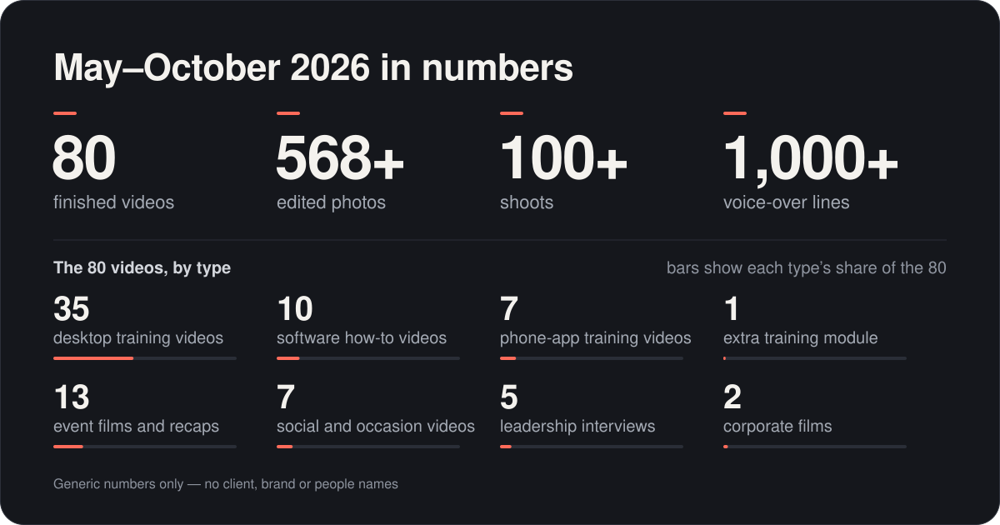
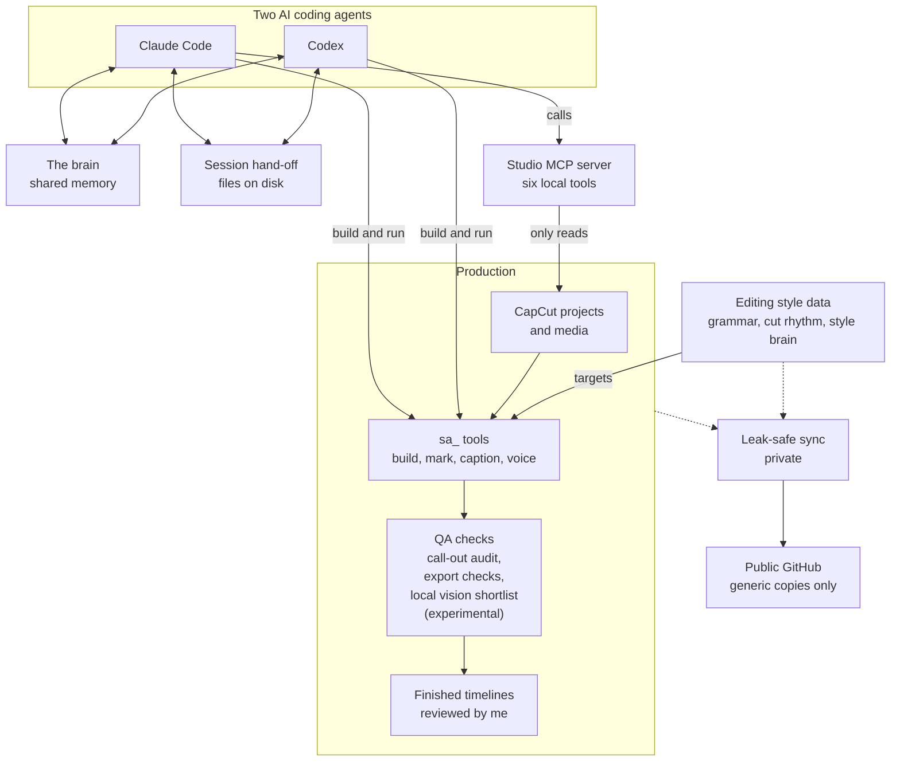
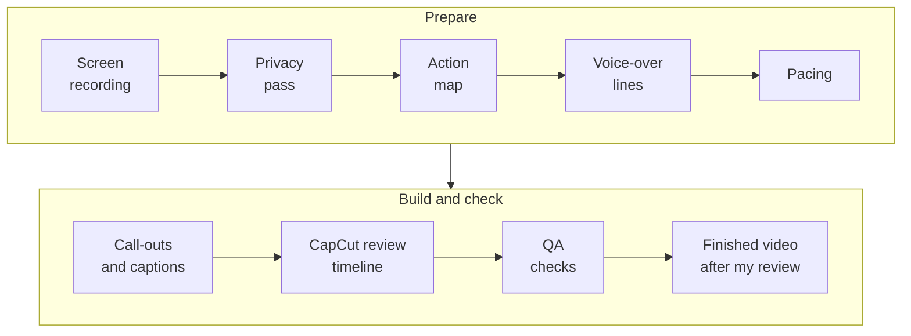

# Saad Ahmad — AI-assisted media production

I work in media production for a diversified business group in the UAE. I design AI-assisted workflows for video, photo and training content, and direct AI coding agents (Claude Code and Codex) to build the tooling. This repository holds six months (May–October 2026) of that work, made generic: the tools, the methods, my prompts and style, and the AI workspace that runs it.

**My CV:** [experience, education and links to my earlier work](CV.md).

**Short on time?** Read [training-video production](playbooks/training-video-production.md), then the [CapCut hub](playbooks/capcut.md), then [my AI generation style](playbooks/ai-video-and-image-generation.md). The [map](#the-map) below points to everything else, most relevant first.

---

## By the numbers

**May–October 2026 in numbers: 80 finished videos · 568+ edited photos · 100+ shoots · 1,000+ voice-over lines**

| Training | Events and brand | Photo and writing |
|---|---|---|
| 35 desktop training videos | 13 event films and recaps | 16 photo sets |
| 7 phone-app training videos | 5 leadership interviews | 35 training scripts |
| 1 extra training module | 7 social and occasion videos | |
| 10 software how-to and explainer videos | 2 corporate films | |

**In progress:** 5 e-learning modules · 199 interior photos awaiting review.

**In this repository:** 195 [tools](tools/README.md) · 38 [playbooks](#the-map) · 7 multi-agent [workflows](workflows/README.md) · 3 Claude Code skills, 1 sub-agent and 2 hooks · a [studio MCP server](mcp/studio/README.md), a [voice-over kit](kits/fish-voice-kit/README.md), a [CapCut watcher app](apps/capcut-eyes/README.md) and reusable [HyperFrames](playbooks/templates/hyperframes-brand-tutorial/README.md) and [Remotion](playbooks/templates/remotion/README.md) video templates · a [starter workspace kit](workspace-kit/README_START_HERE.md).

The work counts are totals across all my work, checked by three independent counts against my own records; no tile stands for a named project, client or person. The repository counts were taken at publication.

---

## How it fits together

*Recordings and CapCut projects go through the `sa_` tools and QA checks to a finished timeline I review; both agents share memory and state on disk, and only generic copies reach this repository.*

**Where to look:**

- Studio MCP server: [mcp/studio/README.md](mcp/studio/README.md) – six tools; it only reads CapCut projects
- Leak-safe sync: [how this portfolio is kept clean](playbooks/security-and-data-policy.md#6-how-this-portfolio-is-kept-clean)

---

## The map

**Workflows, tool by tool** → [every workflow as a diagram](playbooks/workflows.md): each box is the tool that does the step and each arrow the file it hands on, with a step table and a run example under each – [desktop training videos](playbooks/workflows.md#1-desktop-training-videos) · [phone-app training videos](playbooks/workflows.md#2-phone-app-training-videos) · [CapCut drafts and style learning](playbooks/workflows.md#3-capcut-building-drafts-and-learning-my-style) · [event films and reels](playbooks/workflows.md#4-event-films-and-reels) · [photo grading and retouching](playbooks/workflows.md#5-photo-grade-lut-and-fidelity-first-retouching) · [voice-over and captions](playbooks/workflows.md#6-voice-over-and-captions) · [HyperFrames brand tutorials](playbooks/workflows.md#7-hyperframes-brand-tutorials) · [the AI workspace](playbooks/workflows.md#8-the-ai-workspace-hand-off-health-checks-publishing).

| # | Area | Start here | In one line |
|---|---|---|---|
| 1 | [Training-video programme](#1-training-video-programme) | [training-video-production.md](playbooks/training-video-production.md) | Screen recording to a paced, narrated, captioned CapCut timeline with a call-out on every action |
| 2 | [CapCut](#2-capcut) | [capcut.md](playbooks/capcut.md) | How I edit in CapCut, its undocumented project format, and every tool that touches it |
| 3 | [My prompts and AI-generation style](#3-my-prompts-and-ai-generation-style) | [ai-video-and-image-generation.md](playbooks/ai-video-and-image-generation.md) | Higgsfield, Kling, Veo and image models; thinking prompts; music prompts |
| 4 | [Editing style as data](#4-editing-style-as-data) | [learning-an-editors-style.md](playbooks/learning-an-editors-style.md) | My cut rhythm and story grammar, measured from finished timelines and kept as data |
| 5 | [Photo](#5-photo-lightroom-recipe-style-dna-and-fidelity-first-retouching) | [lightroom-recipe.md](playbooks/lightroom-recipe.md) | My Lightroom recipe with every preset value, the look on one page, and retouching that never redraws |
| 6 | [Occasions calendar and visual guide](#6-occasions-calendar-and-visual-guide) | [designing-for-gulf-occasions.md](playbooks/designing-for-gulf-occasions.md) | Every Islamic, UAE national and corporate occasion: dates, design mode, imagery, copy, music |
| 7 | [Voice and code-rendered motion](#7-voice-code-rendered-motion-and-media-operations) | [fish-audio-voice-cloning.md](playbooks/fish-audio-voice-cloning.md) | Cloned-voice voice-over, a brand-tutorial template, motion graphics written as code |
| 8 | [The AI workspace](#8-the-ai-workspace) | [the-brain.md](playbooks/the-brain.md) | Shared memory, two-agent hand-off, the engineering method, learning from mistakes, agent fleets |
| 9 | [Apps and kits](#9-apps-and-kits) | [apps/capcut-eyes/](apps/capcut-eyes/README.md) | A read-only CapCut watcher, a double-click voice kit, video templates, a starter workspace |
| 10 | [Six months, month by month](#10-six-months-month-by-month) | [six-months-timeline.md](playbooks/six-months-timeline.md) | What each month added, and the classes of problem found and fixed |

Then: [tools](#tools) · [how this was built](#how-this-was-built) · [confidentiality](#confidentiality) · [status labels](#status-labels).

---

## 1. Training-video programme

**35 screen-recorded training videos (a 21-module end-to-end process series and 14 role-by-role modules) and 7 phone-app training videos, over two hours of finished training.** A raw screen recording of a business system becomes a paced, narrated, captioned video with a call-out on every action, built as a new, editable CapCut timeline that I review and finish. Every number in the method was measured from my own finished edits. → **[Training-video production](playbooks/training-video-production.md)**

- **Map the lesson before any voice exists.** Every click, field entry, role switch and save is a row in an [action map](playbooks/templates/training_action_map_template.csv); a line that says “do X, then Y” becomes two beats, and a visible on-screen label is evidence where a model’s recollection is not.
- **Pace the picture to the voice, one clip per line.** Freeze rather than speed up (never above about 1.2× on a readable screen). The freeze default is a measured median – 3.0 s across 120 freezes in the 20 modules finished at the time, and 4.45 s across 78 freezes on the denser role-by-role screens. A default changes only after three recurrences.
- **Build a new review project, never patch mine:** silent picture, one voice clip per line, editable one-line captions (a new cue at 46 characters), and each call-out’s box and label as separate layers.
- **Check every marking at its start, middle and end** on the rendered cut, as pass / fail / unknown with frame evidence; sync is checked three ways (box against word, box held, caption against speech onset), and a local OCR privacy sweep reads every played quarter-second.
- **Phone-app recordings** add on-device OCR of every screen state, a call-out only where OCR proves its target is on screen, and the picture pinned to the words that name each marking.

*The desktop training-video pipeline in brief; the full version, with the tool behind each step, is in [the pipeline at a glance](playbooks/training-video-production.md#the-pipeline-at-a-glance).*

| Part | Status |
|---|---|
| The finished videos | **Delivered** |
| The method end to end, including one module authored entirely by code (61 voice lines placed with zero drift) | **Built, in use** |
| Revision protocol for later software changes | **Built, awaiting review** |
| Local vision-model checks of call-outs | **Experimental** – shortlists frames for a person; signs nothing off |
| Automatic release approval | **Not approved** – every cut is reviewed by me |

**What does the work:** [`sa_stepmark.py`](tools/sa_stepmark.py) (house-style call-outs) · [`sa_dubcut.py`](tools/sa_dubcut.py) (pace a recording to a replacement voice) · [`sa_appread.py`](tools/sa_appread.py) and [`sa_appbuild.py`](tools/sa_appbuild.py) (phone-app read and build) · [`sa_scrollscan.py`](tools/sa_scrollscan.py) (fast-scroll check at intake) · [`sa_voice_anchors.py`](tools/sa_voice_anchors.py) · [`sa_captions.py`](tools/sa_captions.py) (script-locked captions) · [`sa_check_sync.py`](tools/sa_check_sync.py) · [`sa_privacy_sweep.py`](tools/sa_privacy_sweep.py) · [`sa_finalcheck.py`](tools/sa_finalcheck.py) – the full list by stage is in [section 17](playbooks/training-video-production.md#17-tools-by-stage). The method is packaged as a Claude Code skill, [`training-video-pipeline`](workspace-kit/.claude/skills/training-video-pipeline/SKILL.md), and was checked at scale by [`adversarial-verify.js`](workflows/adversarial-verify.js): one agent per marking, every major fault re-checked by three refuters, the largest fleet over 300 agents.

---

## 2. CapCut

CapCut is where my edits are finished. It has no public project API, so my AI coding agents worked out its undocumented project format from my own projects; the tools build new, editable timelines, read back every draft they write, and never write over mine. → **[CapCut hub](playbooks/capcut.md)** – how I work in it, my defaults as numbers, my style as data, and all 71 tools that touch CapCut, each with a usage line.

- **[The CapCut draft format](playbooks/capcut-draft-format.md)** – the identity rules that decide whether a project opens at all, the geometry maths, the material shapes, and the guard rails every writer follows. Plans go in through [`timeline_plan.schema.json`](playbooks/templates/timeline_plan.schema.json).
- **[Tutorial templates](playbooks/capcut-tutorial-templates.md)** and **[the three masters at a glance](playbooks/capcut-tutorial-masters.md)** – three approved tutorial timelines decoded: a 61.6 s short walkthrough, a 200.1 s dense feature tour and a 563.9 s long module on an animated base, with the two pacing modes and the invariants every tutorial final keeps.
- **[CapCut live eyes](playbooks/capcut-live-eyes.md)** and the **[CapCut Eyes app](apps/capcut-eyes/README.md)** – a read-only watcher that records what changed in my saved timeline and what CapCut’s window showed while it changed, so the agents learn from what I do rather than from what I say I do.
- **[The studio MCP server](mcp/studio/README.md)** – lets an AI agent summarise a CapCut project (tracks, export range, missing media), export its captions to a new subtitle file and list narrated actions with no call-out nearby (candidates to check on frames, never a pass), without ever writing inside a CapCut project. **Built, in use.**
- **My defaults:** 0.9 s between voice lines; a 2.5 s tail hold; Slow Fade only at a real chapter or tone change; music low under the voice (about 0.03–0.06 in CapCut’s volume) and entering exactly at the export in-point; one voice engine per series; no “in the next video” teaser.

| Part | Status |
|---|---|
| Building new projects from a donor (call-outs, captions, voice, outro) | **Built, in use** |
| Tutorial templates and style measurement | **Built, in use** |
| Plan-driven writer for any reviewed timeline plan | **Built, awaiting review** – structural checks pass; the live open-in-CapCut test is pending |
| Live edit-watching | **Pilot** – read-only; the app bundles are **Experimental** |
| Rendering a CapCut project without CapCut | **Pilot** – review renders only, never delivery |

**What does the work:** [`sa_capcut_writer.py`](tools/sa_capcut_writer.py) (plan to new draft, with rollback) · [`sa_capcut_callouts.py`](tools/sa_capcut_callouts.py) (one layer per call-out) · [`sa_capcut_captions.py`](tools/sa_capcut_captions.py) (SRT to styled, editable text) · [`sa_capcut_relink.py`](tools/sa_capcut_relink.py) (fixes “media missing”) · [`sa_finaldiff.py`](tools/sa_finaldiff.py) (my final against the machine build) · [`sa_ffrender.py`](tools/sa_ffrender.py) (review render with ffmpeg alone) · [`sa_editwatch.py`](tools/sa_editwatch.py) (edit events from saved timelines) – and the [senior video editor](workspace-kit/.claude/agents/senior-video-editor.md) sub-agent, which reads all of this before deciding anything.

---

## 3. My prompts and AI-generation style

How I direct AI video and image models for occasion reels, product and vehicle reveals, transition bridges, green-screen composites and lip-synced presenter intros: choose the model by the job, write the shot the way a director would, lock whatever must not change with real frames, and check the picture itself before anything becomes final. The prompts are rewritten around neutral placeholders. → **[My AI generation style – Higgsfield, Kling, Veo and image models](playbooks/ai-video-and-image-generation.md)**

- **[The formula](playbooks/ai-video-and-image-generation.md#3-the-formula)** I write every prompt against: `[Camera move] + [Subject or scene] + [Time and light] + [Colour palette] + [Atmosphere] + [Motion detail] + [Quality] + "no people, no text, no logos"`. Subject, camera and environment all move; depth is built in layers; in image-to-video, only what is already in the frame is animated.
- **Clip discipline:** 8 s, one continuous shot, by default; several scenes at 4 s each and no more than two combined; an intro is one shot of 3–4 s.
- **[The real-frame consistency lock](playbooks/ai-video-and-image-generation.md#61-the-real-frame-consistency-lock-first-and-last-frame):** Kling 3.0 with the real photograph as both first and last frame, so a product has no room to be redrawn – and where it must stay pixel-exact, no generation at all.
- **Guard rails:** reels are 9:16, verified before every generation; no hands; no text, logos or people baked into AI video; real structures are never invented or reshaped. Fine jewellery first went through the real-frame lock below; after a test showed that even the strictest prompt rearranged stones, it no longer goes through a generative model at all.
- **[What I approved and rejected, and why](playbooks/ai-video-and-image-generation.md#17-what-i-approved-and-rejected-and-why)** – for example, holy-site imagery rejected for Eid al-Adha, a 15-second stitched montage rejected as an intro, and the cheaper video tier rejected for presenter clips because lip-sync was worse even where resolution measured the same.

The other prompt pages:

- **[Thinking prompts – six moves for sharper answers](playbooks/thinking-prompts.md)** – clarify before doing, critique don’t rewrite, a three-version spread, steelman the opposite, find the blind spot, and a PR-style walkthrough; a sceptic pass before every answer, and a rule that has the agent fire the right move without my asking. Every prompt in full.
- **[AI music prompting](playbooks/ai-music-prompting.md)** – Suno and MiniMax Music for brand audio with a Gulf and Arabic identity: my first rule (“the Arabic soul should be felt, not heard”) and how one round of feedback reversed it, so the Arabic element is now clearly audible and cinematic; the standing never and always lists; the negative prompt; and every ready prompt in full.
- **[How I prompt AI agents](playbooks/how-i-prompt-ai-agents.md)** – brief the goal and the reason, say what must not be touched, make the agent prove its work, and put each repeated correction into memory rather than into a longer prompt.

| Part | Status |
|---|---|
| Prompt formula, one-shot discipline, occasion styles; lip-synced presenter intros | **Delivered** – used on approved occasion reels and across a training series |
| Thinking moves, auto-fire rule and sceptic pass | **Built, in use** |
| Green-screen background swap that keeps the filmed person; chained anchors and loops; the covered-to-revealed product beat; camera-only animation of real stills | **Pilot** |
| On-hold and phone-system music prompt set | **Pilot** |

**What does the work:** [`media_kit.py`](tools/media_kit.py) (upload, download, contact sheets and crops) · [`sa_kenburns.py`](tools/sa_kenburns.py) and [`sa_revealreel.py`](tools/sa_revealreel.py) (motion from real pixels only) · [`sa_introline.py`](tools/sa_introline.py) and [`sa_introcheck.py`](tools/sa_introcheck.py) (presenter clips) · [`sa_brand_stamp.py`](tools/sa_brand_stamp.py) (real artwork stamped on a generated plate) · [`sa_upscale.py`](tools/sa_upscale.py) (local, non-generative upscale) · [`sa_qa.py`](tools/sa_qa.py) (pre-publish checks) · [`sa_beats.py`](tools/sa_beats.py) and [`sa_tailkit.py`](tools/sa_tailkit.py) (music to picture) · the prompts the agents read: [`THINKING_PROMPTS.md`](workspace-kit/Reference/THINKING_PROMPTS.md).

---

## 4. Editing style as data

My editing style is kept as data a tool can read, not as adjectives in a prompt – and none of it outranks my approved final export. → **[Learning an editor’s style from finished timelines](playbooks/learning-an-editors-style.md)**; every field is explained in the [CapCut hub, section 3](playbooks/capcut.md#3-editing-grammar-and-cut-rhythm-as-data).

| File | What it holds | Built from |
|---|---|---|
| [`SAAD_EDITING_GRAMMAR.json`](Reference/SAAD_EDITING_GRAMMAR.json) | The story grammar: an order of authority; story-first rules for selection, transitions, sound, format and finish; four destination formats; seven edit families, each with a cut-rhythm range, a transition budget and a chapter template; the checks a plan must pass | A structural read of 95 timelines across 85 CapCut projects, 11 approved exports and 20 finished training exports. Read by [`sa_edit_skeleton.py`](tools/sa_edit_skeleton.py) |
| [`EDIT_DNA_STATS.json`](Reference/EDIT_DNA_STATS.json) | Cut-length percentiles, rhythm spread, speed-change share and layer density for eight style groups | The same 56 projects as the style brain; the eight groups cover the 51 with measurable picture cuts (1,555 cuts), 38 of them high-confidence finished export ranges. Written by [`sa_editdna.py`](tools/sa_editdna.py) |
| [`capcut_style_brain_anonymised.json`](Reference/capcut_style_brain_anonymised.json) ([readable](Reference/capcut_style_brain_anonymised.md)) | One fingerprint per project: canvas, approved range, shot lengths, speed, where each shot starts inside its source clip, reframing, transitions, confidence | 56 projects renamed P01–P56, in the same eight style families; 39 are high-confidence finished export ranges, 14 are measured over the whole draft. Client-restricted work, empty, AI-built and duplicate drafts removed |

**What the numbers say:** event styles cut fastest – a 1.10 s median across 2 luxury event reels, 1.20 s across 9 vertical event montages and 1.50 s in 1 tribute film – and lean on speed changes (70%, 65% and 88% of clips); the 10 tutorial and explainer projects cut at a 2.20 s median and almost never change speed (0.4% of clips); and in six of the eight high-confidence event, montage and tribute fingerprints a shot starts about halfway into its source clip – the best moment is often deep inside the clip.

- **[My editing style, full playbook](playbooks/editing-style-full.md)** – the house style that survived into finished work, from 77 readable project fingerprints, 50 saved export ranges and my own approvals and rejections.
- **[Editing technique, observed](playbooks/editing-technique-observed.md)** – session by session, the AI’s first assembly against my finished cut, in my own numbers.
- **[My creative bar](playbooks/my-creative-bar.md)** – how I judge a grade, a set, a frame, a cut and a caption; how I fix things; my red lines; and how to brief me.

| Part | Status |
|---|---|
| Style measurement from finished timelines; final-edit diff | **Built, in use** |
| Story-first edit skeleton and the grammar file it reads | **Built, awaiting review** |
| Plan-versus-final round trip and correction trend | **Experimental** – one round-trip test so far |

**What does the work:** [`sa_stylebrain.py`](tools/sa_stylebrain.py) (fingerprints from saved export ranges; whole drafts only as a flagged low-confidence fallback) · [`sa_editdna.py`](tools/sa_editdna.py) · [`sa_edit_skeleton.py`](tools/sa_edit_skeleton.py) · [`sa_finaldiff.py`](tools/sa_finaldiff.py) · [`sa_style_delta.py`](tools/sa_style_delta.py) and [`sa_learncurve.py`](tools/sa_learncurve.py) (is the pipeline learning?) · [`sa_capcut_corpus.py`](tools/sa_capcut_corpus.py) (read-only census).

---

## 5. Photo: Lightroom recipe, Style DNA and fidelity-first retouching

A photograph of a real product, building or structure is evidence of what exists, so my retouching cleans and corrects but never redraws.

- **[My Lightroom recipe](playbooks/lightroom-recipe.md)** – my develop settings read out of my own Lightroom catalogue rather than described from memory: five interior scene presets (into the room, against the window, kitchen, washroom, dark entrance or corridor), the window Object mask, the reverse mask that lifts dark corners, white balance first, and my rules for exteriors and product. Every preset value is on the page, but the preset files are not published: the shared base layer came from a house preset, not from me. To be straight about the sample, too: the presets rest on 10 individual edits, and two of them on a single frame.
- **[Style DNA – the look on one page](playbooks/style-dna.md)** – the guardrails, the prompt formula, grades, caption rules, formats (9:16 reels verified before generation) and sound, in one place any agent or person can read.
- **[Fidelity-first photo retouching](playbooks/photo-fidelity-retouching.md)** – the hard lines on generative AI, a non-generative RAW workflow, and the measured reason: across all 291 files from one generative “enhance” run, every output came back at about 1.6 MP whatever went in. Generative enhancement is not upscaling.
- **[Design and deck craft](playbooks/design-and-deck-craft.md)** – titles carry the story, slides stay light, type is readable from the back of the room, nothing looks like a generic AI deck.

| Part | Status |
|---|---|
| Non-generative RAW workflow: cull, technical develop, one grade per set | **Delivered** – used on property and product photo sets |
| Interior presets, catalogue reading, preset-to-video LUT | **Built, in use** |
| Generative clutter removal, boxed in with crop-and-paste-back | **Experimental** – needs my sign-off on each shoot |
| A window mask that syncs across a whole set | **Planned** |

**What does the work:** [`sa_lrread.py`](tools/sa_lrread.py) (reads edits from the catalogue) · [`sa_presets.py`](tools/sa_presets.py) (scene presets from my edits) · [`sa_rawdev.py`](tools/sa_rawdev.py) (technical develop as sidecars) · [`sa_cull.py`](tools/sa_cull.py) · [`sa_photolib.py`](tools/sa_photolib.py) · [`sa_house_grade.py`](tools/sa_house_grade.py) (one treatment for a mixed set) · [`sa_xmp2cube.py`](tools/sa_xmp2cube.py) and [`sa_lut.py`](tools/sa_lut.py) (a photo grade as a video LUT) · [`sa_upscale.py`](tools/sa_upscale.py) (refuses protected product files) · [`jewellery_edit.py`](tools/jewellery_edit.py) (true-colour product RAW edit).

---

## 6. Occasions calendar and visual guide

→ **[Occasions calendar and visual guide](playbooks/designing-for-gulf-occasions.md)** – every Islamic, UAE national, corporate, CSR and international occasion I design for, written for an audience in the UAE and the wider Gulf.

- **The calendar, with every date rule.** Islamic occasions follow the lunar Hijri calendar, so each arrives about 10–11 days earlier every year; Ramadan and the two Eids hang on the crescent sighting, announced as late as the evening before – so plan for a day either side and keep the date off the artwork. Fixed-date national occasions are listed with their day.
- **Five design modes** – calligraphy-forward, 3D CGI, real photography, heritage and archival, editorial stock – each occasion mapped to one, with its motifs and palette (deep green with gold and amber for the Eids, for example).
- **Imagery that would be culturally wrong**, each rule from a real correction – no holy-site imagery, and no lanterns for Eid al-Adha.
- **Arabic-first copy** and the text timing for an 8-second occasion clip: picture alone to 2 s, logo at 2 s, Arabic headline from 2 s, English joining at 4.5 s, a bilingual tagline from 6 s – delivered as four subtitle files and never baked into the prompt.
- **Camera moves and music by occasion**, and a checklist for each one.

| Part | Status |
|---|---|
| The calendar and the occasion-to-mode map; the imagery rules | **Built, in use** |
| Islamic occasion visuals; text timing and subtitle files | **Delivered** |
| Generated visuals for national, corporate and CSR occasions | **Planned** – these use real or archival photography |

**What does the work:** [`sa_translate.py`](tools/sa_translate.py) (local English-to-Arabic subtitle draft that keeps every timing) · [`sa_capcut_captions.py`](tools/sa_capcut_captions.py) · [`sa_font.py`](tools/sa_font.py) (Arabic typefaces as real font files) · [`sa_kenburns.py`](tools/sa_kenburns.py) (slow 9:16 motion from real photographs) · [`sa_brand_stamp.py`](tools/sa_brand_stamp.py).

---

## 7. Voice, code-rendered motion and media operations

- **[Cloned-voice voice-over with Fish Audio](playbooks/fish-audio-voice-cloning.md)** and the **[Fish Voice Kit](kits/fish-voice-kit/README.md)** – the free model through the official API, with a loud warning on every line before any paid fallback; one sentence per line and one file per line (the 500-character cap belongs to the web page, not the API); speed matched to approved narration by words per second, not chosen on a slider; a pronunciation file, so a word only has to be wrong once; each take transcribed locally and kept only at ≥ 0.95 similarity to the script. **Consent first:** clone only voices you own or have permission or a licence to use.
- **[Brand tutorial videos with HyperFrames](playbooks/hyperframes-brand-tutorials.md)** and its **[brand-agnostic template](playbooks/templates/hyperframes-brand-tutorial/README.md)** – script → voice → word timings → edit plan → HyperFrames/GSAP render → font proof → review preview → editable CapCut draft (13 read-back checks) → knowledge check and certificate, with a placeholder brand, “Acme”.
- **[Code-rendered motion graphics](playbooks/code-rendered-motion-graphics.md)** – proving the typeface really loaded, small type in a display face, weight by role, 3D that stays readable, and trusting only rendered frames; the Remotion alternative is in [`templates/remotion/`](playbooks/templates/remotion/README.md).
- **[Media-operations field notes](playbooks/media-ops-field-notes.md)** – slow motion that isn’t choppy (10 of 10 clips at 120 frames with no duplicate frames), rescuing a truncated download, copying and verifying camera cards, cleaning storage without breaking a project, and culling rushes with agents.

| Part | Status |
|---|---|
| Fish Audio API route with best-of-N takes and a local word check | **Built, in use** |
| HyperFrames pipeline and the brand-agnostic template | **Built, awaiting review** |
| Font proof; editable CapCut draft from the edit plan | **Built, in use** |
| Remotion templates; local voice cloning on the laptop | **Pilot** |
| An automatic “this voice sounds wrong” detector | **Experimental** – five acoustic measures failed; transcription is a shortlist only |

**What does the work:** [`sa_fishvo.py`](tools/sa_fishvo.py) · [`sa_clonevo.py`](tools/sa_clonevo.py) · [`sa_voiceref.py`](tools/sa_voiceref.py) · [`sa_voicecheck.py`](tools/sa_voicecheck.py) · [`sa_vo_words.py`](tools/sa_vo_words.py) · [`sa_verify_fonts.py`](tools/sa_verify_fonts.py) · [`mux_preview.py`](playbooks/templates/hyperframes-brand-tutorial/mux_preview.py) (review preview) · [`sa_capcut_build_from_plan.py`](tools/sa_capcut_build_from_plan.py) · [`sa_compress.py`](tools/sa_compress.py) · [`sa_dedupe.py`](tools/sa_dedupe.py) · [`sa_refmap.py`](tools/sa_refmap.py).

---

## 8. The AI workspace

Two AI coding agents on one Mac, taking turns on the same work, with everything they share kept on disk. → Start with **[the brain](playbooks/the-brain.md)** and **[session handoff](playbooks/session-handoff.md)**; the empty starter version is the **[workspace kit](workspace-kit/README_START_HERE.md)**.

| Page | What it covers | Status |
|---|---|---|
| [My AI brain](playbooks/the-brain.md) | A local MCP server both agents call: six tools (briefing, search, logging, instincts, recent activity, reindex), hybrid search with on-device embeddings plus keywords, a 12,000-character briefing ceiling, and corrections that supersede rather than delete. The code is published; what it knows is not | **Built, in use** |
| [Studio MCP server](mcp/studio/README.md) | A small local MCP server with six tools: style lookup, CapCut project summary, captions export, call-out audit, photo cull and prompt search. Four only read; the captions export and the photo cull each write one new file or folder and never overwrite anything. It runs locally and uploads nothing | **Built, in use** |
| [Session handoff](playbooks/session-handoff.md) · [Running two AI agents](playbooks/running-two-ai-agents.md) | A session folder, one state schema, an append-only log, checkpoints as the context fills and a ground-truth brief after compaction, so the second agent carries on without my re-explaining | **Built, in use** |
| [How I engineer with AI coding agents](playbooks/ai-engineering-method.md) (summary, fourteen rules each from a real incident) · [the full method](playbooks/engineering-method-full.md) · [as a skill](workspace-kit/.claude/skills/engineering-method/SKILL.md) | Route the work by risk, diagnose before fixing, build in checkable steps, and never call anything done without fresh evidence that matches the claim | **Built, in use**; specs **Pilot** |
| [Learning from mistakes](playbooks/learning-from-mistakes.md) | 76 recorded mistakes since May grouped into 16 patterns. No written rule had ever stopped a repeat; only code that refuses had – so each lesson now lands as a check, and every escaped defect stays open in a ledger | **Built, in use** |
| [The agent organisation](playbooks/agent-organisation.md) · [Orchestrating agent fleets](playbooks/orchestrating-agent-fleets.md) | Who may approve what: six departments with charters and 72 role definitions; fan-out shapes worth the tokens; checkers that never see the maker’s reasoning | Fleets **Built, in use**; the standing organisation **Planned** |
| [Workflows](workflows/README.md) | Seven scripts for Claude Code’s workflow runner: research fan-out, issue-tracker research, per-item adversarial verification, mistake mining, fix-log mining, a five-lens review, a pre-delete safety check | Verification fleet **Built, in use**; the others **Built**, each run on real work; the pre-delete rewrite **Pilot** |
| [Claude Code layer](workspace-kit/.claude/README.md) | One sub-agent ([senior video editor](workspace-kit/.claude/agents/senior-video-editor.md)), two skills ([training-video pipeline](workspace-kit/.claude/skills/training-video-pipeline/SKILL.md), [engineering method](workspace-kit/.claude/skills/engineering-method/SKILL.md)), and two hooks – the working rules re-injected on every prompt, and a ground-truth brief after each compaction | **Built, in use** |
| [Local AI and unattended jobs on one Mac](playbooks/local-ai-on-a-mac.md) | Local vision and language models without making the edit lag; overnight jobs; the macOS privacy trap that kills them silently; receipts that make a silent failure visible by morning | **Built, in use** |
| [Security and data policy](playbooks/security-and-data-policy.md) | Four data classes, fail-closed gates, pinned plugins, vetting third-party AI tools, and how this repository is kept clean | **Built, in use** |
| [Spec-driven AI work](playbooks/spec-driven-ai-work.md) | Spec Kit applied to production work: a six-principle constitution, a worked spec, an eight-gate checklist and a validator | **Pilot** |
| [Why AI agents forget](playbooks/why-ai-agents-forget.md) | An audit of a multi-agent set-up that kept re-asking known facts: five causes, their evidence, and a safe-fix script | **Built, awaiting review** |
| [Repository due diligence, 2026](playbooks/repo-due-diligence-2026.md) | Read-only notes on 47 public GitHub repositories, judged for one question: would it help a non-technical media team without new risk? | **Research** – nothing installed |

**The code that enforces it:** [`sa_session.py`](tools/sa_session.py) (the hand-off contract) · [`sa_checkpoint.py`](tools/sa_checkpoint.py) and [`sa_compact_brief.sh`](tools/sa_compact_brief.sh) (surviving compaction) · [`sa_threads.py`](tools/sa_threads.py) (every open thread) · [`sa_guard.py`](tools/sa_guard.py) (pre-flight refusals and the approved-freeze list) · [`sa_loop.py`](tools/sa_loop.py) (attempt ledger, circuit breaker, kill switch) · [`sa_doctor.py`](tools/sa_doctor.py) (health check at every session start) · [`sa_nightly.sh`](tools/sa_nightly.sh) (the overnight runner) and [`sa_nightcheck.sh`](tools/sa_nightcheck.sh) (its morning dead-man check – built, but currently refused by a macOS permissions regression) · [`sa_security.py`](tools/sa_security.py) · [`sa_toolindex.py`](tools/sa_toolindex.py) (a tool catalogue generated from the code, so it cannot drift).

**Templates:** [loop constraints](playbooks/templates/loop_constraints.json) · [consistency-gates checklist](playbooks/templates/consistency_gates_checklist.md) · [fix-log entry](playbooks/templates/fix_log_entry.md) · [Spec Kit constitution](playbooks/templates/spec-kit-constitution.md) · [worked spec](playbooks/templates/spec-agent-consistency-gates.md) · [scheduled-agent prompts](playbooks/templates/scheduled-agent-prompts.md) · [macOS nightly launchd recipe](playbooks/templates/macos-nightly-launchd.md) · [third-party vetting log](playbooks/templates/third_party_vetting_log.md) · [visual-memory schema](playbooks/templates/visual_memory.schema.json) · [safe-fix script](playbooks/templates/apply_safe_fixes.sh).

---

## 9. Apps and kits

| What | What it is | Status |
|---|---|---|
| [CapCut Eyes](apps/capcut-eyes/README.md) | A local, read-only watcher of how I edit: timeline changes read once a second, CapCut’s own windows only, a menu-bar indicator (`REC 12·47` = 12 timeline events, 47 frames) with a kill switch, and counts always read from disk. It never writes to a project and never sends frames to a generation service | **Pilot**; the menu bar **Built, in use**; the two `.app` bundles **Experimental** |
| [Fish Voice Kit](kits/fish-voice-kit/README.md) | Three double-click launchers, one Python file, a pronunciation file and a Claude Code skill, so a non-technical teammate can turn a list of lines into cloned-voice audio | **Pilot** – built and tested end to end on a real account; self-test passes; in a teammate’s hands for Arabic and English voice work |
| [HyperFrames brand-tutorial template](playbooks/templates/hyperframes-brand-tutorial/README.md) · [Remotion templates](playbooks/templates/remotion/README.md) | Reusable, brand-agnostic video generators: word-timed motion graphics with a certificate, narrated slides and screen walkthroughs | **Built, awaiting review** · **Pilot** |
| [Workspace kit](workspace-kit/README_START_HERE.md) | An empty starter version of the workspace that runs all of this – see below | Cut from my own set-up, which is **Built, in use**; its organisation layer is **Planned** and its progress measurement **Experimental** |

**The workspace kit** turns an AI coding agent into an assistant that resumes where it left off. It holds instruction files for Claude Code and Codex ([`CLAUDE.md`](workspace-kit/CLAUDE.md), [`AGENTS.md`](workspace-kit/AGENTS.md)) and a [system prompt](workspace-kit/SYSTEM_PROMPT.txt) for chat assistants without file access; the [`Sessions/`](workspace-kit/Sessions/README.md) hand-off protocol and a [memory index](workspace-kit/memory/MEMORY.md); the agent organisation ([`AGENT_ORCHESTRATION.md`](workspace-kit/AGENT_ORCHESTRATION.md), [`ROLES.md`](workspace-kit/ROLES.md), six [charters](workspace-kit/charters/), [role packs](workspace-kit/Reference/ROLE_PACKS.md) and [hard-won lessons](workspace-kit/Reference/HARD_WON_LESSONS.md)); onboarding and upkeep ([first run](workspace-kit/FIRST_RUN.md), [cheat sheet](workspace-kit/CHEAT_SHEET.md), [maintenance](workspace-kit/MAINTENANCE.md), [Obsidian](workspace-kit/OBSIDIAN.md), [origin](workspace-kit/ORIGIN.md)); a [data policy](workspace-kit/Reference/DATA_POLICY.json) with a [security gate](workspace-kit/Tools/security_gate.py) and a [pinned-plugin registry](workspace-kit/Reference/PLUGIN_SECURITY.json); a [memory protocol](workspace-kit/Reference/AGENT_MEMORY_PROTOCOL.md); [before-and-after measurement](workspace-kit/progress/README.md) (Experimental); [scheduling](workspace-kit/scheduling/README.md); the [Claude Code layer](workspace-kit/.claude/README.md), an [example global instructions file](workspace-kit/global-CLAUDE.example.md) and a [team custom-instructions template](workspace-kit/TEAM_CUSTOM_INSTRUCTIONS.md); and the [brain’s code](workspace-kit/brain/SETUP.md) – but none of its memory. Start with [`README_START_HERE.md`](workspace-kit/README_START_HERE.md), then [`HOW_IT_WORKS.md`](workspace-kit/HOW_IT_WORKS.md).

---

## 10. Six months, month by month

→ **[Six months, month by month](playbooks/six-months-timeline.md)** – what each month added, and which classes of problem were found and fixed, compiled from my work log, fix log, the August post-mortem and the workspace’s history.

| Month | The shift |
|---|---|
| May | Generating video by hand, and writing down the first rules |
| June | A memory and a local toolkit, so the agent stops starting from zero |
| July | A local-first studio: health checks, local vision, editing intelligence |
| August | Production at scale: writing CapCut projects, verifying them, and the mistake post-mortem |
| September | Fleets of checkers, role-by-role re-cuts, phone-app recordings, a photo pipeline, one engineering method |
| October (to the 6th) | Code-rendered motion graphics, an event-film pipeline, and this portfolio |

---

## Tools

195 single-file Python, shell, Swift and JavaScript tools, each described in **[tools/README.md](tools/README.md)**. Most run with `--help` and many have a `--test` self-check; external needs (ffmpeg, Whisper, OpenCV, CapCut, Ollama) are noted in each tool’s docstring.

| Category | Tools |
|---|---:|
| [CapCut automation](tools/README.md#capcut-automation) | 39 |
| [Screen-recorded training videos](tools/README.md#screen-recorded-training-videos) | 22 |
| [Video QA and verification](tools/README.md#video-qa-and-verification) | 29 |
| [Captions, transcripts and voice](tools/README.md#captions-transcripts-and-voice) | 22 |
| [Editing and assembly](tools/README.md#editing-and-assembly) | 20 |
| [Colour and photo](tools/README.md#colour-and-photo) | 25 |
| [AI workspace operations](tools/README.md#ai-workspace-operations) | 24 |
| [Utilities](tools/README.md#utilities) | 14 |
| **Total** | **195** |

146 of them come from my workspace’s main tools folder and 49 from working branches and project folders; each was renamed with the `sa_` prefix, made generic and reviewed before publishing. Tools that only make sense privately – the sync that builds this repository among them – are not published.

---

## How this was built

- **My part:** the direction, the rules both agents follow, the quality bar, testing each tool on live work before it becomes routine, and the review that decides what ships. The prompts, the editing and photo decisions the tools measure, and the judgement calls are mine; I wrote most generation prompts together with Claude.
- **The agents’ part:** the code was written by AI coding agents – Claude Code and Codex – under my direction and review. I did not write it by hand. Claude Code builds and analyses; Codex picks up when Claude hits a usage limit, working from the same session files.
- **Codex’s marker:** since 6 August 2026, what Codex adds carries the tag “(done by codex)”. Where the tag would damage the output it goes in the session log instead; in a few tools and in the grammar file it appears as an `authorship` field.
- **These pages** were drafted by AI agents from my working records, under my direction and review. Where a rule restates a vendor’s guidance, the page credits it in place.

---

## Confidentiality

- **Generic only.** No employer, client, brand, people or project details: no names, internal system names, project titles, per-job dates or status, performance data, or account and voice IDs. Client-restricted work is left out entirely.
- **No media.** The repository holds no footage, photographs, screenshots or audio, and no preset files.
- **Methods and numbers describe how the tools and the editing behave**, never the results of a particular job. The counts at the top are totals.
- **How data is handled in the work itself:** screen frames never go to generation services; other company media goes to one only with approval for that project, and is logged; routine checks run locally and upload nothing; the large one-off verification passes used hosted AI coding agents, and the CapCut watcher’s per-session learning pass has an AI coding agent read the captured CapCut-window frames before they are deleted.
- **How it is enforced:**
  - a private, fail-closed sync that copies only allowlisted files through a sanitiser and a leak scan – one hit and nothing is committed;
  - independent AI reviewers reading every page and tool for context a scan cannot see (on this repository they still found 167 issues after the automated scan had passed);
  - tool changes held back until they are reviewed;
  - a public history that starts from one fresh, reviewed commit.

  More in [how this portfolio is kept clean](playbooks/security-and-data-policy.md#6-how-this-portfolio-is-kept-clean).

  The sync, step by step: [how a change reaches GitHub safely](playbooks/security-and-data-policy.md#how-a-change-reaches-github-safely).

Views and descriptions here are my own and not those of my employer.

---

## Status labels

Maturity is labelled per capability, not per project, so one page can carry several labels.

| Label | Meaning |
|---|---|
| **Delivered** | Used on real work that was approved or handed over |
| **Built, in use** | Finished and relied on in my own day-to-day work, though not itself a delivered output |
| **Built, awaiting review** | Finished and self-checked; waiting for my sign-off or a live test |
| **Built** | Finished and in limited use |
| **Pilot** | Run end to end on one real job or a short trial; not yet routine |
| **Experimental** | Works in tests or disposable projects; not relied on for delivered work |
| **Planned** | Not built yet |
| **Not approved** | Deliberately not allowed yet |
| **Research** | Read and assessed only; nothing installed or run |

---

## Related

- [Tool index](tools/README.md) – every published tool, one line each
- [Workflows index](workflows/README.md) – the multi-agent scripts and how to run them
- [Workspace kit start page](workspace-kit/README_START_HERE.md) – the starter set-up
- [Six months, month by month](playbooks/six-months-timeline.md) – the whole story in order

---

Contact: [@saadahmadofficial1](https://github.com/saadahmadofficial1)

Shared for review; please ask before reusing code.
