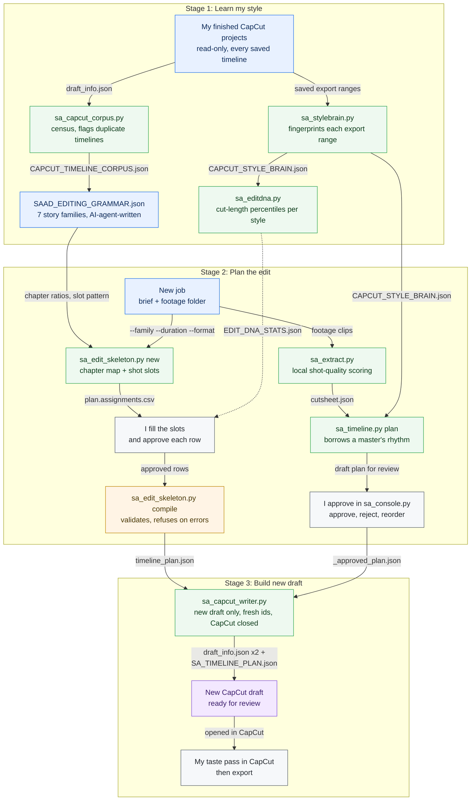
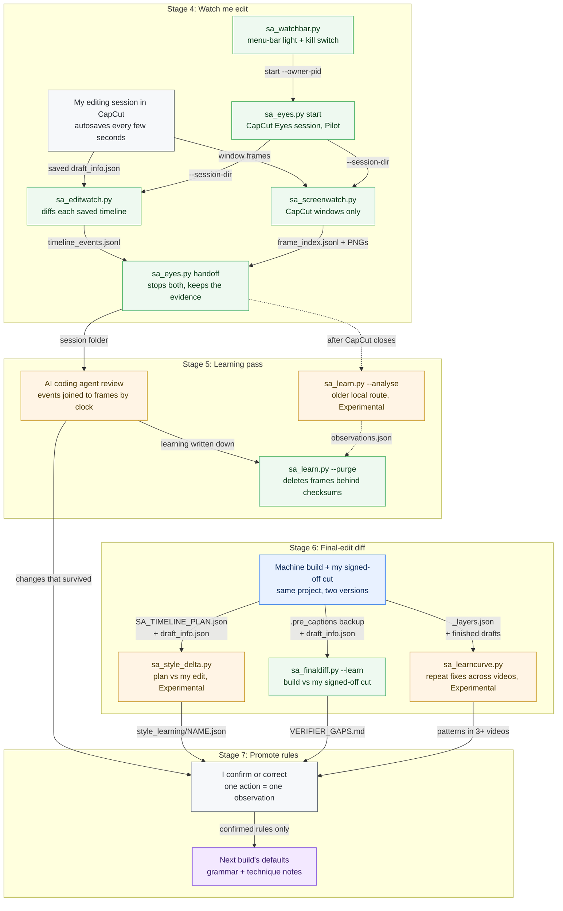

# CapCut: how I edit in it, and the tools that work alongside me

CapCut is where my edits are finished. AI coding agents build first assemblies straight into CapCut’s undocumented project format, measure my finished timelines, and watch how I edit, always writing into new projects and never over mine. This page brings that work together: how I work, the project format, my editing grammar and cut rhythm as data, the tutorial templates, live edit-watching, the human–AI editing contract, and every CapCut tool with a usage line.

**Where the work is done:** the [tools](../tools/README.md) (71 of them touch CapCut; [full table below](#8-every-capcut-tool)) · the style data in [`Reference/`](#3-editing-grammar-and-cut-rhythm-as-data) · the [CapCut Eyes app](../apps/capcut-eyes/README.md) · the [senior video editor agent](../workspace-kit/.claude/agents/senior-video-editor.md) that reads all of this before deciding anything · the deep dives: [the CapCut draft format](capcut-draft-format.md), [learning an editor’s style](learning-an-editors-style.md), [training-video production](training-video-production.md), [the full editing style](editing-style-full.md) and [editing technique, observed](editing-technique-observed.md).

The code was written by AI coding agents (Claude Code and Codex) under my direction and review. I did not write it by hand. The editing decisions it measures and copies are mine.

## Status at a glance

| Capability | Status | Notes |
|---|---|---|
| Building new CapCut projects from a donor (call-outs, captions, voice, outro) | **Built, in use** | Used to build a full training series that was delivered, including one module authored entirely by code |
| Plan-driven writer for any reviewed timeline plan | **Built, awaiting review** | Passes structural checks; the live open-in-CapCut test is still pending |
| Style measurement and cut-rhythm data | **Built, in use** | The measured numbers are planning targets for new edits |
| Tutorial templates (three masters) | **Built, in use** | Used to classify every tutorial brief before any style decision |
| Editing grammar file and the story-first skeleton that reads it | **Built, awaiting review** | Chapter map and shot slots before clips; see the worked example in [section 3.4](#34-worked-example-from-a-brief-to-a-chapter-map) |
| CapCut Eyes live edit-watching | **Pilot** | Read-only; menu-bar control in use; app bundles Experimental |
| Rendering a CapCut project without CapCut | **Pilot** | Review renders only, never delivery |
| Automatic release approval | **Not approved** | Every delivered cut is reviewed by me |

## The workflow, tool by tool

How the CapCut tools hand work to each other: every box is the tool or the person that does the step, and every arrow names the file it hands on. Colours: blue is source material, green a tool, amber a check, grey my own review, purple an output ([legend](workflows.md#how-to-read-the-diagrams)). Every step, with what goes in and what comes out, is in the [step table in workflows.md](workflows.md#steps-capcut-drafts-and-style-learning), with a run example.

**A. From my finished projects to a new CapCut draft (stages 1–3)**



**B. Watching my edit and learning from what I changed (stages 4–7)**



*My finished CapCut projects become style data, a plan I have reviewed becomes a brand-new CapCut draft, and my own edits of that draft are watched live and compared afterwards, so they become the next build’s defaults.* **Maturity:** style measurement and the final-edit diff ([`sa_finaldiff.py`](../tools/sa_finaldiff.py)) are Built, in use. The grammar, skeleton, planner and writer are Built, awaiting review. CapCut Eyes live watching is a Pilot. The plan-versus-final diff, the correction trend and the older local learning route are Experimental. Every delivered cut is still reviewed by me.

## Contents

1. [How I work in CapCut](#1-how-i-work-in-capcut)
2. [The project format in one screen](#2-the-project-format-in-one-screen)
3. [Editing grammar and cut rhythm as data](#3-editing-grammar-and-cut-rhythm-as-data)
4. [Tutorial templates](#4-tutorial-templates)
5. [Live edit-watching: CapCut Eyes](#5-live-edit-watching-capcut-eyes)
6. [The human–AI editing contract](#6-the-humanai-editing-contract)
7. [Trying this on your own projects](#7-trying-this-on-your-own-projects)
8. [Every CapCut tool](#8-every-capcut-tool)

---

## 1. How I work in CapCut

CapCut is my finishing room. The AI hands me a first assembly as a **new** project; I take the taste pass, decide what the viewer should notice and how long it needs, and export. Everything below was read off my own saved timelines and watched sessions, not written from memory.

### Habits the tools have to respect

- **I audition by stacking.** Alternative takes sit on parallel tracks and the rejects are muted or hidden – 1 to 39 hidden segments per timeline in one series – and they stay in the project. Every reader filters to live segments first; an agent that skipped this once heard a rejected line and reported a finished video as faulty.
- **I work in two directions at once: cut the dead, hold the important.** In one 29-minute session on a 291-second video: 216 actions, 14.4 s of dead time removed in four ripple deletes (6.10, 3.33, 2.47 and 2.50 s), 8.9 s of holds added, 5.5 s shorter overall.
- **Ripple delete, my way:** split every track at the point, trim the head off the right-hand piece, slide everything downstream earlier by exactly that amount. Picture, voice, captions and call-outs move together, so nothing drifts.
- **Freeze, my way:** insert a still at the cut, then trim it back to the hold I want. Three of five freezes in that session landed at exactly 2.30 s (range 0.67–2.30 s). That is “when a screen needs to land, about 2.3 s” – not “every gap is 2.3 s”; 0.9 s stays the floor between ordinary steps.
- **The repeatable unit is freeze first, then the label over it**, the label slightly longer than the freeze, both anchored to the same timestamp.
- **I work continuously and decisively.** Median 5 s between actions; median repositioning step 350 px, largest 3,205 px; only 4% of moves were 10 px or less. I land a box and rarely go back for the last few pixels.
- **On a sign-in or account choice, I let the real interaction show** – a short stretch of the raw recording, then a still – rather than a clean instant freeze.
- **My intro and outro are my structure.** A tool that finds them reordered asks whether it was intended; it never “improves” the order.
- **Only what I name gets added.** If I ask for a filter and the outro, a corner logo is not implied.
- **On event reels, the target length is asked up front.** A 30-second reel and a 100-second recap are different edits.
- **Shot-to-shot finish happens in CapCut:** match exposure between neighbouring shots, straighten verticals on display or architecture shots, and fade the music so it lands on the outro’s end.

### My working defaults, as numbers

| Setting | Default |
|---|---|
| Gap between voice lines | 0.9 s |
| Tail hold after the last line | 2.5 s |
| Speed on a readable screen | Never above about 1.2×; when the voice runs long, freeze instead of speeding up |
| Scene length in an animated module | About 6–8 s (the animated-base master’s median is 8 s) |
| Call-out hold | About 1.5 s on a moving screen; the whole line on a frozen explanatory screen |
| Freeze hold | About 3.0 s median across finished training modules; 6 s or more on a dense screen |
| Transitions | Slow Fade, and only at a real chapter or tone change. Text enters with Fade In or Pop Up and leaves with Fade Out or Blur Out. Blur sparingly. Nothing flashy |
| Captions | One line; 46 characters is where a new cue starts, up to 54 to keep a phrase whole. Size 5, scale 75%, position (0, −892), shadow 50 / 15 / 5 / −45, no background panel. Text from the approved script, timing from Whisper word timestamps |
| Titles | Main title centred and larger; subtitle below, smaller, Semibold or Regular. “Step N:” and its label never both bold. Short lists centred, not bulleted. Sentence case. Long lines broken at natural phrases, equal padding both sides. Voice-over and on-screen text say the same thing |
| Music | Chosen for cultural and emotional fit before beat density; low under the voice (about 0.03–0.06 in CapCut’s volume); enters exactly at the export in-point; in long modules it restarts at section changes so it doubles as a chapter marker |
| Ending | The brand frame breathes. No “In the next video…” teaser |
| Voice | One engine per series, never mixed. Short lines, each listened to beside its neighbours |

### What I fix most in AI first cuts

- Reading moments that run too fast. I cut one build by nearly a quarter for dead air (233.9 s to 180.4 s) and lengthened others for comprehension, so each moment is judged, not the total length.
- Boxes near the target instead of on it; labels covering content.
- Duplicate or overlapping layers; transitions used as decoration.
- Role or chapter changes that don’t feel like a new scene.
- Wording that drifts from the screen or from my vocabulary.

The full measured record – every session, every build-versus-final comparison – is in [editing technique, observed](editing-technique-observed.md); the reasoning behind the style is in [the full editing style](editing-style-full.md).

---

## 2. The project format in one screen

CapCut has no public project API, so the tools read and write its JSON project files directly. The format was worked out by the agents from my own projects and is written up in full in **[the CapCut draft format](capcut-draft-format.md)**. The facts that matter most:

- **Projects live at** `~/Movies/CapCut/User Data/Projects/com.lveditor.draft/<project>/`. The timeline is stored **twice** – `draft_info.json` at the root and `Timelines/<uuid>/draft_info.json` – and CapCut may read either. Writers build one blob and write it to both (the root only when the project has exactly one timeline).
- **The opening invariant:** `draft_info.json` `id` = the `Timelines/<uuid>` folder name = `project.json` `main_timeline_id` = `timelines[0].id`. Break it and the project won’t open.
- **Never copy a project folder wholesale.** Copies that kept the original’s timeline folder and id left four projects sharing one timeline id, and the original stopped opening. New projects are built from a donor skeleton with every id regenerated; CapCut’s own project index (`root_meta_info.json`) is never written.
- **Time is integer microseconds.** Ids are upper-case UUID4s. The `duration` header is what CapCut exports – shorten a project without recomputing it and the difference exports as black.
- **Geometry:** `px = W/2 + x·W/2`, `py = H/2 − y·H/2` (y is positive upwards); the UI’s position readout is the file value × 1000. `clip.rotation` positive is clockwise.
- **Keyframes** (`common_keyframes`) use `time_offset` in **source** time, in microseconds – keyframes for a clip sit at `source_start` and `source_start + source_duration`.
- **Per-clip brightness, highlight and shadow** are `effects` materials cloned from an existing project, value as a fraction (−0.15 ≈ slider −15).
- **Text:** `content` is a JSON string; collapse to one style range spanning the whole text, or shadows stack. A two-weight title’s ranges must be recomputed whenever its text changes.
- **A muted clip stores volume `0.0010000000474974513`**, so the mute test is `vol <= 0.01`.
- **CapCut must be closed for every write** – it holds the open project in memory and writes it back on save, silently undoing a repair. Back up beside the file, write, then re-read and verify.
- **Choose the donor with care.** Every media path in it must exist on disk (a donor pointing at cloud-only footage made every generated project crash CapCut on open), its canvas must already be the target shape, and it should carry the fewest tracks. Details in [media-ops field notes](media-ops-field-notes.md#5-choosing-a-donor-project-for-generated-capcut-projects).
- **Snapshot live drafts at every observed save.** CapCut keeps only a `.bak` and its latest mini-draft; an earlier version I wanted back was rebuilt exactly only because an earlier read had been recorded.

---

## 3. Editing grammar and cut rhythm as data

My style is kept as data a tool can read, not as adjectives in a prompt. Three published files, read in this order of authority:

1. **[`Reference/SAAD_EDITING_GRAMMAR.json`](../Reference/SAAD_EDITING_GRAMMAR.json)** – the story grammar: how a new edit should be shaped.
2. **[`Reference/EDIT_DNA_STATS.json`](../Reference/EDIT_DNA_STATS.json)** – measured cut rhythm per style.
3. **[`Reference/capcut_style_brain_anonymised.json`](../Reference/capcut_style_brain_anonymised.json)** (with a [readable summary](../Reference/capcut_style_brain_anonymised.md)) – one fingerprint per finished project, with names replaced.

None of them outranks my approved final export. The grammar says so itself (`authority_order`).

### 3.1 The editing grammar: `SAAD_EDITING_GRAMMAR.json`

Built from a structural read of 85 CapCut project folders and 95 timelines (86 readable, 9 encrypted or unreadable), 11 approved exports read directly, and 20 finished training exports checked against their final timeline ranges. **Read by** [`sa_edit_skeleton.py`](../tools/sa_edit_skeleton.py).

| Field | What it means |
|---|---|
| `schema_version`, `updated`, `authorship` | File version, the date of the last full-library read, and which agent wrote the file (“done by codex” marks Codex’s work) |
| `purpose` | One line: the grammar creates a review skeleton; it never replaces my finishing |
| `evidence` | The counts behind it: `capcut_projects_read` 85, `capcut_timelines_read` 95, `readable_timelines` 86, `unreadable_or_encrypted_timelines` 9, `approved_reference_exports_read` 11, `training_final_exports_verified` 20, plus a note that final exports and named approved timelines outrank draft duration |
| `authority_order` | Five levels, highest first: my approved final export and corrections → the named approved timeline and format → a human-reviewed cutsheet → this grammar and the closest family → automatic source analysis |
| `global_rules.story_first` | Chapters before clips; every shot earns a role (hook, context, action, detail, reaction, transition, payoff, resolution); no coverage just because it is attractive; a repeat needs a new narrative reason |
| `global_rules.selection` | The strongest moment inside a clip, not its first seconds; alternate wide, medium, detail and reaction; keep imperfect human micro-moments that bridge the story; a wide opener only if it tells the viewer something the hook can’t |
| `global_rules.transition` | Hard cuts are normal for real events; a transition only at a chapter boundary, tonal shift, designed premise or final resolve; Slow Fade is the dominant structural transition; never an effect to hide weak sequencing |
| `global_rules.sound` | Music for cultural and emotional fit before beat density; keep natural-sound moments and duck around them; don’t force a cut on every beat |
| `global_rules.format` | Each destination format is its own editorial pass; reframe every shot; a different format may need a different outro shot |
| `global_rules.finish` | End on a meaningful final visual; the released export is the truth, not a saved export range |
| `formats` | Four canvases and their focus: `story_9x16` 1080×1920, `square_1x1` 1920×1920, `landscape_16x9` 1920×1080, `training_wide` 1920×1020 |
| `families.<name>.description` | What the family is for |
| `families.<name>.typical_duration_s` | Usual length range in seconds |
| `families.<name>.cut_rhythm_s` | `median_range` – the median shot length to aim for – and `long_hold_for`, the moments allowed to run longer |
| `families.<name>.speed` | `usual` speed range and a note on when slow motion earns its place |
| `families.<name>.transition_budget` | `default` join, `max_structural_transitions_per_30s`, and the `allowed` transition names |
| `families.<name>.chapter_template` | Ordered chapters, each with an `id`, `label`, `ratio` of the running time and `purpose` |
| `families.<name>.slot_pattern` | The cycle of shot roles used to suggest slots inside a chapter |
| `families.<name>.must_check` | Review checks for that family (event recap only) |
| `families.training_tutorial.instruction_rules` | Caption spec, call-out default hold 2.1 s, freeze default 3.0 s, dense-screen freeze 6.0 s minimum, re-strike repeated actions, role change as a scene change, call-out placement, a 9.1 s muted outro |
| `validator` | `duration_tolerance_s` 0.35 and the list of checks the validator runs (below) |

**The seven families:**

| Family | Typical length | Median shot | Usual speed | Default join | Structural transitions per 30 s | Chapter shape |
|---|---|---|---|---|---:|---|
| `event_recap_fast` | 20–60 s | 0.9–1.8 s | 0.7–1.0× | Hard cut | 4 | Hook → arrival and context → discover → programme → recognition → participation → resolution |
| `premium_product_event` | 20–35 s | 0.9–1.3 s | 0.5–0.8× | Hard cut | 3 | Hero detail → place → desire → event energy → signature |
| `tribute_farewell` | 35–60 s | 1.3–1.8 s | 0.6–0.8× | Hard cut | 3 | Premise → people and place → leadership and exchange → celebration → legacy resolve → brand resolve |
| `designed_occasion_interview` | 40–70 s | 3–5 s | 1.0× | Designed punctuation | 8 | Emotional hook → testimony I → testimony II → testimony III → legacy → occasion resolve |
| `designed_greeting` | 8–20 s | 6–9 s | 1.0× | Minimal | 1 | Visual world → message → brand resolve |
| `corporate_commercial` | 45–90 s | 4.5–7 s | 1.0–1.1× | Concept punctuation | 8 | Premise → problem → proof through variation → solution → call to action |
| `training_tutorial` | 40–600 s | 2–6 s | 1.0× | Minimal | 2 | Title and outcome → role or access → guided steps → verification → outro |

**What the validator actually enforces** (from the code, so nobody over-trusts the switches in the file): errors for missing chapters, a first chapter not at 0, overlapping or non-positive chapters, a chapter total more than 0.35 s off the target, no resolution chapter, and any approved slot without a file or an out-point. Warnings for unassigned required slots, a 9:16 or 1:1 shot not confirmed as reframed, transitions over budget (budget × target length ÷ 30 s), a speaker run without a reaction shot in an event recap, and a repeated asset without a new reason. The `warn_training_role_change_without_hold` switch is documented but not yet checked.

### 3.2 Cut rhythm: `EDIT_DNA_STATS.json`

Measured over the same 56 projects as the anonymised style brain in [section 3.3](#33-the-anonymised-style-brain), so every figure can be checked against the published fingerprints. Five of the 56 – P08, P14, P15, P20 and P29, all `other_or_mixed` – have no measurable picture cuts and are skipped, so the per-style figures cover **51 projects and 1,555 cuts in eight style groups**. The set mixes evidence levels: 38 of the 51 are high-confidence finished export ranges; the other 13 are saved ranges without an outro or music (2) or whole drafts (11). **Written by** [`sa_editdna.py`](../tools/sa_editdna.py) from the private per-project fingerprints that [`sa_stylebrain.py`](../tools/sa_stylebrain.py) makes. No tool reads it automatically yet: it is a planning target and the source of the cut-rhythm table in the [style playbook](learning-an-editors-style.md#3-what-the-numbers-say).

| Field | What it means |
|---|---|
| `generated_from`, `project_count`, `principle` | Provenance (the same project set as the anonymised style brain), the 56-project count, and the rule: plan to these numbers, not generic defaults |
| `styles.<style>.projects` | How many projects fed the style. Projects with no measurable picture cuts are skipped, so the eight rows add up to 51, not 56. Five of the eight rows rest on one or two projects: read them as a direction, not a law |
| `styles.<style>.total_cuts` | Picture cuts measured: video-track segments whose role is “picture” and that last more than 0.05 s. Clips whose file names mark them as screen recordings or an animated base are classed as base footage and left out, so tutorial rows understate how long the base video runs |
| `styles.<style>.cut_seconds` | Shot-length percentiles (`p25`, `median`, `p75`, `p90`), linear interpolation |
| `styles.<style>.rhythm_spread` | Population standard deviation ÷ mean of the cut lengths. Low means a metronomic rhythm, high means loose, storytelling pacing |
| `styles.<style>.speed_ramp_share` | Share of video segments whose speed differs from 1.0× by more than 0.01. It counts constant speed changes, not curves |
| `styles.<style>.common_speeds` | Despite the name: up to six distinct non-1.0× speeds, **lowest first**, not ranked by frequency |
| `styles.<style>.avg_video_layers` | Mean number of distinct video tracks per project – how layered the edit is |

All eight style groups in the file, fastest median first. *High-confidence* is how many of the row’s projects have a saved export range that also contains an outro or music in the style brain – the signs of a finished export.

| Style | Projects | High-confidence | Cuts | p25 | Median | p75 | p90 | Spread | Speed-changed share | Video layers |
|---|---:|---:|---:|---:|---:|---:|---:|---:|---:|---:|
| `fast_montage` | 1 | 1 | 36 | 0.47 | 0.62 | 0.90 | 1.45 | 0.67 | 8% | 6.0 |
| `luxury_event_reel` | 2 | 2 | 47 | 0.75 | 1.10 | 1.88 | 3.96 | 1.96 | 70% | 4.0 |
| `vertical_event_montage` | 9 | 4 | 173 | 0.90 | 1.20 | 2.00 | 3.09 | 2.18 | 65% | 3.3 |
| `tribute_farewell` | 1 | 1 | 33 | 1.27 | 1.50 | 1.90 | 2.45 | 0.36 | 88% | 4.0 |
| `tutorial_or_explainer` | 10 | 9 | 678 | 1.80 | 2.20 | 4.00 | 14.57 | 3.14 | 0.4% | 9.2 |
| `other_or_mixed` | 26 | 19 | 519 | 2.10 | 2.50 | 5.00 | 16.89 | 3.20 | 6% | 6.8 |
| `tutorial_short_walkthrough` | 1 | 1 | 16 | 2.63 | 3.43 | 4.99 | 44.43 | 1.51 | 32% | 9.0 |
| `training_animation` | 1 | 1 | 53 | 4.77 | 8.03 | 11.77 | 28.89 | 1.19 | 1% | 13.0 |
| **All eight groups** | **51** | **38** | **1,555** | | | | | | | |

What it says, in plain words, with the number of projects behind each figure:

- **Event styles cut fastest** (13 projects, 289 cuts between them): a 0.62 s median in the one fast montage, 1.10 s across the 2 luxury event reels, 1.20 s across the 9 vertical event montages and 1.50 s in the one tribute film.
- **Event reels lean on speed changes:** 65% of video clips in the vertical event montages (9 projects), 70% in the luxury reels (2) and 88% in the tribute film (1). The single fast montage is the exception at 8%.
- **Tutorials hold longer and run at real speed** (12 projects, 747 cuts): a 2.20 s median across the 10 tutorial and explainer projects – the largest sample, 678 cuts – 3.43 s in the one short walkthrough and 8.03 s in the one animated-base module. Only 0.4% of clips in the tutorial and explainer group and 1% in the animated-base module change speed; the short walkthrough is the exception at 32%.
- **Rhythm:** the tribute film is the most regular (spread 0.36, one project); the tutorial and explainer group (3.14, 10 projects) and the mixed group (3.20, 26 projects) are the loosest, because long holds sit among short cuts.
- **Layers:** tutorials are the most layered (9.0–13.0 video tracks on average, 12 projects), because screen, call-outs, titles and freezes all stack; the event styles use 3.3–6.0 (13 projects).
- **Read with care:** the vertical event montage row rests on 4 high-confidence projects and 5 whole drafts, and `other_or_mixed` (26 projects) is a catch-all, not a style.

### 3.3 The anonymised style brain

One fingerprint per CapCut project of mine – 56 projects, renamed P01 to P56. Project names are replaced, and per-segment detail, client-restricted work, empty drafts, AI-built drafts and duplicate copies are removed. They fall into eight style families: `other_or_mixed` 31, `tutorial_or_explainer` 10, `vertical_event_montage` 9, `luxury_event_reel` 2, and one each of `fast_montage`, `training_animation`, `tribute_farewell` and `tutorial_short_walkthrough`. Generated from the private fingerprints by a private script; the counts below are from the published file.

| Field | What it means |
|---|---|
| `project` | Anonymised id (P01…P56) |
| `canvas` | `width`, `height`, `fps` and CapCut’s own `ratio` label (`original` means the canvas follows the first clip) |
| `approved_range` | `start` and `duration` in seconds: the saved export range, or the whole draft when none was saved |
| `metrics.segments_by_type` | Segment counts by track type inside the range (video, audio, text, effect, filter…) |
| `metrics.primary_video_track` | Index of the video track carrying the most picture time – the spine of the edit |
| `metrics.primary_picture_segments` | Number of shots on that spine |
| `metrics.primary_picture_duration` | Shot length `min`, `median`, `max` in seconds |
| `metrics.speed` | Speed `min`, `median`, `max` on the spine |
| `metrics.source_in_ratio` | Where each shot starts inside its source clip, as a fraction of the clip (0 = first frame), as `min`, `median`, `max`. In six of the eight high-confidence event, montage and tribute fingerprints the median is 0.45–0.62: shots typically start about halfway into their source clip – the evidence behind “the best moment is often deep inside the clip”. Tutorials start earlier and vary more: across the 11 high-confidence tutorial and training fingerprints the median runs from 0 to 0.46 (middle value 0.21), and four sit at or near 0, where a screen recording is used from its start |
| `metrics.reframed_ratio` | Share of spine shots with any scale, position or rotation change |
| `metrics.text_segments`, `metrics.audio_segments` | Counts inside the range |
| `metrics.transitions` | Transition names and how often each is used |
| `style_type` | The inferred style family – eight in this file, the same eight groups as `EDIT_DNA_STATS.json` |
| `evidence.approved_range_source` | `saved_export_range` (42 projects) or `whole_draft_fallback` (14) |
| `evidence.confidence` | `high` = a saved export range that also contains an outro or music, the signs of a finished export (39); `medium` = a saved range only (3); `low` = measured over the whole draft (14) |
| `evidence.has_outro`, `evidence.has_music_or_sound` | Whether the range contains an outro clip or a music/sound bed |
| `evidence.approval` | `user_confirmed` where I confirmed the timeline as approved (one project); otherwise `not_recorded` |

Only high-confidence fingerprints should steer a plan; the low-confidence ones are kept so the census is complete, not because they are style evidence.

### 3.4 Worked example: from a brief to a chapter map

**Brief:** a 30-second vertical recap of an event. [`sa_edit_skeleton.py`](../tools/sa_edit_skeleton.py) reads the `event_recap_fast` family:

```text
python3 tools/sa_edit_skeleton.py new --name "Example recap" --family event_recap_fast \
    --duration 30 --format story_9x16 --out plan.json
```

| Chapter | Ratio | Starts | Length | Slots | Hold per slot |
|---|---:|---:|---:|---:|---:|
| Hook | 0.08 | 0.0 s | 2.4 s | 2 | 1.20 s |
| Arrival and context | 0.13 | 2.4 s | 3.9 s | 3 | 1.30 s |
| Discover | 0.20 | 6.3 s | 6.0 s | 4 | 1.50 s |
| Programme | 0.23 | 12.3 s | 6.9 s | 5 | 1.38 s |
| Recognition | 0.16 | 19.2 s | 4.8 s | 4 | 1.20 s |
| Participation | 0.10 | 24.0 s | 3.0 s | 2 | 1.50 s |
| Resolution | 0.10 | 27.0 s | 3.0 s | 2 | 1.50 s |
| **Total** | | | **30.0 s** | **22** | |

Slots per chapter = chapter length ÷ the midpoint of the family’s median range (1.35 s), rounded. Each slot gets a role from the slot pattern (wide or hero, human medium, detail, reaction, action…). The family allows four structural transitions in 30 s and speeds of 0.7–1.0×. For comparison, my approved event recap ran about 10 shots per 10 s with a 0.97 s median, so a real cut of this brief would split several slots – the skeleton is a floor for story, not a shot count.

The same tool for a 120-second training module gives title 6.0 s, role 9.6 s, guided steps 82.8 s (21 slots at about 3.9 s), verification 9.6 s and outro 12.0 s. One honest limitation shows up here: the slot pattern restarts at the top of each chapter and cycles, so a long “guided steps” chapter is offered `title` and `outro` roles in its middle. They have to be corrected on the assignment sheet, which is one reason the tool is still **Built, awaiting review**.

Then: fill the assignment sheet in story order, mark rows `approved` only after checking the exact in- and out-points, `validate`, and `compile` the approved rows into a timeline plan ([schema](templates/timeline_plan.schema.json)) that [`sa_capcut_writer.py`](../tools/sa_capcut_writer.py) can write as a new CapCut project.

---

## 4. Tutorial templates

Not every tutorial needs a new style. Three approved CapCut projects are my masters; a new brief is classified against them first, and then their structure is rebuilt with the new script, recording, voice and titles. Brand, event and social films are a separate world – these masters never apply to them; they follow the [style DNA](style-dna.md) and the grammar families above.

This section is the full recipe in one place. The two working notes it comes from are also published as I give them to an agent: [the three masters at a glance](capcut-tutorial-masters.md) and [the tutorial recipe for Claude](capcut-tutorial-templates.md). For brand tutorials rendered in code rather than cut from a recording, see [HyperFrames brand tutorials](hyperframes-brand-tutorials.md), which hands off to a new CapCut project ([section 11 there](hyperframes-brand-tutorials.md#11-hand-off-to-an-editable-capcut-draft)).

The aim is not just editing: it is to take the manual CapCut labour off me. The AI turns the brief into a scene map, writes voice lines and on-screen text, makes the voice clips line by line (only when I have asked for voice), analyses the recording, and pre-places voice, titles, captions, music and outro in a new CapCut project. I keep the taste pass: small visual nudges, the final export and approval.

### Master A – short screen walkthrough

**For:** one raw screen recording, one simple task, 4–7 steps, under 90 seconds.

| Measure | Value |
|---|---|
| Exported length | 61.6 s |
| Tracks in the project | 10 video, 8 audio, 5 text |
| Segments inside the export | 31 video, 25 audio, 35 text |
| Transitions | 6 × Slow Fade |
| Effects | 2 × Blur |

**Structure:** 0–10 s title card and promise → 10–45 s step-by-step walkthrough → 45–55 s centred benefit closer (three single words, then a reassurance line) → 55–62 s logo outro.

**Approved style rules:**

- The opening title has two levels: a big title, a smaller subtitle underneath.
- Step titles: “Step N:” bold, the rest Semibold. Never both bold.
- Captions (the spoken words) are separate from step titles.
- Short benefit words are centred, not bulleted.
- Voice-over and on-screen text must match.
- Product and portal names are spelt exactly as the product writes them, casing included.

**Reusable scene recipe:**

```text
Title: [System name]
Subtitle: Quick & easy / Simple guide / How to [task]

Step 1: [action]
Caption: [natural spoken instruction]

Step 2: [action]
Caption: [natural spoken instruction]

Closer:
[Benefit 1]
[Benefit 2]
[Benefit 3]
[final reassurance line]
```

**Use it when the brief sounds like:** “Make a quick walkthrough.” “Explain how to submit, request or track something.” “We have a screen recording and need an internal how-to.”

### Master B – dense feature tour

**For:** an app tutorial with many features, many sections and a lot of text guidance – usually 3–5 minutes.

| Measure | Value |
|---|---|
| Exported length | 200.1 s |
| Tracks in the project | 33 video, 44 text, 1 sticker, 9 audio |
| Segments inside the export | 46 video, 141 text, 4 audio |
| Transitions | Slow Fade, Gradual Fade |
| Text density | Roughly one text segment every 1–2 s |

**Structure:** intro (what the app does and what the tutorial covers) → setup sequence (download, access the account, sign in, connect the mobile app, scan the pairing code) → feature sequence, in the order a user meets the features → thank-you, support contact and logo outro.

**Visual language:**

- Three text layers often coexist: the spoken caption, a section title and a step or action label.
- Text is boxed and balanced, never flush to an edge.
- Long captions break at natural phrase boundaries.
- Sentence case, except product names and acronyms.
- Bullets only for feature lists, never for short benefit closers.

**Watch for:**

- CapCut’s text renderer can open gaps at the “fi” ligature – “benefi cial”, “fi rst” – and can drop the spacing inside an email address. Check every email address and every word with “fi” on the rendered frame.
- Links and support addresses are checked against the source before export.
- If the video already carries complete on-screen text, a separate subtitle file may be unnecessary.

**Use it when the brief sounds like:** “Explain an app.” “Show all the features.” “Make a 3–5 minute tutorial.” “The viewer has to follow many UI actions.”

### Master C – long module on an animated base

**For:** a long training or process video built over an existing animated explainer or presentation-style video – usually 5–10 minutes.

| Measure | Value |
|---|---|
| Exported length | 563.9 s (about 9.4 minutes) |
| Tracks in the project | 27 video, 34 text, 7 sticker, 27 audio |
| Segments inside the export | 73 video, 18 text, 3 sticker, 62 audio |
| Transitions | Mostly Slow Fade, one Dissolve |
| Median video segment | About 8 s |
| Music | Restarts at section markers, roughly every 3–4 minutes |

**Structure:** the long base animation (exported without music) is the backbone; many small voice blocks sit on top; text is added only where the animation needs correction, emphasis or extra clarity.

**Visual language:**

- Don’t overload the screen with captions when the animation already carries text.
- Let the animation breathe.
- Use the music restarts as chapter markers.
- Overlay text is a correction and emphasis layer, not the whole story.

**Use it when the brief sounds like:** “This is a full training.” “Use this presentation or animated base video.” “The video is 5–10 minutes.” “We need narration over an existing animated explainer.”

### Choosing the master

| Brief | Master |
|---|---|
| One process, one system, a short how-to | A – short walkthrough |
| App tour with many functions | B – dense feature tour |
| Long HR, training or process module | C – animated base |
| Brand, event or social film | None of these: use the [editing grammar](#31-the-editing-grammar-saad_editing_grammarjson) families and the [style DNA](style-dna.md) |

### The two pacing modes

| Mode | Masters | Median cut | Text | Voice and music |
|---|---|---|---|---|
| Screen recording / feature | A, B | 4.0 s | Dense: about one text element every 2 s; lower thirds plus captions; zoom into the UI to hide browser chrome | Voice split into one clip per line |
| Animation base | C | 8.0 s | Light: the animation carries its own text | Music re-enters about every 3.5 minutes as a section marker |

### Invariants on every tutorial final

- **Music enters exactly at the export in-point.** On the masters, music start equals the export range start.
- **The logo outro closes** – the landscape version for 16:9, the portrait version for 9:16.
- **1920 × 1080** for tutorials.
- **Transitions:** Slow Fade by default; Gradual Fade sparingly; Blur is the one effect, used only to focus attention or hide clutter. An early note also allowed Camera Glow “for polish”; the later full-library grammar restricts glow and graphic transitions to designed occasion and commercial work, so tutorials follow the grammar.
- **The timeline is layered:** screen or base video, title layer, caption layer, voice, music, logo outro.
- **A finished draft is recognisable by three things together:** a saved export range, background music and an attached outro. The style tools use a looser form of the same test: a saved export range plus an outro or music scores a project as high-confidence.
- **Never build a voice-only skeleton.** A useful skeleton has voice (if asked for), step and title text, captions, music and the outro in place.
- **No voice-over by default.** My edits are not all one shape – tribute montages, for instance, are music-only – so voice is generated only when I ask for it, and the voice is confirmed first.
- **Never replace an old project.** Experiments go into new drafts.

### From brief to CapCut skeleton

1. **Classify** the brief: master A, B or C (or not a tutorial at all).
2. **Write a scene map** before touching the timeline.
3. **Voice, only if requested:** one clip per line or scene, so any single line can be swapped.
4. **Screen recording:** analyse it and map in- and out-points to each scene (a cut sheet).
5. **Overlays, if wanted:** code-rendered lower thirds or end cards (for example with Remotion).
6. **Write the CapCut skeleton directly** into a new project, with CapCut closed and a backup first: base video, voice clips, title and step text, captions, music from the in-point, outro.
7. **Apply only approved transitions and effects:** Slow Fade, Gradual Fade, Blur.
8. **QA:** voice matches text; titles balanced; no text flush to an edge; no broken words or email addresses; centred words instead of bullets for short closers; outro attached; the export range starts where the music does.
9. **I open CapCut and take the taste pass.**

**What the AI asks me for – only what is truly missing:** the brief or script; the raw screen recording for a walkthrough; the preferred voice if it isn’t obvious; any official email address or link that appears on screen. It does not ask me how to style it: it uses the masters first.

### The prompt I give an agent

```text
This is a tutorial / walkthrough video. Use my three tutorial masters:
the short screen walkthrough, the dense feature tour and the long module on an animated base.
Classify the brief as one of the three before making any style decision.
Follow the tutorial-template rules: scene map first, voice only if I asked for it
(one clip per line), captions, the title hierarchy, music from the export in-point, the logo outro.
Build a NEW CapCut skeleton so I only need a taste pass. Never edit an existing project.
Brand, event and social films are separate; do not use these masters for them.
```

---

## 5. Live edit-watching: CapCut Eyes

To learn how I actually edit, a local, read-only observation system watches CapCut while I work. Full detail – controls, states, evidence layout, building the app bundles – is in **[the CapCut Eyes README](../apps/capcut-eyes/README.md)**; the method is in [the draft-format playbook](capcut-draft-format.md#11-watching-edits-without-touching-them), and the working note behind it is published as [CapCut live eyes](capcut-live-eyes.md).

- **What changed:** every saved CapCut timeline is checked once a second ([`sa_editwatch.py`](../tools/sa_editwatch.py)). Events record the project, timeline id, exact time, before and after hashes, and numerical changes to timing, source trim, speed, volume, position, scale, rotation, opacity, tracks, keyframes and text. Every readable project and timeline is in scope, including ones created after the session starts.
- **How it was changed:** CapCut’s own windows – never the desktop, mail, messages or a browser – are captured about every three seconds when they materially change ([`sa_screenwatch.py`](../tools/sa_screenwatch.py)).
- **What survived:** the first and final saved draft of every touched timeline are kept. Reverted or temporary changes are evidence of process, never promoted into my style.
- **Who is in charge:** the menu-bar controller ([`sa_watchbar.py`](../tools/sa_watchbar.py)) owns both watchers; if it closes or crashes, they stop, so nothing can record invisibly. Orange means both evidence streams are live, yellow means one is missing and the session is degraded.
- **The learning pass:** “Finish recording” stops capture and preserves the evidence for an AI coding agent to review. I made the agent the owner of the learning pass after the fully local learner failed; frames never go to generation services, and screenshots are deleted only after the learning is written down, behind a checksum receipt ([`sa_learn.py`](../tools/sa_learn.py)).
- **The rule that keeps it honest:** a single action is an observation, never a style rule. Repeated sessions or my direct correction are needed before the grammar changes. A zoom to 248% looked like a style choice; I was magnifying the preview.

---

## 6. The human–AI editing contract

Agreed between me and both AI agents. This is its CapCut form, merged with the rules from my style playbook and the corrections since.

```
I brief the AI in plain language
        ↓
Local tools read the footage, the dialogue and my closest approved timeline
        ↓
The AI writes a chapter or scene map, then chooses extracts, in/out points and order
        ↓
Plan → a NEW CapCut project (CapCut closed, backup first, donor read-only)
        ↓
I open it, take the taste pass and export
        ↓
CapCut Eyes records what I changed, read-only
        ↓
My final against the build → the corrections become the next build's defaults
```

### Rules the AI follows on every edit

1. Study the closest approved final before cutting anything.
2. Analyse locally first. No fire-then-fix.
3. Chapter map before clips; never cut in raw-footage order.
4. Build a **new** CapCut project. My working and finished timelines are read-only, apart from writes I ask for: appending an outro, importing media into the media pool, or a surgical retime matched by file name.
5. CapCut is closed before **every** write and re-checked each time; back up beside the file; re-read and verify after writing.
6. Never copy a project folder wholesale and never write CapCut’s project index.
7. Voice detached from picture: one clip per line at its own timestamp, captions on the same timing.
8. Stop at the first assembly. Nothing is final until I approve the feel, music, timing and story. Separate objective assembly work from taste decisions in the handover.
9. Uncertain decisions become markers, labelled slates or muted alternate tracks, flagged in the review note.
10. My intro and outro are my structure. Never reorder them; if a big unexplained reorder appears in my draft, ask whether it was intended – never praise it.
11. Add only what I name.
12. For corrections, deliver assets and timestamps; don’t place replacement audio in my timeline unless I ask.
13. Verify like the viewer: watch the rendered export at the start, middle and end of every marking and title. Unknown or failed checks mean incomplete, never a pass.
14. After I finish, compare my final with the build and record the difference as the new authority.
15. Tell me only which project to open and the one decision I need to make. Paths and counts go in the session log.

### The honest capability line

| The AI reliably does | Stays mine, by design |
|---|---|
| Scene and chapter maps; selects; silence, filler and retake removal | Complex speed ramps |
| Story order from a brief | Advanced transitions |
| New multi-track CapCut projects with voice, captions, call-outs, music and outro | Reframing and tracking |
| Placeholders, markers and alternates | Grading |
| Reading my saves and measuring my corrections | Motion graphics and the audio mix |
| Review renders and checks | Settings whose project-file key is unknown, such as optical-flow slow motion – set in CapCut’s UI, never by writing the file |
| | Final taste |

For my training-video work, my own estimate is that the AI contributed about 40% (research, automation, first assembly, repeatable production) and I contributed about 60% (taste, domain accuracy, corrective editing, final timing, QA, approval and delivery). The evidence and its limits are in [learning an editor’s style](learning-an-editors-style.md#6-the-humanai-editing-contract).

---

## 7. Trying this on your own projects

The tools were written for my own workspace. Most find CapCut’s projects at its default macOS location; some carry a small project map at the top of the file that you replace with your own names. Run everything from the repository root, with CapCut closed for anything that writes.

1. **Census, read-only:** `python3 tools/sa_capcut_corpus.py` lists every project and timeline and flags duplicates.
2. **Fingerprint your finished work:** `python3 tools/sa_stylebrain.py` (it measures the saved export range, and falls back to the whole draft only with a `low` confidence flag – steer by the high-confidence rows), then `python3 tools/sa_editdna.py` for your own cut-rhythm table. The fingerprints name your projects, so keep them private.
3. **Plan story-first:** `python3 tools/sa_edit_skeleton.py families`, then `new`, fill the assignment sheet, `validate` and `compile` (section 3.4).
4. **Write a new project:** `python3 tools/sa_capcut_writer.py timeline_plan.json --name "Review v1"`.
5. **Edit it in CapCut**, then measure the difference: `python3 tools/sa_style_delta.py "/path/to/CapCut project" --plan timeline_plan.json --out style_learning/review-v1`.
6. **Optional:** watch yourself edit with [CapCut Eyes](../apps/capcut-eyes/README.md).

Every write follows the safety rules in [the draft format, section 8](capcut-draft-format.md#8-how-the-tools-write-safely).

---

## 8. Every CapCut tool

Every tool in [tools/README.md](../tools/README.md) that reads or writes CapCut projects or watches CapCut – 71 in all: the 39 in the “CapCut automation” category and 32 from other categories. Each is a single file; most have `--help`, and `--test` (or `--demo`) runs a self-check. Usage lines assume the repository root as the working directory. Tools that write to a project are built to back up first and to refuse while CapCut is open, but a few older ones – [`sa_assemble.py`](../tools/sa_assemble.py) and [`sa_applyfix.py`](../tools/sa_applyfix.py) among them – don’t check for an open CapCut themselves, so close CapCut before running anything that writes. Layer and overlay tools ([`sa_stepmark.py`](../tools/sa_stepmark.py), [`sa_phoneframe.py`](../tools/sa_phoneframe.py)) write image and video files for a project, not the project itself.

### Build new projects

| Tool | What it does | Usage |
|---|---|---|
| [`sa_capcut_callouts.py`](../tools/sa_capcut_callouts.py) | Builds a new editable CapCut project where every call-out is its own layer, regenerating ids and verifying the draft by reading it back | `python3 tools/sa_capcut_callouts.py <build>/_layers.json --name "New project"` |
| [`sa_capcut_writer.py`](../tools/sa_capcut_writer.py) | Writes an editor-neutral JSON timeline plan into a new CapCut draft, including the per-timeline read path, with rollback and a self-test | `python3 tools/sa_capcut_writer.py timeline_plan.json --name "Review v1" [--donor NAME] [--output-root DIR]` |
| [`sa_capcut_build_from_plan.py`](../tools/sa_capcut_build_from_plan.py) | Edit-plan JSON to a new CapCut review draft (silent picture, one voice clip per line, music with a scene-boundary restart, captions) with 13 safety checks | `python3 tools/sa_capcut_build_from_plan.py <module-key> [--verify]` – module table at the top of the file |
| [`sa_assemble.py`](../tools/sa_assemble.py) | First-pass assembler: turns a footage folder into a paced timeline by cloning a donor project’s transitions, music bed and outro | `python3 tools/sa_assemble.py <footage-folder> --name "New project" --style tribute [--donor NAME]` |
| [`sa_appbuild.py`](../tools/sa_appbuild.py) | Turns an action map and an app read into a CapCut review project, placing a call-out only where OCR proves the target is on screen | `python3 tools/sa_appbuild.py --id ID --map map.json --read screens.json --video in.mp4 --out BUILD_DIR` |
| [`sa_console.py`](../tools/sa_console.py) | Browser approval console: plain-English brief to a reviewed rough-cut plan, then a new CapCut project | `python3 tools/sa_console.py "<brief>" /path/to/footage [--port 8777]` |
| [`sa_edit_skeleton.py`](../tools/sa_edit_skeleton.py) | Story-first skeleton: chapter map, semantic shot slots and a validated, human-approved compile to a timeline plan | `python3 tools/sa_edit_skeleton.py new --name NAME --family FAMILY --duration 45 --format story_9x16 --out plan.json` |
| [`sa_timeline.py`](../tools/sa_timeline.py) | Plans editor-neutral timelines from a learned style corpus (master selection, in-points, speed, transforms) with per-clip evidence and review flags | `python3 tools/sa_timeline.py plan FOOTAGE --name NAME --style luxury_event_reel --out timeline_plan.json` |
| [`sa_capcut_landscape_copy.py`](../tools/sa_capcut_landscape_copy.py) | Makes a 16:9 desktop copy of an approved 9:16 video: phone centred, captions right, step list left | `python3 tools/sa_capcut_landscape_copy.py "<9:16 project>" <tag> [--dry] [--suffix=16x9]` |
| [`sa_capcut_colour_copy.py`](../tools/sa_capcut_colour_copy.py) | Safe copy with its own identity whose app picture is recoloured, leaving every other layer untouched | `python3 tools/sa_capcut_colour_copy.py "<project>" <tag> [suffix]` |
| [`sa_capcut_restyle.py`](../tools/sa_capcut_restyle.py) | Copies a hand-made layer stack verbatim to other projects with fresh ids, re-pointed media and verify-then-restore | `python3 tools/sa_capcut_restyle.py <reference_dir> "<target project>" --tag TAG` |
| [`sa_timeline_slice.py`](../tools/sa_timeline_slice.py) | Slices a span of a finished timeline into a new tab in the same project, keeping source in-points in step and registering it so CapCut shows it | `python3 tools/sa_timeline_slice.py "<project>" --from <timeline-id> --name "Reviewer" --span 230.0 294.7` · `--list` |

### Edit an existing timeline, and make its layers

| Tool | What it does | Usage |
|---|---|---|
| [`sa_import.py`](../tools/sa_import.py) | Registers media in a project’s media pool without touching the timeline | `python3 tools/sa_import.py "<project>" clip.mp4 line.mp3` · `--plan` |
| [`sa_outro.py`](../tools/sa_outro.py) | Places the outro using values measured from my own hand edit | `python3 tools/sa_outro.py "<project>"` (dry run) · `--apply` |
| [`sa_introfull.py`](../tools/sa_introfull.py) | Copies a finished intro, title and music recipe from a donor: ripple shift, layered intro, two-weight title, lip-synced voice offset, looped music bed, verify-or-rollback | `python3 tools/sa_introfull.py <TAG> --voice raw.mp3 --line-seconds 2.78 --speed 1.124 [--timeline NAME] [--apply]` |
| [`sa_tailkit.py`](../tools/sa_tailkit.py) | Back-times a looping music bed so its real ending lands on the final frame and inserts a two-part voiced sign-off | `python3 tools/sa_tailkit.py "<project>" --timeline "<name>" [--apply]` · `--demo` |
| [`sa_capcut_signoff.py`](../tools/sa_capcut_signoff.py) | Idempotently appends a sign-off voice line and caption, with a Whisper check of whether it is already spoken | `python3 tools/sa_capcut_signoff.py "<project>" [--remove]` · `--all` |
| [`sa_openline.py`](../tools/sa_openline.py) | Inserts a voiced opening line: freeze-frame, ripple shift and cloned caption styling | `python3 tools/sa_openline.py "<timeline>" --voice OPEN.mp3 --caption "a\|b\|c" [--apply]` |
| [`sa_freezeinsert.py`](../tools/sa_freezeinsert.py) | Pure timeline transform that inserts a freeze-frame: splits straddling clips, ripples later segments, stretches overlays instead of duplicating them | Library, imported by other tools · `python3 tools/sa_freezeinsert.py --test` |
| [`sa_addvo.py`](../tools/sa_addvo.py) | Adds one voice-over track and mutes the original narration, refusing overlapping lines | `python3 tools/sa_addvo.py "<project>" vo.json` |
| [`sa_addsource.py`](../tools/sa_addsource.py) | Adds a hidden, muted, speed-fitted source-recording reference track without changing the export length | `python3 tools/sa_addsource.py "<project>" [--full \| --remove]` |
| [`sa_voiceswap.py`](../tools/sa_voiceswap.py) | Mutes a stretch or drops a new voice file at an exact time without moving anything else (superseded) | `python3 tools/sa_voiceswap.py mute <TAG> 33.95 36.73` · `place <TAG> 49.67 line.mp3 --apply` |
| [`sa_capcut_flatten.py`](../tools/sa_capcut_flatten.py) | Collapses per-call-out tracks into one markings track and one names track, refusing when segments overlap | `python3 tools/sa_capcut_flatten.py "<project>" [--apply]` |
| [`sa_capcut_split_marks.py`](../tools/sa_capcut_split_marks.py) | Splits each marking into separate box and heading layers, keeping my hand-nudged timing | `python3 tools/sa_capcut_split_marks.py <tag> "<project>" [--wait]` |
| [`sa_capcut_relink.py`](../tools/sa_capcut_relink.py) | Repairs “media missing” after files move: prefix rewrite or filename hunt with folder-tail matching, refusing on a tie | `python3 tools/sa_capcut_relink.py --scan` · `--move OLD NEW` · `--fix ROOT… [--only NAME] [--dry-run]` |
| [`sa_badge.py`](../tools/sa_badge.py) | Pins a logo badge to a moving subject in a generated clip and writes smoothed position keyframes | `python3 tools/sa_badge.py "<project>" --clip INTRO.mp4 [--anchor x,y] [--apply]` |
| [`sa_rolemark.py`](../tools/sa_rolemark.py) | Clones my hand-typed text label so automated role-change labels match it exactly, on one idempotent track | `python3 tools/sa_rolemark.py --check` · `--fix [--items role_items.json]` |
| [`sa_relabel.py`](../tools/sa_relabel.py) | Redraws call-out label images in place so CapCut keeps its links and my adjustments | `python3 tools/sa_relabel.py --check` · `--fix` |
| [`sa_applyboxes.py`](../tools/sa_applyboxes.py) | Applies verified call-out boxes: finds a pixel-stable window, renders the overlay, rebuilds one track with verification | `python3 tools/sa_applyboxes.py results.json --check` · `--fix` |
| [`sa_applyfix.py`](../tools/sa_applyfix.py) | Applies measured call-out corrections: canvas validation, collision detection, re-render and nearest-match retiming | `python3 tools/sa_applyfix.py <manifest> corrections.json --dry-run` · `--apply --draft "<project>"` |
| [`sa_stepmark.py`](../tools/sa_stepmark.py) | House-style click call-outs as alpha overlays or CapCut layers, with label placement and frame-difference QA | `python3 tools/sa_stepmark.py steps.json --layers` · `--overlay` · `--burn` |
| [`sa_phoneframe.py`](../tools/sa_phoneframe.py) | Puts a phone recording in a device frame for 9:16 and can write it as separate CapCut layers | `python3 tools/sa_phoneframe.py in.mp4 out.mp4 [--layers LAYER_DIR --name app]` |

### Captions, text and script

| Tool | What it does | Usage |
|---|---|---|
| [`sa_capcut_captions.py`](../tools/sa_capcut_captions.py) | Imports an SRT as editable, consistently styled text layers (one style range, one shadow, exact placement) plus a two-line title | `python3 tools/sa_capcut_captions.py "<project>" captions.srt [--title "Line 1" "Line 2"]` |
| [`sa_capcut_caption_style.py`](../tools/sa_capcut_caption_style.py) | Copies caption style and position from my own finished caption to another project | `python3 tools/sa_capcut_caption_style.py "<target project>" [--from "<reference project>"]` |
| [`sa_srtexport.py`](../tools/sa_srtexport.py) | Exports SRT subtitles and a clean transcript straight from project files (CapCut can’t export SRT itself) | `python3 tools/sa_srtexport.py ["<project>"]` |
| [`sa_transcript.py`](../tools/sa_transcript.py) | Extracts the delivered script from timelines, export-range aware, removing duplicate auto-caption layers | `python3 tools/sa_transcript.py [TAG] [--out DIR]` |
| [`sa_scriptbook.py`](../tools/sa_scriptbook.py) | Course-ready narration scripts from projects, separating spoken captions from on-screen labels | `python3 tools/sa_scriptbook.py [--verify] [--clean]` |

### Read, measure and learn (read-only)

| Tool | What it does | Usage |
|---|---|---|
| [`sa_capcut.py`](../tools/sa_capcut.py) | Reads every local project into an edit-style report: cut pace, track mix, text, effects, transitions, music in-points, style clusters | `python3 tools/sa_capcut.py [-o report.md]` |
| [`sa_capcut_corpus.py`](../tools/sa_capcut_corpus.py) | Census of every project and timeline, with content signatures to detect duplicate timelines | `python3 tools/sa_capcut_corpus.py [--root DRAFTS_DIR] [--out FILE.json]` |
| [`sa_stylebrain.py`](../tools/sa_stylebrain.py) | Mines a project library into style fingerprints (pacing, in-points, speed, reframes, transitions) from saved export ranges; a project with no saved range is measured over the whole draft and flagged `low` | `python3 tools/sa_stylebrain.py [--json OUT.json] [--markdown OUT.md]` |
| [`sa_editdna.py`](../tools/sa_editdna.py) | Cut-length percentiles, rhythm spread and speed-change share per style, written to `EDIT_DNA_STATS.json` | `python3 tools/sa_editdna.py` |
| [`sa_style_delta.py`](../tools/sa_style_delta.py) | Diffs a generated plan against my finished edit (removed, reordered, in-points, speed, reframes) as learning evidence | `python3 tools/sa_style_delta.py "/path/to/project" --plan plan.json --out style_learning/NAME` |
| [`sa_finaldiff.py`](../tools/sa_finaldiff.py) | Diffs my finished timeline against the machine-built baseline, turning every correction into a recorded pipeline defect | `python3 tools/sa_finaldiff.py "<project>"` · `--all [--learn]` |
| [`sa_learncurve.py`](../tools/sa_learncurve.py) | Whether the pipeline is learning: the recurring corrections I make across finished videos | `python3 tools/sa_learncurve.py` |
| [`sa_residue.py`](../tools/sa_residue.py) | Which auto-placed call-outs I still moved, against the verifier’s rating, to judge whether automation can be trusted | `python3 tools/sa_residue.py ["<project>"] [--json out.json]` |
| [`sa_training_timeline_audit.py`](../tools/sa_training_timeline_audit.py) | Classifies captions, titles, role labels, call-outs, freezes, intros, outros, transitions and audio beds in finished timelines | `python3 tools/sa_training_timeline_audit.py [TAG …] [--out DIR]` |
| [`sa_mobile_style.py`](../tools/sa_mobile_style.py) | Reproduces CapCut’s transform, mask and feather maths locally, matching its renders to within half a pixel | `python3 tools/sa_mobile_style.py LAYER_DIR TAG out.mp4 [--at 12.5]` |
| [`sa_refmap.py`](../tools/sa_refmap.py) | Maps which CapCut and other editing-app projects reference each media file | `python3 tools/sa_refmap.py build` · `check FILE` · `missing` · `free DIR` |
| [`sa_organize.py`](../tools/sa_organize.py) | Folder tidy-up that never breaks editing projects: reference-locked through the map above, journalled and undoable | `python3 tools/sa_organize.py plan` · `apply` · `undo JOURNAL` |
| [`sa_delivery.py`](../tools/sa_delivery.py) | Delivery tracker that keeps disk evidence apart from exports I have confirmed | `python3 tools/sa_delivery.py [--done "<name>"] [--write]` |
| [`sa_training_revision.py`](../tools/sa_training_revision.py) | Change-request planner for training videos: anchored, fingerprinted, duplicate-only revision plans that never touch the approved project | `python3 tools/sa_training_revision.py inspect TAG` · `plan request.json --out plan.json` |

### Render and check

| Tool | What it does | Usage |
|---|---|---|
| [`sa_ffrender.py`](../tools/sa_ffrender.py) | Renders a project to MP4 with ffmpeg alone: exact transform geometry, styled captions, call-out overlays, freeze stills, separate audio pass | `python3 tools/sa_ffrender.py "<project>" -o /tmp/render [--seconds 12]` · `--demo` |
| [`sa_ffbatch.py`](../tools/sa_ffbatch.py) | Batch-renders every timeline and checks each render against it (duration, caption ink, outro, voice level) | `python3 tools/sa_ffbatch.py --out /tmp/ffall [--only TAG] [--check-only]` |
| [`sa_ffboard.py`](../tools/sa_ffboard.py) | Self-contained HTML board pairing the render-match report with real frames | `python3 tools/sa_ffboard.py --renders /tmp/ffall` |
| [`sa_exportcheck.py`](../tools/sa_exportcheck.py) | Pre-export QA: captions, title card, one-line rule, duplicate sign-off, trailing black, missing media, audio over black | `python3 tools/sa_exportcheck.py ["<project>"]` |
| [`sa_tailcheck.py`](../tools/sa_tailcheck.py) | Finds silent tails, where picture outlives narration, in timelines and rendered builds | `python3 tools/sa_tailcheck.py` |
| [`sa_videocheck.py`](../tools/sa_videocheck.py) | Measures every video in a series against a reference edit’s house style | `python3 tools/sa_videocheck.py [TAG]` · `--demo` |
| [`sa_vo_quality_audit.py`](../tools/sa_vo_quality_audit.py) | Voice-over QA for drafts: per-line clips, word error rate, loudness, clipping, dropouts and an HTML report | `python3 tools/sa_vo_quality_audit.py --project "<project>" --out REPORT_DIR [--no-transcribe]` |
| [`sa_voicecheck.py`](../tools/sa_voicecheck.py) | AI voice-drift shortlist from transcription error rates, reading voice lines from the timeline | `python3 tools/sa_voicecheck.py [TAG]` · `--demo` |
| [`sa_voiceplan.py`](../tools/sa_voiceplan.py) | Cuts and measures each line’s original audio from the timeline for an original-versus-new-take comparison | `python3 tools/sa_voiceplan.py TAG` · `--all [--skip A,B]` |
| [`sa_actioncheck.py`](../tools/sa_actioncheck.py) | Splits narration into individual instructions and flags any step with no on-screen marking nearby | `python3 tools/sa_actioncheck.py ["<project>"]` |
| [`sa_coverage.py`](../tools/sa_coverage.py) | Finds steps where the narration says to act but no call-out is on screen, counting call-outs I typed myself | `python3 tools/sa_coverage.py ["<video>"] [--json out.json]` |

### Watch me edit (read-only)

| Tool | What it does | Usage |
|---|---|---|
| [`sa_eyes.py`](../tools/sa_eyes.py) | Session supervisor: launches the timeline and window watchers with a manifest, liveness checks and the hand-off for review | `python3 tools/sa_eyes.py start` · `status` · `stop` · `handoff` · `test` |
| [`sa_watchbar.py`](../tools/sa_watchbar.py) | Menu-bar indicator and kill switch for the watchers | `python3 tools/sa_watchbar.py` · `--test` |
| [`sa_eyes_pad.py`](../tools/sa_eyes_pad.py) | Always-on-top movable control pad for the watchers | `python3 tools/sa_eyes_pad.py` · `--test` |
| [`sa_editwatch.py`](../tools/sa_editwatch.py) | Diffs saved timeline JSON into plain-English edit events (moves, holds, trims, retypes, new call-outs) | `python3 tools/sa_editwatch.py ["<project>"] [--once] [--summary]` |
| [`sa_screenwatch.py`](../tools/sa_screenwatch.py) | Captures only CapCut’s windows, with perceptual-hash de-duplication | `python3 tools/sa_screenwatch.py [--interval 3]` · `--analyse` |
| [`sa_learn.py`](../tools/sa_learn.py) | Pairs captured frames with exact timeline events, then purges screenshots only behind checksum gates and a receipt | `python3 tools/sa_learn.py --analyse --session-dir DIR` · `--purge` |

### Workspace and safety

| Tool | What it does | Usage |
|---|---|---|
| [`sa_guard.py`](../tools/sa_guard.py) | Pre-flight guard: refuses writes to work I have signed off, refuses while CapCut is open, keeps vision batches exclusive | `python3 tools/sa_guard.py --status` · `--test` |
| [`sa_desk.py`](../tools/sa_desk.py) | Always-on-top assistant window that floats beside CapCut and sends requests with the current project as context | `python3 tools/sa_desk.py` |
| [`sa_nightly.sh`](../tools/sa_nightly.sh) | Overnight runner that skips the project-reading steps while CapCut is open, so it never contends with an edit | `tools/sa_nightly.sh` (run by a scheduler) |

---

## Related

- [The CapCut draft format](capcut-draft-format.md) – the full format and the write rules.
- [Learning an editor’s style from finished timelines](learning-an-editors-style.md) – what was measured and how builds are compared with my finals.
- [Editing technique, observed](editing-technique-observed.md) and [the full editing style](editing-style-full.md) – the complete records behind sections 1 and 3.
- [Training-video production](training-video-production.md) – screen recording to a reviewed CapCut timeline.
- [The three tutorial masters](capcut-tutorial-masters.md) and [the tutorial recipe for Claude](capcut-tutorial-templates.md) – the working notes behind section 4.
- [HyperFrames brand tutorials](hyperframes-brand-tutorials.md) – code-rendered modules handed off to a new CapCut project.
- [Style DNA](style-dna.md) – the look for brand, event and social work.
- [Media-ops field notes](media-ops-field-notes.md) – choosing a donor project, caches and storage around CapCut.
- [Senior video editor agent](../workspace-kit/.claude/agents/senior-video-editor.md) – the agent definition that reads this style before every decision.
- [CapCut Eyes](../apps/capcut-eyes/README.md) and [CapCut live eyes](capcut-live-eyes.md) – the watcher app, its controls and evidence.
- [Learning from mistakes](learning-from-mistakes.md) – why the write rules are code, not prose.
- [Security and data policy](security-and-data-policy.md) – what stays local and why.
- [Timeline-plan schema](templates/timeline_plan.schema.json) – the plan format the writers accept.
