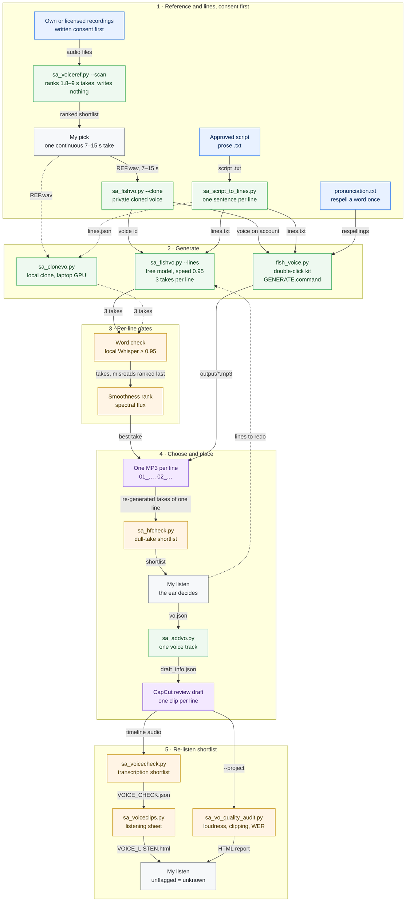
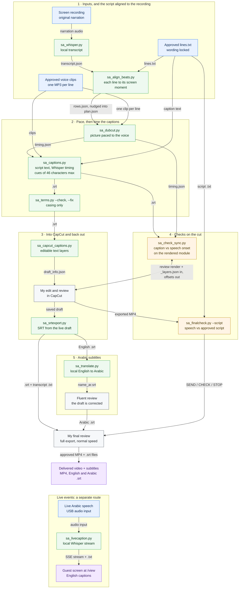

# Cloned-voice voice-over with Fish Audio: one line, one clip, checked

How I turn a script into voice-over in a cloned voice through Fish Audio’s official API – on the free model while it lasts, one line per audio file, every take checked before anyone listens – and the double-click kit that lets a non-technical teammate do the same. The code was written by AI coding agents (Claude Code and Codex) under my direction and review.

The kit is [kits/fish-voice-kit/](../kits/fish-voice-kit/README.md) (three double-click launchers, one Python file, a pronunciation file and a Claude Code skill). The production tools are [`sa_fishvo.py`](../tools/sa_fishvo.py) (best-of-N takes with a local word check), [`sa_clonevo.py`](../tools/sa_clonevo.py) (local cloning and the choppiness measure), [`sa_voiceref.py`](../tools/sa_voiceref.py) (finding the best reference take), [`sa_voicecheck.py`](../tools/sa_voicecheck.py) and [`sa_hfcheck.py`](../tools/sa_hfcheck.py) (shortlists for a human ear). The voice feeds [training-video-production.md](training-video-production.md) and [hyperframes-brand-tutorials.md](hyperframes-brand-tutorials.md).

> **Consent first.** Clone only voices you own or have explicit permission or a licence to use. A voice you can only hear through someone else’s product is not yours to clone, and a person’s voice is theirs: get their written agreement for the specific use before uploading a single sample.

## Status at a glance

| Part | Status | Notes |
|---|---|---|
| API route with best-of-N takes and a local word check ([`sa_fishvo.py`](../tools/sa_fishvo.py)) | **Built, in use** | Voices training modules and an animated course, line by line |
| Double-click kit for non-technical users ([kits/fish-voice-kit/](../kits/fish-voice-kit/README.md)) | **Pilot** | Built and tested end to end on a real account; self-test passes; handed to a teammate for Arabic and English voice work |
| Pronunciation-fix file | **Built, in use** | A word only has to be wrong once |
| Local cloning on the laptop’s GPU ([`sa_clonevo.py`](../tools/sa_clonevo.py)) | **Pilot** | Built and measured; the API route replaced it for production lines |
| Automatic “this voice sounds wrong” detector | **Experimental – not reliable** | Five acoustic measures failed; transcription is a shortlist only |

## The workflow, tool by tool

Every box is the tool or the person that does the step, and every arrow names the file it hands on. Colours: blue is source material, green a tool, amber a check, grey my own review, purple an output ([legend](workflows.md#how-to-read-the-diagrams)). Every step, with what goes in and what comes out, is in the [step table in workflows.md](workflows.md#steps-voice-over-and-captions), with a run example.

**Voice-over: one checked clip per line**



*A recording I own or am licensed to use becomes a private cloned voice, and the approved script becomes one checked MP3 per line, placed as its own clip on one voice track.* **Maturity:** the API route is Built, in use; the double-click kit is a Pilot; the local clone is a Pilot. The word check and the smoothness ranking only choose between takes. [`sa_hfcheck.py`](../tools/sa_hfcheck.py), [`sa_voicecheck.py`](../tools/sa_voicecheck.py) and [`sa_vo_quality_audit.py`](../tools/sa_vo_quality_audit.py) are Experimental shortlists for my ear and never pass a line. Anything I reject is respelt in `pronunciation.txt` or generated again.

**Where the voice goes next: captions, SRT export and live captions**



*Caption words come only from the approved script, and only their timing comes from the audio. The captions go into CapCut as editable text and come back out as SRT for delivery and for Arabic drafts. Live events use a separate local route that uploads nothing.* **Maturity:** script-locked captions, CapCut caption import and SRT export are Built, in use. Arabic translation is Built, in use, for drafts only, and is always reviewed. Live captions are a Pilot. [`sa_check_sync.py`](../tools/sa_check_sync.py) and [`sa_finalcheck.py`](../tools/sa_finalcheck.py) give me evidence to review and release nothing; my final review releases the delivery.

## Contents

1. [The route](#1-the-route)
2. [The kit: three double-clicks](#2-the-kit-three-double-clicks)
3. [The free model, and the loud fallback](#3-the-free-model-and-the-loud-fallback)
4. [One line, one clip – and no 500-character limit](#4-one-line-one-clip--and-no-500-character-limit)
5. [Speed is measured, not chosen](#5-speed-is-measured-not-chosen)
6. [Pronunciation: fix the word once](#6-pronunciation-fix-the-word-once)
7. [Quality gates](#7-quality-gates)
8. [The reference sample](#8-the-reference-sample)
9. [Accounts and keys](#9-accounts-and-keys)
10. [Running it from Claude Code](#10-running-it-from-claude-code)
11. [Traps](#11-traps)
12. [What isn’t solved](#12-what-isnt-solved)

---

## 1. The route

```
script (one line per sentence)
  → pronunciation fixes applied (pronunciation.txt)
  → Fish Audio API, cloned voice, free model, measured speed
  → 3 takes per line → local word check drops misreads → smoothest kept
  → trailing silence trimmed, loudness matched
  → one MP3 per line, named in order (01_…, 02_…)
  → detached voice track in the edit, one clip per line
```

What goes where: **the script text is sent to Fish Audio to be spoken; nothing else is.** The word check, the smoothness ranking and the loudness work run locally and upload nothing. Keep confidential wording out of anything you send to any voice service.

## 2. The kit: three double-clicks

The [Fish Voice Kit](../kits/fish-voice-kit/README.md) is for someone who will never open a terminal:

| File | What it does |
|---|---|
| [`SETUP.command`](../kits/fish-voice-kit/SETUP.command) | Installs ffmpeg (through Homebrew) and `requests` into a private `.venv` inside the folder, creates `fish_key.txt` with `chmod 600`, and opens it for the key to be pasted in |
| [`GENERATE.command`](../kits/fish-voice-kit/GENERATE.command) | Speaks every line of `lines.txt` into `output/`, one MP3 per line, trimmed and levelled |
| [`MY_VOICES.command`](../kits/fish-voice-kit/MY_VOICES.command) | Lists the voices actually on the account(s), with their ids |
| [`fish_voice.py`](../kits/fish-voice-kit/fish_voice.py) | Everything above, plus `--say`, `--speed`, `--clone`, `--credit`, `--list` and a `--test` self-check. Only one Python package (`requests`); all audio work is ffmpeg |
| [`lines.txt`](../kits/fish-voice-kit/lines.txt) | The script: one line becomes one file; lines starting `#` are notes |
| [`pronunciation.txt`](../kits/fish-voice-kit/pronunciation.txt) | Respellings, `written => how it should sound`, applied to every line |
| [`claude-skill/SKILL.md`](../kits/fish-voice-kit/claude-skill/SKILL.md) | A Claude Code skill so the user can just say “say these lines in my voice” |

Two design decisions matter more than the code:

- **The voice is never typed in by hand.** On the first run the kit reads the account’s own voice list (`GET /model?self=true`), shows public and private voices together, and remembers the one picked. A voice id found by searching the public directory proves only that the voice exists, not that it is the one this person uses – and a private voice cannot be found that way at all. A stored id that is no longer on the account is ignored and the user is asked again.
- **The API key never goes into a chat.** It lives in a local file readable only by its owner; the setup opens that file for pasting, and the tools never print the key.

## 3. The free model, and the loud fallback

Fish Audio selects the model by **HTTP header, not in the request body** (`POST /v1/tts`, Bearer authentication). The models available over the API when this was built were `s1`, `s2-pro`, `s2.1-pro` and `s2.1-pro-free`; checked against the official documentation, not from memory.

- Both tools default to **`s2.1-pro-free`**, which generates at zero API credit. A balance of 0 is not a problem while the free model is accepted.
- Fish has offered the free model for a limited period. **If the API refuses it (402 or 403), the tools fall back to the paid `s2.1-pro` and say so loudly on every line** – “WHICH IS CHARGED”. A silent fall-through would spend money nobody chose to spend.
- When that warning appears: stop, check the balance (`--credit`), and decide before generating a batch.
- Fish’s own speech-to-text (`/v1/asr`) is billed against API credit and is **not** covered by the free model; a free account gets 402. The kit’s read-back check switches itself off once, with a message – a check that silently does nothing looks like a pass. The production tool does its word check locally instead (section 7).

## 4. One line, one clip – and no 500-character limit

The web page caps a generation at 500 characters, which once meant splitting a long transcript into blocks by hand. **That cap belongs to the web tier: over the API a whole line goes in one call** (`chunk_length`, 100–300, only controls internal batching).

But the right unit is still **one sentence per line, one file per line**:

- Text-to-speech quality sags towards the end of a long take; short lines stay even.
- One clip per line lands in the edit as one draggable clip on the voice track, so a single line can be moved, re-timed or replaced without touching the picture.
- Re-running one line is free on the free model, so an important line can be generated two or three times and the best kept.
- Filenames carry the order and the start of the words (`03_steep_for_three_minutes.mp3`); a line in a non-Latin script gets `line_03.mp3` rather than a row of underscores.

Settings used for every line: WAV out, `normalize` on, `latency: normal`, `temperature` and `top_p` at 0.7, prosody speed as measured (section 5). **Settings do not transfer between engines**: a stability value tuned on another text-to-speech service means nothing here.

## 5. Speed is measured, not chosen

The commonest complaint is “too slow” or “too fast”, and it is not a matter of taste. The speed sitting in the web panel is where someone started, not what was approved – a line at the panel’s 0.7 was heard at once as far too slow.

Measure the approved narration and match it:

1. Take narration that was already approved, with its captions.
2. Compute **words per second per caption cue** and take the median – per cue, so the pauses between lines do not drag the figure down.
3. Generate the same three lines at a few speeds and measure them the same way.

| Speed setting | Words per second |
|---|---|
| Approved narration (median of 61 cues) | **2.74** |
| 0.7 | 1.98 |
| 0.95 | **2.70** |
| 1.0 | 2.85 |

So **0.95** became the production default ([`sa_fishvo.py`](../tools/sa_fishvo.py)). The kit starts at Fish’s 1.0, and its skill tells Claude to run exactly this measurement before changing it.

## 6. Pronunciation: fix the word once

**Do not regenerate a mispronounced line hoping for better.** Respell the word the way it should sound, in [`pronunciation.txt`](../kits/fish-voice-kit/pronunciation.txt), and every line from then on says it correctly:

```
written form => how it should sound
```

The four causes, in the order they occur in Arabic, with their cures:

1. **No vowel marks.** Undiacritised Arabic is ambiguous – the same consonants are several words – so add the vowel marks to the one word that comes out wrong.
2. **Numbers and dates** read digit by digit or in the wrong language: write them out as words.
3. **Latin-script names inside Arabic** switch the accent mid-sentence: write the name in Arabic letters.
4. **Initials** read as separate phrases with pauses: spell out the letter names.

And in English:

- **Spaced capitals pause.** Two capitals joined by “and” (“Q and A”) come out as separate phrases – “Q… and A…”. Bind them: **“Q-and-A”**; the production tool does this to every such pair and warns about any other standalone capital. This is engine-specific; a spelling that behaved on another engine proves nothing here.
- **Product names at the start of a sentence.** A two-syllable product name, spelled plainly, was heard as a different common word when it opened a sentence. Respelt with a doubled vowel, or hyphenated by syllable, it was heard correctly (0.32 s and 0.38 s long); a third respelling turned it into two words and was rejected.
- **Build the list from past failures.** On the first session, go through the scripts and audio already made, play back what was flagged, and add each word. The list is built from a person’s ear, not guessed from the text.

**The pronunciation gate** for names that matter: a take is accepted only if **two different local speech-recognition models both hear the intended word**, and among the takes that pass, the one whose word sounds closest (MFCC distance) to an approved reference recording wins. A name read too slowly stood out the same way: in one series every body occurrence of a product name lasted 0.20–0.36 s, while the sign-off’s take drew it out to 0.46 s – which was exactly the mismatch a listener heard. More on this in [training-video-production.md](training-video-production.md#9-voice-over-lines).

## 7. Quality gates

[`sa_fishvo.py`](../tools/sa_fishvo.py) never hands over a single take. For each line:

1. **Three takes** (`--takes`, default 3).
2. **Trailing silence trimmed** to the engine’s natural tail.
3. **Word check, locally** with faster-whisper: the take’s transcript must match the script at **≥ 0.95** similarity (apostrophes dropped and “&” read as “and” before comparing – an apostrophe once split a correct name in two and failed every good take). Misreads sink to the bottom.
4. **Smoothness ranking** by spectral flux: the 95th percentile of frame-to-frame spectral change over voiced frames. High-frequency energy could **not** hear what a listener calls choppy (0.055 against 0.057 for a choppy and a clear line); flux could (0.119 clear against 0.145 choppy). Lower is smoother.
5. **Loudness matched** to the reference voice’s own files – their measured level and peak – not a broadcast default that flattens the voice. The kit, which has no reference, levels every line to −16 LUFS, true peak −1.5 dB.

The ranking is **a shortlist, not a verdict**. One line a listener disliked measured clean. The ear decides.

For narration that already exists, [`sa_voicecheck.py`](../tools/sa_voicecheck.py) shortlists lines worth a re-listen by transcription error rate. Five acoustic approaches (flatness, high-frequency energy, pitch jumps, roll-off collapse, timbre distance) all failed to separate known-bad lines from good ones; only transcription carried signal – good lines scored exactly 0, three of five bad ones scored 0.05–0.29. That makes it **high precision, about 65% recall**: a line it does not flag is *unknown*, never “good”. [`sa_hfcheck.py`](../tools/sa_hfcheck.py) catches the separate “dull, like an old radio” drift, comparing only takes of the same words.

**Before anything is handed over**, check the output itself: every file exists, is not silent, and runs for a length that fits its word count. A file under half a second is a failed generation; regenerate it rather than ship it. A tool printing “Done” proves a file was written, not that it says the right words.

## 8. The reference sample

A clone is only as good as what it listens to.

- **One continuous take of 7–15 seconds**, clean and bright, from one recording session. **Never a splice.** A montage of many short takes can be good audio and still a bad reference, because the model learns every one of their starts and stops.
- Find the best take by measurement, not by memory: [`sa_voiceref.py`](../tools/sa_voiceref.py) ranks recordings you own or are licensed to clone by level, length, silence and brightness, and checks each with a transcript for stutters and doubled phrases.
- When cloning, supply the reference’s words if you know them (it skips a transcription step), and keep the voice **private**.

**The local alternative** ([`sa_clonevo.py`](../tools/sa_clonevo.py)) clones zero-shot on the laptop’s GPU with an MIT-licensed open model, with the same best-of-N and word check, at no cost per line. Check the licence of the **model weights** as well as the code before using any local voice model at work: some popular ones ship weights for non-commercial use only. Use a clone for **new** work, never to patch lines inside a finished series – two engines in one video is exactly the “the voice suddenly changes” fault listeners notice.

## 9. Accounts and keys

`fish_key.txt` takes one key per line, optionally labelled – **one per team member or language**:

```
arabic: sk-fish-…
english: sk-fish-…
```

The kit pools the voices from every key into one numbered list, shows which account each belongs to, and routes each line to the key that owns the chosen voice, so nobody has to match keys to voices by hand. Use it within each account’s plan and Fish Audio’s terms; labels are for telling accounts apart, nothing else.

## 10. Running it from Claude Code

Install the skill once (`mkdir -p ~/.claude/skills/fish-voice && cp claude-skill/SKILL.md ~/.claude/skills/fish-voice/`), restart Claude Code, then talk to it: “which voices are on my account?”, “say these lines in my voice”, “that one is too slow, regenerate it”. The skill encodes the rules above, including the ones an assistant is most likely to break: find the kit folder rather than assume its path; never write a voice id from a directory search or from memory; never ask for the key in chat; measure speed instead of copying the panel; add a pronunciation entry instead of re-rolling; stop at the paid-model warning; and verify the files before handing them over.

## 11. Traps

| Trap | What happened | Guard |
|---|---|---|
| Model in the body | Fish chooses the model from a request header, not from the body | Send it as the `model` header |
| Silent spend | A refused free model could fall through to the paid one | Loud warning on every charged line; check `--credit` before a batch |
| Read-back on a free account | Fish’s speech-to-text returns 402 on free accounts | Switch the check off once, say so; check words locally instead |
| Speed copied from the panel | The panel’s value was where someone started | Measure words per second against approved narration |
| Initialisms | “Q and A” paused mid-phrase | Bind with hyphens; read the output back |
| Apostrophes in the word check | A correct name with an apostrophe split in two and failed every take | Drop apostrophes before comparing |
| A spliced reference | Many short takes taught the model many starts and stops | One continuous 7–15 s take |
| Voice id from a search | A public listing proves existence, not ownership | Read the voice list with the account’s own key |
| ffmpeg log levels | `astats` and `silencedetect` report at info level, so `-v error` returned nothing and every take measured silent | Run those filters at info level and parse stderr |
| Takes that never improve | Re-rolling a stubborn line burns time | Stop after about five takes; the wording is probably the problem |

## 12. What isn’t solved

- **No detector hears “this doesn’t sound like the same person”.** Transcription shortlists; the ear decides.
- **The free model is time-limited.** The fallback is loud, but the cost decision is a person’s.
- **Arabic pronunciation still depends on a native ear** to notice the word that is wrong; the file only makes sure it is wrong once.

---

**Related:** [kits/fish-voice-kit/](../kits/fish-voice-kit/README.md) · [training-video-production.md](training-video-production.md) · [hyperframes-brand-tutorials.md](hyperframes-brand-tutorials.md) · [code-rendered-motion-graphics.md](code-rendered-motion-graphics.md) · [security-and-data-policy.md](security-and-data-policy.md)
