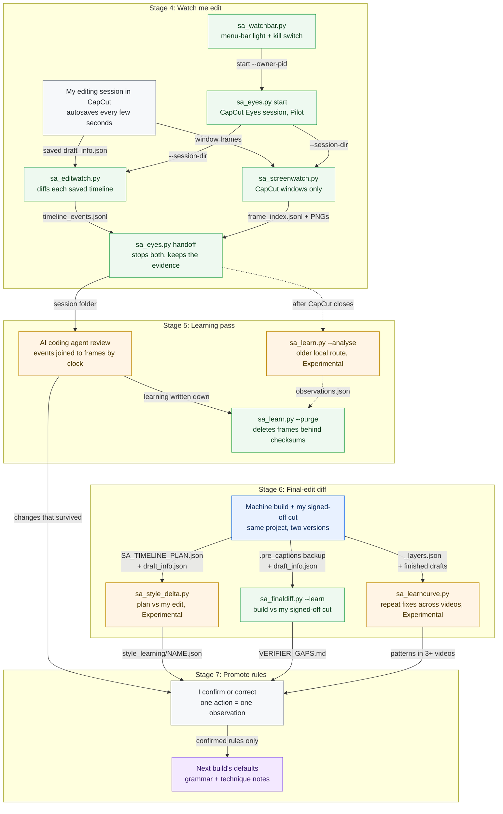
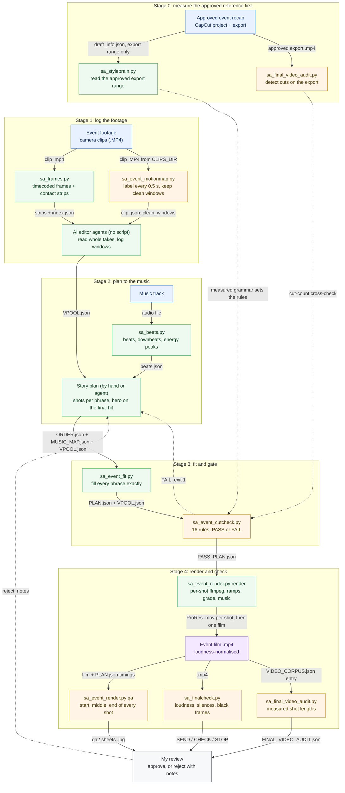
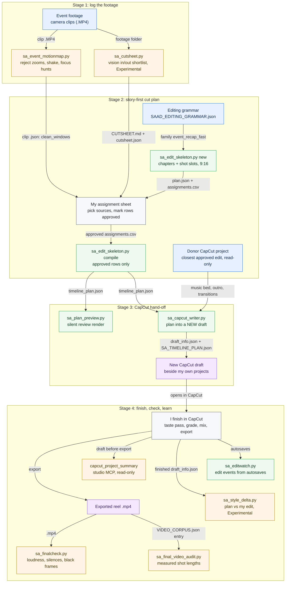

# Learning an editor’s style from finished timelines

I taught my AI production tools to cut the way I cut by measuring my finished timelines, not by describing my taste in prompts. This playbook covers what was measured, what the numbers say, how an AI build is compared with my final cut, and the contract that decides what the AI does and what stays mine.

The tools were written by AI coding agents (Claude Code and Codex) under my direction and review; I did not write them by hand. The editorial decisions they measure are mine. The measured style is also published as data a tool can read – see [section 8](#8-the-data).

**Where the work is done:** the tools in [section 7](#7-the-tools) · the data in [`Reference/`](#8-the-data) · the [CapCut hub](capcut.md), which explains every field of the data files · the read-only watcher, [CapCut Eyes](../apps/capcut-eyes/README.md) · the full records behind this page, [the full editing style](editing-style-full.md) and [editing technique, observed](editing-technique-observed.md).

| Part | Status |
|---|---|
| Style measurement from finished CapCut timelines | **Built, in use** – corpus read; the numbers are in use as planning targets |
| Final-edit diff of finished training videos (`sa_finaldiff.py`) | **Built, in use** – run on finished training videos; three analysed in depth |
| Live edit watching (`sa_editwatch.py`) | **Pilot** – ten monitored projects |
| Plan-versus-final round trip and correction trend (`sa_style_delta.py`, `sa_learncurve.py`) | **Experimental** – one round-trip test so far |
| Story-first edit skeleton and grammar file | **Built, awaiting review** |
| Writing a plan into a new CapCut draft | **Built, awaiting review** – structurally verified; one 27-clip plan built and checked |
| Event-film rebuild chain (motion map → verified windows → fit to music → plan gate → render) | **Experimental** – it has not yet produced a cut I have reviewed; see [section 10](#10-event-films-measure-the-approved-reference-before-cutting) |

## The workflow, tool by tool

How my edits become data the next build reads: a built draft is watched while I edit it, compared afterwards with the cut I signed off, and only what I confirm is promoted. Colours: blue is source material, green a tool, amber a check, grey my own review, purple an output ([legend](workflows.md#how-to-read-the-diagrams)). Every step, with what goes in and what comes out, is in the [step table in workflows.md](workflows.md#steps-capcut-drafts-and-style-learning) (steps 13–22); how the style data is measured and turned into a new draft is drawn in the [CapCut hub](capcut.md#the-workflow-tool-by-tool), and event films have their own flow in [section 10](#the-event-film-workflow-tool-by-tool).



*A built draft is watched while I edit it, compared with the machine build and with my signed-off cut afterwards, and promoted to the next build’s defaults only when I confirm the change.* **Maturity:** the final-edit diff ([`sa_finaldiff.py`](../tools/sa_finaldiff.py)) is Built, in use. CapCut Eyes live watching is a Pilot. The plan-versus-final diff, the correction trend and the older local learning route are Experimental; the local vision route is a shortlist, never a pass gate.

---

## 1. Why measure instead of describe

“Premium, fast-paced, cinematic” means something different to every model and every editor. My finished timelines don’t. So the rule is that evidence of what I actually shipped outranks anything written about it.

The order of authority the tools follow:

1. My approved final export and my final corrections.
2. The timeline and destination format I name as approved.
3. A human-reviewed shot list (cutsheet).
4. The learned grammar and the closest approved edit family.
5. Automatic analysis of the source footage.

Two details matter more than they look:

- **Only the approved export range counts.** A CapCut project often holds unused media, muted experiments and a tail that never made the export. Measuring the whole draft gives the wrong answer.
- **The released video beats the saved export range.** A saved range can be stale or broader than what went out, so the final file has the last word.

---

## 2. What was read

| Corpus | Count |
|---|---|
| Published style set (the source of the cut-rhythm table below) | 56 projects, renamed P01–P56: 39 high-confidence finished export ranges, 3 saved ranges without an outro or music, 14 whole drafts; 51 of them have measurable picture cuts |
| Style playbook evidence | 77 readable project fingerprints, 50 high-confidence export ranges |
| Full structural read, 31 August 2026 | 85 project folders, 95 timelines – 86 readable, 9 encrypted or unreadable |
| Approved exports read directly | 11 |
| Finished training videos checked against their final timeline ranges | 20 |

All of this runs locally. The CapCut project files are opened read-only and never modified.

**Known limits, stated so the numbers aren’t over-trusted.** An earlier automated census measured whole drafts rather than approved ranges, so projects with untrimmed footage skewed long; one of those was re-checked by hand. The census also can’t tell text-light from text-heavy work, only whether text is present. It is supporting evidence, not a replacement for a hand-verified read.

---

## 3. What the numbers say

### Cut rhythm by style (all eight style groups; 51 of the 56 published projects)

The cut rhythm of every style group in [`EDIT_DNA_STATS.json`](../Reference/EDIT_DNA_STATS.json), measured over the same 56 projects as the anonymised style brain. Five of them have no measurable picture cuts, so the figures cover 51 projects and 1,555 cuts.

| Style | Projects | Cuts measured | Median shot (s) | Middle half (s) | Clips with a speed change |
|---|---:|---:|---:|---|---:|
| Fast montage | 1 | 36 | 0.62 | 0.47–0.90 | 8% |
| Luxury event reel | 2 | 47 | 1.10 | 0.75–1.88 | 70% |
| Vertical event montage | 9 | 173 | 1.20 | 0.90–2.00 | 65% |
| Tribute film | 1 | 33 | 1.50 | 1.27–1.90 | 88% |
| Tutorial / explainer | 10 | 678 | 2.20 | 1.80–4.00 | 0.4% |
| Other or mixed | 26 | 519 | 2.50 | 2.10–5.00 | 6% |
| Short tutorial walkthrough | 1 | 16 | 3.43 | 2.63–4.99 | 32% |
| Training animation | 1 | 53 | 8.03 | 4.77–11.77 | 1% |
| **All eight groups** | **51** | **1,555** | | | |

Five of the eight rows rest on one or two projects, so I read them as a direction, not a law. The evidence is mixed, too: 38 of the 51 projects are high-confidence finished export ranges and 13 are saved ranges without an outro or music, or whole drafts – the vertical event montage row, for instance, rests on 4 high-confidence projects and 5 whole drafts. The event styles (13 projects) cut fastest, at medians of 0.62–1.50 s, and three of them lean heavily on speed changes (65–88% of clips). The tutorial styles (12 projects) cut at medians of 2.20–8.03 s and hardly change speed at all, except the single short walkthrough (32%). The tribute film had the most regular rhythm (spread 0.36, one project).

### Edit families (full-library read, 31 August 2026)

The wider read showed that one “reel recipe” is wrong. My work falls into distinct families, each with its own pace and shape:

| Family | Median shot | Default join | Chapter shape |
|---|---|---|---|
| Fast event recap | 0.9–1.8 s | Hard cut; at most 4 structural transitions per 30 s | Hook → arrival → discover → programme → recognition → participation → resolution |
| Premium product event | 0.9–1.3 s | Hard cut; at most 3 per 30 s | Hero detail → place → desire → event energy → signature |
| Tribute film | 1.3–1.8 s | Hard cut; at most 3 per 30 s | Premise → people and place → shared moments → celebration → legacy → brand |
| Designed occasion / interview | 3–5 s | Designed punctuation | Emotional hook → three testimonies → legacy → occasion card |
| Designed greeting | 6–9 s | Minimal | Visual world → message → brand |
| Corporate commercial | 4.5–7 s | Concept-led transitions | Premise → problem → proof through variation → solution → call to action |
| Training tutorial | 2–6 s | Minimal | Title → role → guided steps → verification → outro |

### Patterns that held across approved work

- **Story before inventory.** Chapters come first, then clips. Every shot needs a job: hook, context, action, detail, reaction, payoff or resolution. A repeated person or angle needs a new reason to be there.
- **Hard cuts are the default.** In one approved event recap (60 clips – 59 shots plus the outro – so 59 joins), only 7 joins use a transition. Across the library, a slow fade is the main structural transition. Effects never cover weak sequencing.
- **Fast is not uniform.** Ceremony, emotion and key information get longer holds.
- **The best moment is often deep inside the clip**, not in its first seconds.
- **Speakers are bridged.** Audience or listener reactions sit between podium shots, so a programme doesn’t read as a row of speeches.
- **A square version is a new edit, not a crop.** In one approved event film, the square cut kept the same 60-clip timing but every main shot was reframed by hand, normally at around 1.78× scale. The vertical and square versions also ended on different outro shots.
- **Real beats synthetic.** In event work, synthetic product imagery inside a real recap reads like an e-commerce post. Authentic footage wins.
- **Natural sound earns space.** A real human or tactile moment keeps its sound, and the music ducks around it.

---

## 4. Watching an edit happen

CapCut saves the whole timeline to JSON every few seconds while I work. [`sa_editwatch.py`](../tools/sa_editwatch.py) reads those saves and turns them into plain-English edit events: which box moved and where, how long a freeze was held, which word was retyped. It uses no screen capture and sends nothing to an outside service.

One 29-minute session on a 291-second training video:

| Measure | Value |
|---|---|
| Edit actions | 216 |
| Dead time removed | 14.4 s, in four ripple deletes (6.10, 3.33, 2.47 and 2.50 s) |
| Holds added | 8.9 s |
| Net change | 5.5 s shorter |
| Freezes I settled on | five; three at exactly 2.30 s, range 0.67–2.30 s |
| Median time between actions | 5 s |
| Moves of 10 px or less | 4% |

The repeatable unit turned out to be **freeze first, then lay the label over it, with the label slightly longer than the freeze**. Both are anchored to the same timestamp.

### Observation is not habit

Two conclusions looked solid from the numbers and failed once someone asked me what had happened:

- A zoom to 248% was not a style choice. I was magnifying the preview to inspect it.
- 84 captions sliding earlier did not mean the caption timing was late. They moved because I had ripple-deleted upstream.

The rule since then: **an action seen once is an observation.** Ask what it was for before turning it into a rule. A pattern that shows up in three or more finished videos is no longer taste. It is a defect in the build defaults, and [`sa_learncurve.py`](../tools/sa_learncurve.py) reports it that way.

### A measurement trap

CapCut stores a freeze frame as a PNG. Counting those as call-outs turned 18 call-outs into 46, which produced the confident and wrong finding that I had added 28 boxes. [`sa_finaldiff.py`](../tools/sa_finaldiff.py) now filters that pattern out before comparing anything.

---

## 5. The AI build against my final cut

When I sign a video off, the gap between what was built and what I was willing to ship becomes a specification. Every difference is something the pipeline should have done. Three finished software-training videos were compared in depth:

| | Video A | Video B (inserted section) | Video C |
|---|---|---|---|
| AI build | 291.7 s | 175.1 s | 233.9 s |
| My final | 253.9 s (−13%) | 159.1 s (−9%) | 180.4 s; 57.5 s removed in 16 ripple deletes |
| Freezes | 0 → 6 (median 2.83 s) | baked into the picture → 11 separate stills (median 3.0 s) | closing freeze rebuilt as a separate still |
| Call-out time on screen (median) | 3.10 s → 1.60 s | 2.47 s → 1.73 s; eight set to exactly 1.50 s | 11 of 30 markings moved |
| Structure | 19 tracks → 10; all call-outs on one lane | 15 of 22 call-outs nudged; 3 long narration lines split at the action | all 32 voice lines kept |

Across ten monitored projects, the edit watcher logged 153 repositioning actions, 200 clip-shortening actions and 54 holds. These are action events, not unique decisions, so they are not converted into a percentage. They do show that the correction pass was substantial, not cosmetic.

One systematic gap stood out. The call-out planner treated “sign in” as an opening step, so it marked the first role and none of the switches after it. Across the series, the script told the trainee to change role 30 times, and only 13 of those had a call-out.

### What changed in the build defaults as a result

- A call-out at **every** role switch. The login marking goes on the account row the trainee actually clicks, not on the search field.
- Call-out hold on a moving screen down to about **1.5 s**. A hold for the full narration line only happens on a frozen explanatory screen. Later this was refined to hold for the clause that names the control, plus 0.2 s lead and 0.3 s tail.
- Freezes become **separate, trimmable stills**, not holds baked into the paced picture.
- All call-outs go on **one track**, not one track each.
- **Dead time is cut by rule:**
  - after a line ends on a settled screen, 0.3–0.6 s (median 0.6);
  - an action between two lines, 1–3.5 s (median 2.3);
  - a result moment such as a success message, about 4.5 s;
  - silent rows of 2.5 s or less are left alone; rows of 2.7 s or more are cut unless they show a result or a demonstration.
- A compound line (“do X, then Y”) is **split at the action**, so each half plays on its own click.
- **Captions:** 46 characters is the point to start a new cue, not a hard cap. A cue can run to 54 to keep a phrase whole. A capitalised name or on-screen string is never split.
- An **occlusion check on the rendered cut** runs before handover. In one video, four labels shipped covering on-screen text and cost four of my eleven moves.
- **Endings** cut at the last click: about 2.2 s of silent still, then the sign-off, then about 0.6 s of tail.

### Training defaults, and how they moved

| Setting | Earlier default | Current evidence |
|---|---|---|
| Freeze hold | 2.2 s | about 3.0 s median across 20 finished modules; 6 s or more on dense screens |
| Call-out hold | 2.1 s | about 1.5 s on a moving screen; the whole line on a frozen explanatory screen |
| Click before its narration | – | can lead by up to about 5 s if the visual step stays clear |

---

## 6. The human–AI editing contract

Agreed on 16 July 2026 between me and both AI agents. Its core: the editor is the only window I work in, and everything else is plumbing I shouldn’t have to see. The rules below merge that contract with the rules for AI-assisted editing in my style playbook.

```
I brief the AI in plain language
        ↓
Local tools analyse footage and dialogue (frames, vision model, Whisper)
        ↓
The AI chooses extracts, in/out points and story order
        ↓
Plan → a new project in the editor (a new CapCut draft)
        ↓
It opens as a NEW editable sequence beside my existing work
        ↓
I review, adjust and finish normally
        ↓
After picture lock: plan vs final diff → style delta → next rough cut lands closer
```

### Rules the AI follows on every edit request

1. Analyse footage locally first. No fire-then-fix.
2. Use exact source in/out points, with count-ins trimmed using Whisper word timings.
3. Follow the story order from the brief or storyboard. Deliver an editable rough cut only.
4. Build a **new** sequence or project. Never touch my working or final timelines.
5. Present the edit as a first assembly until I approve it. Separate objective assembly work from taste decisions in the handover.
6. Turn uncertain decisions into markers, labelled slates or alternate tracks, and flag them in the review note.
7. Tell me only which file to import or which button to press.
8. Verify the actual export, not just the timeline data.
9. For corrections, deliver assets and timestamps. Don’t place replacement audio in my timeline unless I ask.
10. After I finish, compare my final with the plan and record the difference as the new authority.

### The honest capability line

| The AI reliably automates | Stays mine, by design |
|---|---|
| Selects; silence, filler and retake removal | Complex speed ramps |
| Story order from a brief | Advanced transitions |
| Linked audio/video cuts; multi-track builds | Reframing and tracking |
| Placeholders and markers | Grading |
| New-sequence creation | Motion graphics and the audio mix |
| Tracking my autosaves | Final taste |

For my training-video work, my own estimate is that the AI contributed **about 40%** (research, automation, first assembly, repeatable production) and I contributed **about 60%** (taste, domain accuracy, corrective editing, final timing, QA, approval and delivery). I don’t claim a different split without a project-by-project comparison of each AI handover against the approved result.

---

## 7. The tools

| Step | Tool |
|---|---|
| Encode finished projects into style fingerprints (the saved export range; the whole draft only as a flagged low-confidence fallback) | [`sa_stylebrain.py`](../tools/sa_stylebrain.py) |
| Mine cut length, rhythm spread and speed-change share per style | [`sa_editdna.py`](../tools/sa_editdna.py) |
| Score shots technically (sharpness, exposure, jitter, duplicates) | [`sa_extract.py`](../tools/sa_extract.py) |
| Build a chapter map and semantic shot slots before placing clips | [`sa_edit_skeleton.py`](../tools/sa_edit_skeleton.py) |
| Plan and validate an editor-neutral timeline | [`sa_timeline.py`](../tools/sa_timeline.py) |
| Write the plan into a new CapCut draft | [`sa_capcut_writer.py`](../tools/sa_capcut_writer.py) |
| Compare the plan with my finished edit | [`sa_style_delta.py`](../tools/sa_style_delta.py) |
| Watch an edit live from CapCut’s autosaves | [`sa_editwatch.py`](../tools/sa_editwatch.py) |
| Diff a finished training video against its build | [`sa_finaldiff.py`](../tools/sa_finaldiff.py) |
| Track whether recurring corrections are falling | [`sa_learncurve.py`](../tools/sa_learncurve.py) |
| Encode the measured pacing, caption and placement rules as a tested library | [`sa_markrules.py`](../tools/sa_markrules.py) |

The timeline plan format is documented in [`templates/timeline_plan.schema.json`](templates/timeline_plan.schema.json).

---

## 8. The data

The style itself is published as data, in three files a tool can read:

| File | What it holds | Tools |
|---|---|---|
| [`SAAD_EDITING_GRAMMAR.json`](../Reference/SAAD_EDITING_GRAMMAR.json) | The authority order; story, selection, transition, sound, format and finishing rules; four delivery formats; the seven edit families of section 3, each with its typical length, cut rhythm, speeds, transition budget and chapter template; and the validator’s thresholds | Read by [`sa_edit_skeleton.py`](../tools/sa_edit_skeleton.py), which builds and validates a chapter map from it |
| [`EDIT_DNA_STATS.json`](../Reference/EDIT_DNA_STATS.json) | Per style: cut-length percentiles, rhythm spread, share of clips with a speed change, common speeds and layer density for eight style groups, measured over the same 56 projects as the anonymised style brain (51 with measurable cuts, 1,555 cuts) – the source of the cut-rhythm table in section 3 | Written by [`sa_editdna.py`](../tools/sa_editdna.py) from the style fingerprints that [`sa_stylebrain.py`](../tools/sa_stylebrain.py) encodes |
| [`capcut_style_brain_anonymised.json`](../Reference/capcut_style_brain_anonymised.json) ([summary](../Reference/capcut_style_brain_anonymised.md)) | One fingerprint per project – 56 projects renamed P01 to P56: canvas, approved range, shot lengths, speeds, where in each source clip the shot starts, reframing, transitions, style family and how much evidence backs it | An anonymised copy of the private fingerprint file, with per-segment detail, client-restricted work, empty drafts, AI-built drafts and duplicates removed |

The full fingerprint file stays private, because it names projects and keeps every segment. [`sa_timeline.py`](../tools/sa_timeline.py) plans from that full file, not from the stats or the anonymised copy, so to use it on your own work, run `sa_stylebrain.py` over your own CapCut projects first. Every field of all three files is explained in the [CapCut hub](capcut.md#3-editing-grammar-and-cut-rhythm-as-data).

---

## 9. If you want to try this on your own edits

- Start with **one finished edit you are proud of** and measure only its exported range.
- Keep raw project files **read-only**, and always generate into a new project.
- Diff **every** video you sign off against what you were handed. That diff is the most useful feedback you will get.
- Before a pattern becomes a rule, **ask what the action was for**.
- Write down which decisions the AI may make and which stay with you, and keep that line honest as it moves.

---

## 10. Event films: measure the approved reference before cutting

An AI first cut of an event film was rejected outright: too slow, not cinematic, the wrong shots and the wrong story. It held shots for about 2 s through its first half, opened on the venue and on text from LED screens, and leaned on static slow motion. When I rejected it, I named an approved event recap of mine as the reference, and only then was that reference measured. The lesson is the order: **measure the approved reference first, then cut.**

### The grammar of my approved event recap

A read-only structural read of the approved timeline, checked against its export. A cut detector run on the export found 56 of the 59 joins; the three it missed were the soft transitions, which is the expected failure.

| Measure | Value |
|---|---|
| Body | 59 shots in 60.3 s, then the outro |
| Shot length | Median 0.97 s (p25 0.82 s, p75 1.18 s); the longest, 2.07 s, is the closing group photo |
| Density | About 10 shots per 10 s (9.8) |
| Speed | 0.79× on 45 of 60 clips, 1.0× on 9, and deeper slow motion (0.39–0.69×) only on 5 hero details. No speed curves |
| Framing | 10 static reframes (1.06–2.28×); no keyframed push-ins |
| Transitions | 7 of 59 joins, all at chapter changes: two cross fades (0.53 s), three glow transitions (0.33–0.73 s), one fade shift (0.4 s), one slow fade (0.4 s) into the outro |
| Music | One occasion song from 0:00 to its own ending, unedited; fades 0.57 s in and 1.23 s out |
| Sound | Music at 0.43, ducked to about 0.11 under a single 2.1 s natural-sound bite – a host’s voice laid under detail shots |
| Beat-locking | None. Against random cut placement (a Monte Carlo test), p ≈ 0.41 |
| Loudness | −18.7 LUFS on the export |

The AI-built version I replaced had a 2.0 s median, everything at 1.0× and no transitions.

### Rules from that rejection

- **Open on people and motion, with energy from the first second.** Don’t lead an event film with venue, LED-wall text or empty-room shots.
- **Read the whole of a long take.** Clips over about 30 s are continuous takes: read all of it and pick the right chunk, never the first usable seconds.
- **Reject optical-zoom windows.** Never use a stretch where the lens is zooming in or out, and never a host caught mid-explanation.
- **Understand, then plan, then edit.** Analyse every clip frame by frame before planning, not pick-and-cut.
- **Never caption a name from seat position.** On-screen name cards did not match who sat where.

### The event-film workflow, tool by tool

Two routes from the same event footage: **A** rebuilds the film from raw footage against the measured reference and renders it with ffmpeg; **B** takes a story-first plan into a new, editable CapCut draft that I finish by hand. Colours: blue is source material, green a tool, amber a check, grey my own review, purple an output ([legend](workflows.md#how-to-read-the-diagrams)). Every step, with what goes in and what comes out, is in the [step table in workflows.md](workflows.md#steps-event-films-and-reels).

**A. Event film: the rebuild chain**



*An event film rebuilt from raw footage: the approved reference is measured first, then the footage is logged and checked for camera motion, shots are fitted to the music, the plan is gated, and the film is rendered and checked. Dotted lines are measurements that set the gate’s rules (not files the gate reads) and the two loops back to the story plan.* **Maturity:** Experimental – the chain has not yet produced a cut I have reviewed.

**B. Event reel: from a story skeleton to an editable CapCut draft**



*An event reel goes from logged footage, through a story-first plan, into a new editable CapCut draft and then to export checks.* **Maturity:** the skeleton and the CapCut writer are Built, awaiting review. The cut sheet is an Experimental vision-model shortlist, the edit watcher is a Pilot and the style delta is Experimental.

### The rebuild chain (Experimental)

| Step | Tool | What it does |
|---|---|---|
| 1. Motion map | [`sa_event_motionmap.py`](../tools/sa_event_motionmap.py) | Samples each clip at 10 fps (480 × 270, greyscale) and labels every 0.5 s: `lens_zoom` (scale changing with a clean similarity fit, i.e. optical zoom – reject), `push` (scale changing with parallax, i.e. walking in – usable), `whip` (a pan faster than about 45% of the frame width a second – a cut point only), `shake` (reject), `focus_hunt` (sharpness dipping more than 45% under its local median while the camera is near-still – reject), `exposure` (mean brightness jumping more than 18 levels in 0.5 s while near-still – reject) or `stable`. Thresholds were calibrated by eye on one shoot; retune them per camera |
| 2. Verified window pool | – | Usable windows are checked and logged before planning. Five parallel AI editor agents logged 137 verified windows from 52 minutes of footage in about 20 minutes |
| 3. Fit to the music | [`sa_event_fit.py`](../tools/sa_event_fit.py) | Fills each music phrase exactly with an ordered shot list: durations start at the window length ÷ 0.79, then stretch (down to 0.69×, or 0.5× on flagged high-frame-rate hero shots) or shrink so every phrase lands on its boundary |
| 4. Plan gate | [`sa_event_cutcheck.py`](../tools/sa_event_cutcheck.py) | Passes or fails the plan before anything renders (exit code 1 on any failure) – see the rules below |
| 5. Render | [`sa_event_render.py`](../tools/sa_event_render.py) | Per-shot ffmpeg render with speed-ramp curves, push-ins, grade, a per-shot fix for faces lit by LED walls, cut / fade / flash / dip transitions, a loudness-normalised music edit, and start, middle and end QA sheets for every shot |

**The gate’s rules**, written from the approved reference: the final shot starts on the song’s final hit (±0.03 s) and lasts 2.0–3.0 s; body median 0.95–1.15 s, p25 at least 0.70 s, p75 at most 1.30 s, no body shot over 2.1 s; at least 8 shots in the first 10 s and a first shot of 1.6 s or less; every shot inside its verified window; speeds between 0.39× and 1.1×, below 0.69× only on 100 fps clips, and no more than three deep slow-motion shots; no more than four transitions; no duplicate source moments, no clip twice in a row, no keyframed push-ins. The shot-count band (33–38 body shots) is set for the target length.

Two ffmpeg traps from the renderer: `crop` evaluates its width and height once, so push-ins use `zoompan` (one output frame per input frame, zoom driven by the frame number); and `xfade` needs matching `settb` and `setpts` on both inputs.

---

## Related

- [CapCut hub](capcut.md) – how I work in CapCut, every field of the style data, and every CapCut tool.
- [The CapCut draft format](capcut-draft-format.md) – the files these measurements are read from.
- [CapCut Eyes](../apps/capcut-eyes/README.md) – the watcher behind section 4.
- [Editing technique, observed](editing-technique-observed.md) – every watched session in full.
- [The full editing style](editing-style-full.md) – the evidence-based style playbook.
- [Training-video production](training-video-production.md) – where the training defaults in section 5 are applied.
- [CapCut live eyes](capcut-live-eyes.md) – the working note behind the watcher.
