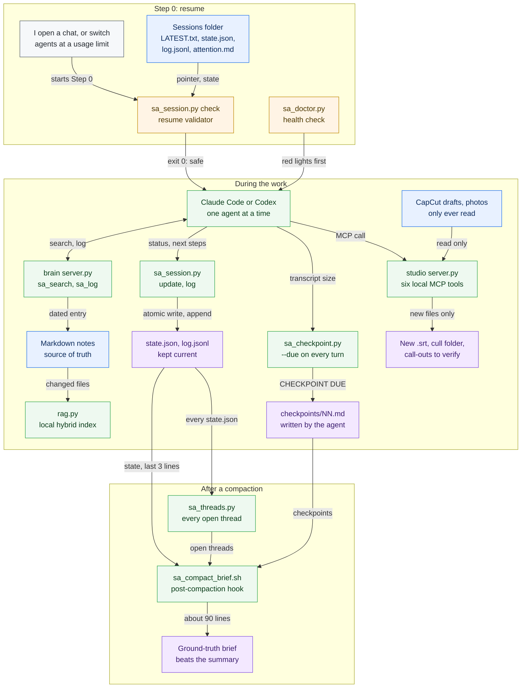
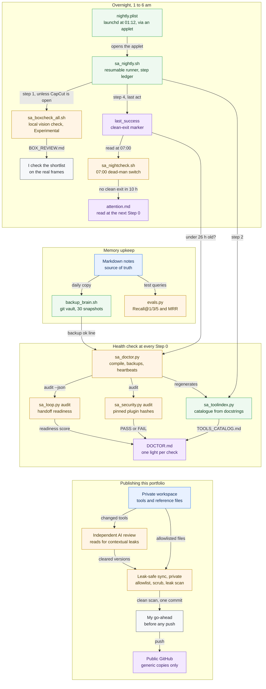

# Running two AI agents in one workspace

I work with two AI coding agents – Claude Code and Codex – and switch between them when one hits its usage limit, often mid-task. Neither can see the other’s chat, so everything they share lives on disk: a session folder that says where we are, an append-only log of how we got there, and a long-term memory both can search. A clean, cut-down starter version of the set-up is in [`../workspace-kit/`](../workspace-kit/) (see [Reading the kit](#reading-the-kit) for what it leaves out).

The tools behind it: [`sa_session.py`](../tools/sa_session.py) (writes and validates the session files), [`sa_threads.py`](../tools/sa_threads.py) (every open thread across all sessions), [`sa_doctor.py`](../tools/sa_doctor.py) (the start-of-session health check), [`sa_checkpoint.py`](../tools/sa_checkpoint.py) and [`sa_compact_brief.sh`](../tools/sa_compact_brief.sh) (decision checkpoints as the context fills, and a ground-truth brief after compaction), and the local memory server in [`../workspace-kit/brain/`](../workspace-kit/brain/). This page is about two agents taking turns on one task; when many agents work at once, see [orchestrating-agent-fleets.md](orchestrating-agent-fleets.md).

## The workflow, tool by tool

Every box is the tool or the person that does the step, and every arrow names the file it hands on. Colours: blue is source material, green a tool, amber a check, grey my own review, purple an output ([legend](workflows.md#how-to-read-the-diagrams)). Every step, with what goes in and what comes out, is in the [step table in workflows.md](workflows.md#steps-the-ai-workspace), with a run example.

**A working session: resume, work, checkpoint, recover**



**Health checks, overnight runs and publishing**



*Two coding agents hand work to each other through files on disk, share one local memory, read projects through a local MCP server and recover from ground truth after compaction, while a health check, an overnight runner and a private leak-safe sync keep the set-up honest.* **Maturity:** Built, in use – the hand-off, the brain, the health check, checkpoints, the compact brief (Claude Code only), the studio MCP server and the nightly runner. The 07:00 dead-man checker is Built, but a macOS permissions regression currently refuses it. The overnight vision check and the morning note are Experimental, and the vision output is a shortlist I check, never a pass. The sync is Built and private.

---

## 1. The problem

1. **Limits hit mid-task.** I run out of usage on one agent, switch to the other, and would otherwise have to re-explain everything.
2. **Context fills up.** Long chats get slow and expensive, and the agent loses the thread.
3. **No shared memory.** Two different AI tools can’t hand work to each other through a chat window.

The fix is plain text files in a folder – no database, no server, no cloud account. Any agent that can read files can pick up the work.

## 2. Three layers

| Layer | What it holds | Where | When it’s read |
|---|---|---|---|
| Instructions | The rules the agent always follows | `CLAUDE.md` (Claude Code), `AGENTS.md` (Codex) | Every turn |
| Session state | What we are doing right now | `Sessions/<date>_<slug>/` | At the start of every session, to resume |
| Long-term memory | Facts, preferences, corrections, past decisions | The memory store and its search index | On demand |

The instruction files stay short, because they load on every turn and a bloated one taxes every reply. Detail lives in reference files that are linked from them and read only when relevant.

---

## 3. The session folder: how the handoff works

```
Sessions/
├── LATEST.txt                  ← name of the active session folder
├── README.md                   ← the protocol, so any agent knows the rules
└── 2026-07-08_<slug>/
    ├── state.json              ← the whiteboard: current truth, edited in place
    └── log.jsonl               ← the logbook: one line per change, append-only
```

`state.json` answers “where are we now?”; `log.jsonl` answers “how did we get here, and who did it?”. The state is JSON rather than prose because two different agents must read it exactly the same way every time. A semantic search is the wrong tool for “what is the current status?” – that needs exact truth, not the closest match.

### One canonical contract

A system audit found six incompatible shapes of `state.json`, missing log events and a stale `LATEST.txt` pointer. The fix was [`sa_session.py`](../tools/sa_session.py) – one command both agents call instead of hand-writing JSON, writing atomically to a fixed schema:

| `state.json` key | Meaning |
|---|---|
| `session` | Folder name |
| `updated` | ISO 8601 timestamp with time zone |
| `agent` | Who wrote it last: `claude`, `codex` or me |
| `purpose` | One line: what this session is for |
| `status` | Short current status |
| `last_action` | The most recent completed step |
| `next` | List of next steps |
| `extra` | Anything session-specific (deliverables, rules, learnings) |

Each log line is `{"ts", "agent", "event", "note"}`, with `event` as a short slug such as `correction` or `vo_generated`. A `check` command validates the folder before a resume and exits non-zero on problems.

---

## 4. Step 0: auto-resume

Both instruction files open with the same rule, which is what lets the agents hand over to each other:

> Before anything else, read `Sessions/LATEST.txt`, then that folder’s `state.json` and the end of `log.jsonl`. Say one line – “Resuming X – last step Y, next Z” – and continue. As you work, keep `state.json` current and add one log line per change.

If I come back to a task, the agent picks it up without asking what we were doing. Step 0 also runs the 0.3-second health check ([`sa_doctor.py`](../tools/sa_doctor.py)) and reads the overnight attention note if one exists. A red light there outranks the plan.

### The daily record

Since 8 July 2026, every working day gets its own session folder, created at the first task of the day and updated after **every** major step – not at the end of the session, and not only when I ask. Compacting a conversation can erase the chat history at any moment, and the session files are the only memory the other agent ever sees. A session file written at the end of the day is a diary; written as you go, it is a save point.

By 5 October 2026 there were 59 dated session folders, the first from 25 June. [`sa_threads.py`](../tools/sa_threads.py) walks all of them and lists every thread still open and everything owed – next steps, things waiting on me, blockers – so a compaction can’t quietly drop one.

---

## 5. Rules that keep the handoff from corrupting

1. **One active agent at a time.** I use Claude *or* Codex, never both at once, so there are no simultaneous writes.
2. **The log is append-only.** Add lines; never edit, reorder or delete old ones.
3. **Overwrite values, keep the shape.** No renamed keys or ad-hoc top-level keys. New kinds of information go under `extra`.
4. **Validate before and after saving.** A broken bracket breaks the next resume.
5. **Tag every log line** with time, agent and event.
6. **Never touch the other agent’s instructions or memory folder.** The shared ground is `Sessions/`.
7. **New session: create the folder, then update `LATEST.txt`.** One source of truth for what’s active.
8. **Attribution.** Since 6 August 2026, everything Codex adds carries the exact marker “(done by codex)”. Where the marker would damage the output – source code, media, client-facing work – the matching session log entry carries it instead. That lets Claude keep track of Codex’s work accurately even after its own context has been compacted.

---

## 6. Long-term memory

The shared memory follows one rule: **Markdown files are the only source of truth; everything else is rebuildable cache.** The search index, the vectors, the agent’s working memory and the chat history can all be lost and rebuilt from the files.

| Part | How it works |
|---|---|
| Two tiers | A small “briefing” loads at session start – standing instincts in full, core facts, and only the headings of everything else, kept under a 12,000-character budget (about 3,000 tokens). The rest is pulled by search when needed. |
| Instincts | One-line, dated reflexes that make the agent behave consistently without being reminded. Added whenever I correct a pattern or approve an approach. Never silently deleted. |
| Hybrid search | Local embeddings (no cloud, no API key) plus keyword search, fused with reciprocal rank fusion (K = 60), a ×1.15 boost when a chunk mentions an entity named in the query, then a re-rank by how many query terms each result covers. |
| Never hard-fail | Only changed files are re-indexed before a search. If the vector layer breaks, search falls back to keywords over the raw Markdown. |
| Corrections | A correction is appended and the old entry is marked superseded; search ranks superseded entries down. Nothing is deleted. |
| Durability | Local backups outside the memory folder, so one bad delete can’t take both: a versioned git repository of the Markdown, rotating snapshots (the last 30) and a one-line log per run. The vector index isn’t backed up – it rebuilds from the files. |
| Evals | A small set of test queries measures Recall@1/3/5 and mean reciprocal rank after any big change, so retrieval decay shows up before it bites. |
| Consolidation | Many writers append; only one agent ever rewrites, during a clean-up pass. When unsure, it flags rather than deletes. |

**Tuning retrieval by measurement, not by feel.** In September 2026 the search was retuned against its own test set rather than by intuition. The failures it found had one cause: on plain fact lookups, project notes and work logs outranked the curated memory files that actually held the answer. The fix weights results by where they come from – curated facts and the reference playbooks get a source-authority boost above project notes. The size of that boost was not tuned to the best score: the gain plateaued across a wide range of values, and the weight was picked from the middle of that plateau so it wouldn’t overfit the test set. Including the reference playbooks in the boosted tier mattered too; leaving them out made one existing test case worse. A query-expansion idea (adding synonyms to each search) was built in the same pass, measured worse on the same test set, and removed completely. The measurements are in [the brain, section 8](the-brain.md#8-evaluation), and the full benchmark is written up in [section 9](the-brain.md#9-the-bm25-benchmark-and-deciding-not-to-switch).

The habit that makes it work: **log in real time.** The commonest way to lose a learning is “I’ll write it at the end” – and then the session dies first.

---

## 7. The sceptic pass

Before acting on any prompt, both agents run a silent accuracy check. I want accuracy over agreement; neither of us is always right.

- Verify important claims before answering – mine included. If I’m mistaken, say why, with reasoning and sources. If uncertain, say so; never guess.
- Keep fact, informed opinion and speculation separate.
- Facts about AI products – model names, prices, limits – come from the official documentation, never from memory.
- Fire the one thinking move that fits: a draft gets critiqued rather than rewritten; a decision gets the opposite case argued at its strongest; a plan gets its blind spot named; copy comes in three versions (safe, punchier, bold); an ambiguous task gets up to three clarifying questions.
- If a missing detail is cheap to get wrong, assume the sensible default and say so in one line. Ask only when a wrong guess would waste time or money, or create risk.

## 8. Autopilot tiers

I direct by brief, not by command line, so the agents work out which capability a task needs and switch it on themselves where they can.

| Tier | Behaviour | Examples |
|---|---|---|
| Silent | Just do it; don’t narrate. | Document and design skills, the right thinking move, memory search, a fresh chat instead of compaction. |
| One line, then go | Recommend in a sentence and proceed. Wait for a yes only for standing configuration or risky changes. | A sub-agent for a big multi-file search, a git worktree for an experimental change, hooks, scheduled jobs. |
| Point, don’t pretend | Name the one switch I have to flip and keep working meanwhile. | App connectors that are off by default, restarting the agent itself. |

Never add a tool just to look busy. If a plain answer will do, use no skill, sub-agent or server at all.

## 9. Division of labour

| Worker | Job |
|---|---|
| Claude Code | Building, deep analysis, pipelines, writing editing projects, judgement calls. |
| Codex | Continuing the work when Claude hits a limit – same Step 0, same rules, its instruction file kept in step with Claude’s. |
| Local vision model (open weights) | Visual memory. A small model by day on temporary 1024-pixel copies, in 20-image runs, pausing while creative apps are open; a larger model overnight. Originals are never touched, and the pass sends nothing to an outside service. |
| Local small language model | English–Arabic subtitle translation. |
| Plain scripts | Everything deterministic. |

Tokens are the scarce resource: anything a local model or a script can do, it does. The agent does only what only the agent can.

**When to spawn a sub-agent:** to sweep many files for an answer, to run a self-contained side task, or as a fresh-context checker that compares finished work against the spec – fresh eyes beat self-review. Never to look busy; each one starts cold and re-reads context.

**Context:** a fresh chat per task beats compacting a long one, because the session files carry the state for free. Screenshots and large dumps are the main drain, so images are described locally first and loaded as pixels only when pixel-exact detail matters.

---

## 10. Traps already hit

| Trap | What happened | Standing fix |
|---|---|---|
| Overwrite instead of merge | An old parser would have silently deleted 16 records. | Merge; never overwrite a data file from a partial source. |
| A job report that wasn’t true | A “done: 150 images” report arrived while the real job was still running. | Check the process list and state files before logging any result. |
| Silent scheduled tasks | Nightly jobs failed invisibly for weeks. | Every scheduled task appends a trace line; the health check flags stale traces. |
| Catch-up runs that did nothing | Every task stamped “ran” in the same second on app launch, with zero output. | Each task writes STARTED and FINISHED to a heartbeat log. |
| Results I never got to see | Things were built and never opened. | Always open the result for me to see. |
| Heavy local AI during the working day | Large models on full-size originals made editing lag. | Small model and temporary copies by day; heavy batches 1–6 am only. |
| Random repository installs | Two trending repositories turned out to be a lossy tool and a boilerplate template. | Sceptic pass first, and log the rejection so it doesn’t resurface. |

---

## Maturity

Labels follow the [status labels in the README](../README.md#status-labels). This is my own working set-up, so “Built, in use” is the honest label: relied on every day, but not itself a delivered output.

| Piece | Status | Code |
|---|---|---|
| Session handoff (pointer, state, log) and Step 0 | **Built, in use** – daily since June 2026 | [`sa_session.py`](../tools/sa_session.py) |
| Open-threads report | **Built, in use** | [`sa_threads.py`](../tools/sa_threads.py) |
| Health check at session start | **Built, in use** | [`sa_doctor.py`](../tools/sa_doctor.py) |
| Decision checkpoints and the post-compaction brief | **Built, in use** | [`sa_checkpoint.py`](../tools/sa_checkpoint.py), [`sa_compact_brief.sh`](../tools/sa_compact_brief.sh) |
| Shared long-term memory with hybrid search | **Built, in use** | [`../workspace-kit/brain/`](../workspace-kit/brain/) |
| Machine-readable handoff receipts (checksums, which checks didn’t pass) | **Planned** – recommended in August 2026 from vetting outside projects; not part of the handoff described here | – |

## Reading the kit

[`../workspace-kit/`](../workspace-kit/) is a cut-down starter version of the same system, with everything specific to my work removed. Start with [`README_START_HERE.md`](../workspace-kit/README_START_HERE.md), then [`HOW_IT_WORKS.md`](../workspace-kit/HOW_IT_WORKS.md); [`SYSTEM_GUIDE.html`](../workspace-kit/SYSTEM_GUIDE.html) is the same tour as a visual page.

**What it includes:**

| Layer | What ships | Files |
|---|---|---|
| Instructions | The two instruction files with the shared resume step (Step 1 in the kit, after a first-run interview), plus a system prompt for chatbots with no file access. | [`CLAUDE.md`](../workspace-kit/CLAUDE.md), [`AGENTS.md`](../workspace-kit/AGENTS.md), [`SYSTEM_PROMPT.txt`](../workspace-kit/SYSTEM_PROMPT.txt) |
| Sessions and memory | The `Sessions/` protocol with the same eight-key `state.json` shape, a memory index, and the full portable memory specification – the inbox hand-off between agents, write discipline (many appenders, atomic writes), one consolidator, and a four-file minimum to start with. | [`Sessions/README.md`](../workspace-kit/Sessions/README.md), [`memory/MEMORY.md`](../workspace-kit/memory/MEMORY.md), [`Reference/AGENT_MEMORY_PROTOCOL.md`](../workspace-kit/Reference/AGENT_MEMORY_PROTOCOL.md) |
| Reference | The thinking moves, capability routing, a starter data policy and plugin registry, role packs for different jobs, recommended skills, a Claude Code operations cheat sheet, and the distilled lessons. | [`Reference/`](../workspace-kit/Reference/HARD_WON_LESSONS.md) |
| Organisation layer | How to run several agents like a small company: six departments with half-page charters, a catalogue of specialist roles, and the rule that no agent approves its own work. Guidance, not yet run as a standing organisation – see [agent-organisation.md](agent-organisation.md). | [`AGENT_ORCHESTRATION.md`](../workspace-kit/AGENT_ORCHESTRATION.md), [`ROLES.md`](../workspace-kit/ROLES.md), [`charters/`](../workspace-kit/charters/quality.md) |
| Onboarding and upkeep | A longer first-run interview, a one-page cheat sheet, a maintenance guide (the monthly review, a growing memory folder, leaving with your data), an optional Obsidian map of the workspace, and a note on where the system came from. | [`FIRST_RUN.md`](../workspace-kit/FIRST_RUN.md), [`CHEAT_SHEET.md`](../workspace-kit/CHEAT_SHEET.md), [`MAINTENANCE.md`](../workspace-kit/MAINTENANCE.md), [`OBSIDIAN.md`](../workspace-kit/OBSIDIAN.md), [`ORIGIN.md`](../workspace-kit/ORIGIN.md) |
| Progress measurement | A before-and-after record – a baseline of how long regular jobs took, one line per finished job, and a report that counts only jobs with both – plus an optional tracker that reads only file names and modification times in folders you name. **Experimental:** the numbers have not been tested against gaming. | [`progress/README.md`](../workspace-kit/progress/README.md), [`Tools/progress.py`](../workspace-kit/Tools/progress.py), [`Tools/autotrack.py`](../workspace-kit/Tools/autotrack.py) |
| Claude Code customisation | An editor sub-agent that reads its taste spec first, two skills (the training-video pipeline and the engineering method), the discipline hook that re-injects the operating rules each turn and calls [`sa_checkpoint.py`](../tools/sa_checkpoint.py), and an example settings file that also wires the post-compaction brief, [`sa_compact_brief.sh`](../tools/sa_compact_brief.sh). Both of those scripts are copied in from [`../tools/`](../tools/README.md). | [`.claude/`](../workspace-kit/.claude/README.md) |
| Helpers | Small scripts – media glue, a security gate, a memory-health map, a share-what-you-learnt export, the scheduling templates for unattended nightly runs, and launchers. | [`Tools/`](../workspace-kit/Tools/security_gate.py), [`scheduling/`](../workspace-kit/scheduling/README.md) |
| Local search | The optional local memory server with hybrid search, backups and a retrieval test set – code only, no memory. | [`brain/`](../workspace-kit/brain/SETUP.md) |

**What it leaves out:** the session tool that writes `state.json` to the contract and validates a folder before a resume (section 3), the open-threads report and the start-of-session health check (section 4). In the kit, session files are kept by hand from the written protocol, and nothing checks them automatically. The three tools are published separately in [`../tools/`](../tools/README.md) – [`sa_session.py`](../tools/sa_session.py), [`sa_threads.py`](../tools/sa_threads.py) and [`sa_doctor.py`](../tools/sa_doctor.py) – but they are not wired into the kit. The kit also ships no memory, no search index and no session history: each user grows their own.

Like the rest of this repository, the kit is shared for review; please ask before reusing it.

**Related:**

- [agent-organisation.md](agent-organisation.md) – the agent-organisation handbook in one page
- [orchestrating-agent-fleets.md](orchestrating-agent-fleets.md) – many agents at once: fan-out, verification and their limits
- [ai-engineering-method.md](ai-engineering-method.md) – how the agents are directed to build and verify
- [local-ai-on-a-mac.md](local-ai-on-a-mac.md) – the local models and scheduled jobs in the division of labour
- [learning-from-mistakes.md](learning-from-mistakes.md) – why a rule in an instruction file is not a guard
- [security-and-data-policy.md](security-and-data-policy.md) – what each agent may send where
