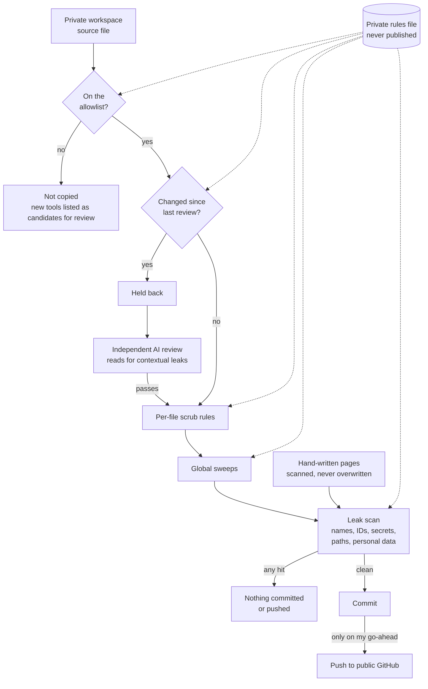

# Security and data policy

The studio workspace holds internal and client material on one Mac, worked on by AI agents that can read files and call cloud services. The policy is short: classify every file, let the class decide what an outside service may receive, pin every third-party plugin to an audited version, and make every gate fail closed. The last section explains how this portfolio itself is kept clean – and what an automated leak scan cannot see.

The code: [`sa_security.py`](../tools/sa_security.py) (data classes, the media gate, the kill switch and the plugin audit), [`sa_provenance.py`](../tools/sa_provenance.py) (a provenance record for each creative output), [`sa_reel.py`](../tools/sa_reel.py) (the reference-video quarantine) and [`sa_doctor.py`](../tools/sa_doctor.py) (which runs the audit at every session start). Generic starters for other workspaces: [`DATA_POLICY.json`](../workspace-kit/Reference/DATA_POLICY.json), [`PLUGIN_SECURITY.json`](../workspace-kit/Reference/PLUGIN_SECURITY.json), [`security_gate.py`](../workspace-kit/Tools/security_gate.py) and a vetting log template, [`templates/third_party_vetting_log.md`](templates/third_party_vetting_log.md).

---

## 1. Four data classes

| Class | Meaning | External processing allowed by the media gate |
|---|---|---|
| `PUBLIC` | Already public, or explicitly approved for public processing | Allowed |
| `INTERNAL` | Ordinary day-to-day work | No – local by default |
| `CONFIDENTIAL` | Employees, meetings, unreleased campaigns, sensitive business content | No – local only |
| `CLIENT_RESTRICTED` | Client, partner or contract-sensitive content | No – local only unless written approval exists |

Anything unclassified defaults to `INTERNAL`, so “unknown” never means “public”. Path hints map folder and file names to a class: client-type paths default to client-restricted; meetings, interviews and staff material default to confidential. My own term lists stay private; the reusable kit ships a generic starter in [`../workspace-kit/Reference/DATA_POLICY.json`](../workspace-kit/Reference/DATA_POLICY.json).

The policy file’s shape:

```json
{
  "classes":             { "PUBLIC": "…", "INTERNAL": "…", "CONFIDENTIAL": "…", "CLIENT_RESTRICTED": "…" },
  "external_processing": { "PUBLIC": true, "INTERNAL": false, "CONFIDENTIAL": false, "CLIENT_RESTRICTED": false },
  "default_class":       "INTERNAL",
  "path_hints":          { "CLIENT_RESTRICTED": ["<private terms>"], "CONFIDENTIAL": ["<private terms>"] },
  "external_generation_uploads": { "rule": "…", "record": "…" },
  "requirements":        [ { "id": "R1", "rule": "…" } ]
}
```

## 2. Five fail-closed requirements

These override any lower-level preference, session instruction or convenience setting.

| ID | Rule |
|---|---|
| R1 | Confidential and client-restricted media never goes to a generation service. No exceptions, no “always approve”. |
| R2 | Automation in the editing app creates *new* sequences only. Existing working and final sequences are never modified. |
| R3 | Automatic updates stay off for plugins and tools. Installs are pinned to audited commits. |
| R4 | Uploading company media to a generation service needs explicit approval for that specific project – never blanket. Every upload is logged with the files, the service and the purpose. |
| R5 | Registered hook and skill hashes must match the pinned registry before anything runs. |

Uploads made through app connectors must be logged by hand.

**Where the line actually sits.** Screen frames never go to a generation service, and neither does confidential or client-restricted media (R1). Other company media – a product photograph, a filmed presenter – goes to a generation service only with explicit approval for that project, and the upload is logged (R4). Routine checks – call-out positions, captions, exports, visual memory – run locally on open-weights models and scripts, and upload nothing. The large one-off verification passes described in these playbooks were run by AI coding agents, and those agents read whatever they check on their provider’s model, exactly as the two coding agents I work with do every day. It is the same exception the coding agents themselves already are, and I approve it knowingly rather than letting it happen by convenience. One such pass is routine rather than one-off: the CapCut watcher’s per-session learning pass, in which an AI coding agent reads the captured CapCut-window frames – including the preview of whatever footage is open – before they are deleted ([CapCut Eyes](../apps/capcut-eyes/README.md#a-session-start-to-finish)). Anything that must not leave the machine at all needs a local model or explicit clearance first.

## 3. The gates, and where they sit

| Gate | What it does | Wired into |
|---|---|---|
| Media gate – [`sa_security.py`](../tools/sa_security.py) `gate <file> --service <name>` | Classifies the file and refuses unless its class allows external processing. | The reference-video analyser and the video-analysis wrapper; the visual-memory indexer uses its classifier. |
| Kill switch | One pause file blocks all automated writes; tools report state only. Removing it needs my approval. | The editing-project writer and the external-service gate. |
| Plugin audit | Compares installed plugins, versions, commits, hook hashes and secret-file permissions with the pinned registry. Any unregistered plugin or changed hook fails. | The health check that runs at every session start ([`sa_doctor.py`](../tools/sa_doctor.py)). |
| Overnight runs | Every training-video step in the overnight runner is local. Its one cloud-permitted step sends text only – logs and counts, never images. | [`sa_nightly.sh`](../tools/sa_nightly.sh) |
| Provenance manifest – [`sa_provenance.py`](../tools/sa_provenance.py) | Records source and output hashes, tools, models, external services, data class, warnings and approval state for a creative output. | Standalone – not yet called by the other tools. |

Two wrappers show the pattern for third-party tools that touch media:

- **Video analysis.** A third-party video-watching plugin runs only through a wrapper that always switches off cloud transcription. Links are treated as public; local files are refused unless they come through an approved public workflow. Storing cloud transcription credentials for it makes the security audit fail.
- **Reference videos.** [`sa_reel.py`](../tools/sa_reel.py) accepts public links only. It downloads into a temporary quarantine, transcribes locally, detects shots with FFmpeg, describes frames with a local vision model, writes timestamped notes and a searchable index, then deletes only its own temporary copy. Original media is never deleted.

---

## 4. Pinned plugins

Third-party plugins and skills are allowed only if they are in a pinned registry. At the time of writing it held four plugins and two skills. Its shape, with placeholder values:

```json
{
  "policy": {
    "unregistered_plugin": "fail",
    "version_drift": "fail",
    "hook_hash_drift": "fail",
    "secret_permissions": ["600", "400"],
    "automatic_updates": false
  },
  "plugins": {
    "<name>@<source>": {
      "source": "<public repository URL>",
      "version": "<x.y.z>",
      "commit": "<full commit SHA>",
      "purpose": "<one line>",
      "risk": "low | medium | high",
      "network_allowed": false,
      "credentials_allowed": false,
      "allowed_data_classes": ["PUBLIC"],
      "hooks": { "hooks/<file>": "<sha256>" },
      "secret_files": ["<path to its credentials file>"],
      "pilot_conditions": ["<each condition the pilot runs under>"]
    }
  },
  "skills": {
    "<skill-name>": { "source": "<repository URL>", "risk": "low", "network_allowed": false, "skill_hash": "<sha256>" }
  }
}
```

**Updating is a deliberate act:** download separately, inspect the hooks and install scripts, test, approve, then refresh the registry. Nothing updates itself.

**Pilots run under written conditions.** Between them, the two open-source tools trialled as pilots ran under these:

- installed outside the workspace, each in its own environment;
- forced into local-only mode – one project’s README claimed it was local-only by default, but the code’s default was the opposite, which is why the code gets read and not just the README;
- run with no cloud opt-ins, no social uploads and no telemetry;
- limited to disposable projects until promoted;
- adopted only after their output passed verification, including frame checks.

Two standing rules sit above all this: agents never install third-party software silently, and never add a new language toolchain to the production machine without asking. If I want to try a tool personally, I install it myself.

---

## 5. How third-party AI tools are vetted

The standing rule: never run a third-party GitHub tool straight inside the workspace. Inspect the code first, and install only after my approval. The routine that watches trending repositories is report-only for the same reason.

**The method.** For each repository: read the README, its most-discussed *open* issues and its most-discussed *closed* issues – the closed ones show what actually broke and how it was fixed. Install nothing during research. In August 2026 the agents applied this to every repository link I had sent since June (24) and to a second set of 24 agent frameworks and marketing-skill repositories. The second review’s recommendation was to install nothing and copy two ideas instead: machine-readable handoff receipts with checksums, and an explicit pass/fail judge for each sub-agent’s output. A third idea worth keeping was a quality gate for written copy in which whatever wrote the draft is never allowed to pass it.

**Ten patterns from the first review:**

| # | Pattern | What I do about it |
|---|---|---|
| 1 | Silent failure is the commonest failure in agent tooling. | Any step that touches a deliverable leaves a receipt – the file exists, the render completed, the caption matches. Never accept a tool’s own word. |
| 2 | Stars measure launch reach, not whether anyone is maintaining it. | Judge by merged pull requests, the open-to-closed issue ratio, and whether a maintainer has answered anything hard in the last month. Community fixes sitting unmerged is the clearest sign of abandonment. |
| 3 | “Local” usually means stored locally, processed remotely. | Ask what leaves the machine, not where the files sit. A cheap test: plant a canary file the agent is told never to open, watch the traffic, and compare bytes sent with bytes actually needed. |
| 4 | Memory and context add-ons usually cost more than they save. | Measure the whole loop, not one step. A saving that breaks the prompt cache or forces a re-fetch is not a saving. |
| 5 | Installers that change your permission settings are the reddest flag there is. | Nothing installs itself into the permission gate. Configuration arrives as a separate, readable file copied in by hand. How maintainers answer a security report says more than their README. |
| 6 | A health check that reports state rather than function is worse than none. | A pre-flight check must prove the capability works, before the expensive step. A false green is worse than a red. |
| 7 | Anything that reads untrusted content is an instruction channel. | Treat whatever a tool brings back from outside as data to report, never instructions to follow. Installing a stranger’s skill is running a stranger’s software. |
| 8 | The documented install path is usually wrong. | Pin what you install, keep the previous working version installable, and keep your own log of each failure and its fix. |
| 9 | Published numbers are marketing until someone reproduces them. | Ship the evidence with the claim: the raw input, the result, the date and who checked it. Label synthetic tests as synthetic. |
| 10 | One person’s project is one person’s risk. | Before anything becomes load-bearing, keep a local copy of the weights or binary, read the licence, and name the replacement you’d switch to. |

The thread through all ten: failures are rarely in the clever part. They are in installation, health checks, permission boundaries, honest measurement, and what happens when the maintainer stops caring.

---

## 6. How this portfolio is kept clean

This repository is published from a private workspace full of names that must never leave it. So it is assembled by a private sync script that fails closed:

- **A separate repository.** The portfolio has its own git history. Files are copied in, never branched out, so the private workspace’s history – which names people, clients and projects – is never pushed. The public history starts from one fresh, reviewed commit.
- **An allowlist of files.** Only files named in a private mirror list are copied. New workspace tools are reported as candidates for review, never published automatically.
- **Tool changes are held back until reviewed.** A listed tool that has changed since its last review isn’t copied again until it has been reviewed again, because a pattern can’t see a new comment that quotes a colleague.
- **A sanitiser.** Each copied file goes through per-file rewrites and global sweeps (such as the tool-name prefix) on every sync.
- **A leak scan over every file and filename:**
  - a blocklist of confidential names and IDs, kept in a private rules file that never ships – nor does the sync script;
  - patterns for secrets: API keys, cloud keys, tokens, private keys;
  - patterns for personal data: absolute home-folder paths, email addresses, UAE phone numbers, private IP addresses, and Arabic text, which is flagged so a person checks it for names;
  - files over 2 MB and unexpected binary types;
  - published Python that doesn’t parse.
- **One leak and nothing is committed or pushed.**
- **Hand-written pages are scanned but never overwritten.** Playbooks like this one live only in the portfolio.

A scanner can’t see context. A sentence can leak with no blocked word in it – a venue, an unreleased campaign, a client’s internal process. So independent AI reviewers also read every page and every tool purely for contextual leaks, and only generic material is published: methods, tools and style data, with no stories about specific projects.

### How a change reaches GitHub safely



*A workspace file is copied only if it is on the allowlist and reviewed in its current version, then scrubbed; hand-written pages are never copied, only scanned. One leak-scan hit and nothing is committed or pushed.*

**Where to look:**

- [What regex scanning misses](#what-regex-scanning-misses) – why the independent AI review step exists
- [Maturity](#maturity) – the sync is **Built** and private; neither the script nor its rules file is published
- [Confidentiality in the README](../README.md#confidentiality) – what is and isn’t published
- [orchestrating-agent-fleets.md](orchestrating-agent-fleets.md) – how independent reviewers are run without seeing the maker’s reasoning

### What regex scanning misses

The first full version of this repository passed the blocklist scan cleanly. An adversarial audit by nine independent AI reviewers, run afterwards, still found **167 issues, 11 of them high severity**. Not one would have been caught by adding another word to the blocklist. The classes, described in the abstract on purpose – quoting an example would republish the leak:

| What slipped through | Why the scan missed it | What changed |
|---|---|---|
| A blocked word directly after an escape sequence inside a string literal | A pattern that requires a non-letter before the word sees the letter of the escape (the `n` of `\n`, say) and decides it is in the middle of a longer word. | The scanner now also scans a copy of each file with `\n`, `\t` and `\r` escapes blanked out, and the sweep rules accept an escape as a word boundary. |
| A name hidden in a literal translation | A correction list for speech recognition held an organisation’s name translated word for word into plain English. No blocked term appears, yet anyone who knows the language can reconstruct it. | Reviewers now read correction lists, glossaries and prompt examples for translated or paraphrased names. |
| Non-Latin text written as Unicode escapes | The check that flags Arabic text for a person to read looks for the script itself; a `\uXXXX` escape in source code is plain ASCII. | Check the *decoded* text, not the raw bytes. |
| Prose that identifies without naming | A quote attributable to one manager; a job title held by exactly one person; the chapter-by-chapter shape of a single identifiable film; a style rule learned from one client’s work. Leaks like these are contextual, not lexical – every word on its own is innocent. | Only the human-style read catches these: an independent reviewer asking “who could this be about?” of every page. Specific stories stay private; the method is published without them. |
| Labels and numbers that drift between pages | The same capability marked as delivered on one page and experimental on another; counts that disagree. Not a leak, but it undermines every other claim. | A consistency pass across pages, and one shared set of [status labels](../README.md#status-labels). |

The rule I took from it: a regex scan proves only that the words you already thought of are absent. It says nothing about the words you didn’t think of, the way they were encoded, or what a paragraph reveals once a reader puts it together. Treat a clean scan as necessary, never as sufficient.

---

## Maturity

Labels follow the [status labels in the README](../README.md#status-labels). These gates protect my own workspace, so “Built, in use” is the honest label for the ones I rely on daily.

| Piece | Status | Code |
|---|---|---|
| Data classes and media gate | **Built, in use** | [`sa_security.py`](../tools/sa_security.py) |
| Pinned plugin registry and audit at every session start | **Built, in use** | [`sa_security.py`](../tools/sa_security.py), [`sa_doctor.py`](../tools/sa_doctor.py) |
| Kill switch | **Built, in use** | [`sa_security.py`](../tools/sa_security.py) |
| Reference-video quarantine | **Built, in use** | [`sa_reel.py`](../tools/sa_reel.py) |
| Provenance manifest | **Built** – standalone, not yet wired into the pipeline | [`sa_provenance.py`](../tools/sa_provenance.py) |
| Portfolio sync and leak scan | **Built** – used to assemble this repository; private | – |
| Adversarial leak audit by independent reviewers | **Built, in use** – run before this repository’s first public commit | – |
| Starter data policy and security gate for others | **Built, awaiting review** – in the kit | [`../workspace-kit/Tools/security_gate.py`](../workspace-kit/Tools/security_gate.py) |

**Related:**

- [ai-engineering-method.md](ai-engineering-method.md) – approvals, the kill switch and the guard rails for automation
- [orchestrating-agent-fleets.md](orchestrating-agent-fleets.md) – the research and verification fleets, and what a hosted agent reads
- [why-ai-agents-forget.md](why-ai-agents-forget.md) – an audit of a multi-agent set-up, including one running with every approval switched off
- [learning-from-mistakes.md](learning-from-mistakes.md) – why only coded checks stop a repeat
- [running-two-ai-agents.md](running-two-ai-agents.md) – what the two coding agents share, and how
