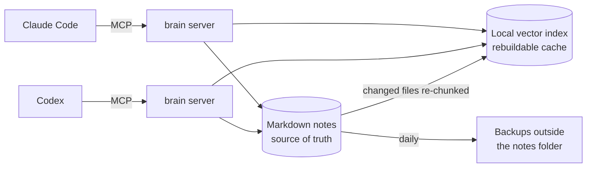

# My AI brain: shared memory for two coding agents

I work with two AI coding agents – Claude Code and Codex – and switch between them when one hits its usage limit. Neither remembers anything between chats, and neither can see the other’s. “The brain” is how they share what outlives a single task: every correction I have made, the standing rules, the prompts that worked, the history of past projects. It is a small local server that both agents call as a tool. It searches a folder of plain Markdown notes by meaning and by keyword, hands each new session a short briefing, and lets either agent write down what it has just learnt.

**Status: Built, in use** – relied on daily since June 2026, by Claude Code from the start and by Codex since it joined later that month. It is my own working set-up, not a delivered output. The code was written by AI coding agents – Claude Code and Codex – under my direction: I set the requirements, the rules both agents follow and the tests, and I decided what shipped.

**Published here:** the code, in [`workspace-kit/brain/`](../workspace-kit/brain/) – the server ([`server.py`](../workspace-kit/brain/server.py)), the search layer ([`rag.py`](../workspace-kit/brain/rag.py)), the retrieval test ([`evals.py`](../workspace-kit/brain/evals.py) with a placeholder [`eval_set.json`](../workspace-kit/brain/eval_set.json)), the backup script ([`backup_brain.sh`](../workspace-kit/brain/backup_brain.sh)), the set-up guide ([`SETUP.md`](../workspace-kit/brain/SETUP.md)) and the benchmark in [`bench/`](../workspace-kit/brain/bench/).
**Not published:** anything the brain knows. No notes, no search index, no session history, no test questions. Every number on this page is a measurement of the system, not of what it holds; every example is made up.

---

## At a glance

| Piece | What it does | Status |
|---|---|---|
| Local server, six tools | Briefing, search, logging, instincts, recent activity, reindex – over the Model Context Protocol (MCP) | **Built, in use** |
| Hybrid search | On-device embeddings plus keyword search, fused, boosted, reranked; keyword-only fallback | **Built, in use** |
| Lean session briefing | 12,000-character hard ceiling (about 3,000 tokens) | **Built, in use** |
| Corrections that don’t lie | `supersedes` marks the old entry; search demotes it; nothing is deleted | **Built, in use** |
| Retrieval test | Recall@1/3/5 and mean reciprocal rank over a fixed question set | **Built, in use** |
| Backups | Versioned git copy, 30 rotating snapshots and a run log, outside the notes folder | **Built, in use** |
| BM25 in the hybrid | Benchmarked offline in September 2026; mixed results | **Not approved** – needs a larger passage-level test first |

---

## 1. Why it exists

The agents’ instruction files load on every turn, so they have to stay short. The session files (see [running two AI agents](running-two-ai-agents.md)) hold exact current state: what we are doing right now. Everything in between – a colour rule I gave in May, the reason a prompt failed, how a past project was structured – needs a home that any agent can search on demand and that costs nothing until it is needed.

One rule governs the whole design, taken from the [memory protocol](../workspace-kit/Reference/AGENT_MEMORY_PROTOCOL.md):

> **Markdown files are the only source of truth. Everything else is rebuildable cache.**

The search index, the vectors, the agent’s context and the chat history can all be lost. The notes are plain text on disk, backed up outside their own folder, and the index rebuilds from them. That rule has been tested for real: in June the index corrupted, and it was rebuilt from the Markdown with nothing lost.

### How it grew

| Date (2026) | Change | Why |
|---|---|---|
| 1 June | First server: a full-dump briefing, keyword search, logging, recent activity | Every new chat started blank |
| 3 June | Local vector search; a forced-reindex tool | The notes passed 100 KB and keyword precision would degrade |
| 5 June | Hybrid search, entity tags, a coverage reranker, one-line “instincts”, chunk overlap; project notes added to the index | Keyword or meaning alone each missed things the other found |
| 6 June | Backups and the retrieval test | It lived in one place, and “it seems to work” was not evidence |
| 8 June | A deliberate stress test: three real bugs found and fixed | See [failure modes](#11-failure-modes-found-and-fixed) |
| 2 July | Crash-safe reindexing; the backup schedule replaced | An index corruption, and a backup that had silently died |
| 9 July | Log entries compressed before storage | Bloated entries were re-read into context and burnt tokens |
| 10 July | The briefing rebuilt from about 31,000 tokens to about 3,000 | A system audit measured it |
| 9 August | Superseded entries demoted in search | Search could return the wrong version of a rule with full confidence |
| 16 September | Source-authority weighting shipped; query expansion built, measured worse and removed; BM25 benchmarked and not adopted | Retrieval had slipped as the index grew |

---

## 2. Architecture



Each agent starts its own copy of the same server, pointed at the same folder. The server, the embedding model and the index all run locally and upload nothing. Whatever the search returns is then read by the agent, and a hosted agent processes it on its provider’s servers like anything else it reads – the [data policy](security-and-data-policy.md) decides what may go into the notes in the first place.

### The notes

The server expects eight Markdown files at the root of the workspace. The names are a convention set in `BRAIN_FILES` at the top of [`server.py`](../workspace-kit/brain/server.py); rename them to suit.

| File | Holds | Written by |
|---|---|---|
| `SA_INSTINCTS.md` | One-line, dated reflexes – the rules that should fire without being asked | `sa_instinct` |
| `SA_MEMORY.md` | Core facts: who, what, standing context | By hand only – `sa_log` refuses to write here |
| `SA_FEEDBACK.md` | Corrections and approvals, with the reasoning | `sa_log` |
| `SA_PROMPTS.md` | Prompts that produced approved work | `sa_log` |
| `SA_PROJECTS.md` | Project history and decisions | `sa_log` |
| `SA_OCCASIONS.md` | Seasonal and occasion guidance | `sa_log` |
| `SA_MUSIC.md` | Music direction and feedback | `sa_log` |
| `SA_WORKLOG.md` | A dated record of what was done | `sa_log` |

Every entry is a `## [date] heading` section. The `##` headings matter: they are the unit the briefing lists, the unit the keyword fallback scores, and the boundary the indexer splits on.

---

## 3. The tools

The server registers as `sa-brain`. These are the exact names in the published [`server.py`](../workspace-kit/brain/server.py):

| Tool | Signature | What it returns or does |
|---|---|---|
| `sa_briefing` | `sa_briefing()` | The lean session briefing ([section 6](#6-the-session-briefing)). Called once at the start of a session. |
| `sa_search` | `sa_search(query)` | The top eight matching chunks with their file, heading and score, labelled with the mode used (`hybrid+rerank` or `keyword`). Superseded entries are tagged and sorted last. |
| `sa_log` | `sa_log(log_type, content, heading="", supersedes="")` | Adds a dated entry, newest first, to one of `feedback`, `worklog`, `projects`, `prompts`, `occasions` or `music`. Squeezes noisy content first; can mark an older entry superseded. |
| `sa_instinct` | `sa_instinct(reflex)` | Adds a dated one-liner under `## ACTIVE INSTINCTS`; skips it if the same text is already there. |
| `sa_recent` | `sa_recent(days=14)` | Entries from the worklog, feedback and projects files dated within the window (up to five per file, 800 characters each). |
| `sa_reindex` | `sa_reindex()` | Forces a full rebuild of the vector index. |

The server’s own instructions tell any connecting agent the same three habits: brief at the start, search for specifics, log what you learn.

---

## 4. Indexing

**What is indexed.** The eight brain files, `CLAUDE.md`, every Markdown file in `Reference/`, and every `.md`, `.srt` and `.txt` file under `Projects/`. The index is deliberately wider than the briefing: the briefing covers the curated core, while search can surface something written in a project note months ago that nobody remembers. My own copy takes a hand-picked handful of reference playbooks rather than the whole folder; the kit takes all of `Reference/`.

**What is not indexed, on purpose.**

- `Sessions/` – the current state of a task needs exact truth, not the closest match. The briefing reads the active session’s `state.json` directly instead.
- `memory/` – the agent’s own one-fact-per-file memory, which has its own index file.
- Everything else: media, office documents, PDFs, raw logs.

**How a file becomes chunks** ([`rag.py`](../workspace-kit/brain/rag.py)):

1. Split at `##` headings. A `###` heading stays inside its parent section.
2. A section body up to 1,800 characters becomes one chunk. A longer one is cut at paragraph breaks into chunks of about 1,800 characters.
3. Each chunk is prefixed with its section heading, so a chunk taken out of context still says what it is about.
4. Consecutive chunks overlap by one paragraph, so a fact that straddles a boundary can be found from either side.
5. Each chunk is stored with its file, heading and the entities it mentions, under an ID of the form `file:section:chunk`.

**Embeddings.** Chroma’s built-in ONNX build of all-MiniLM-L6-v2, with cosine distance: on-device after a one-time model download of about 80 MB, no PyTorch, no API key. Chroma’s anonymous telemetry is switched off in the client settings.

**Keeping it fresh.** Before every search, the server compares each file’s modification time with the last one it indexed. Only changed files are re-read, re-chunked and replaced – the old chunks for that file are deleted and the new ones written. `sa_reindex()` forces a full rebuild.

**Crash safety.** Reindexing runs on the search path, so two searches can trigger it at once. Since July a non-blocking lock lets only one reindex run at a time (a second call skips rather than waits); every file is read and chunked before anything is deleted, so a parse error costs nothing; and one bad file is reported and skipped instead of aborting the pass.

**Size over time.** 7 files and 162 chunks on 3 June; about 30 files and 322 chunks on 5 June; 68 files and 918 chunks in August; 392 files and 2,667 chunks by mid-September, mostly project notes and subtitle files.

---

## 5. Retrieval

`sa_search(query)` runs this pipeline (`_hybrid_search` in [`server.py`](../workspace-kit/brain/server.py), helpers in [`rag.py`](../workspace-kit/brain/rag.py)):

| Step | What happens | Parameter |
|---|---|---|
| 1. Refresh | Re-index any changed file | – |
| 2. Dense arm | Nearest chunks by cosine similarity | top 12 |
| 3. Sparse arm | Same chunks, scored by how often each query word appears (words of three characters or more) | top 12 |
| 4. Fuse | Reciprocal rank fusion: each arm adds 1 ÷ (K + rank) for every chunk it returned, rank counted from 1 | K = 60 |
| 5. Entity boost | If the query names an entity the chunk is tagged with | × 1.15 |
| 6. Source authority | If the chunk comes from a file where facts are decided: the eight brain files, `CLAUDE.md` or `Reference/` | × 1.3 |
| 7. Rerank | The best 16 are rescored as 0.5 × fused score + coverage, where coverage is the share of distinct query words the chunk contains | top 8 kept |
| 8. Demote corrections | Any result whose heading or first 300 characters says “SUPERSEDED” is moved below every live result and flagged | – |

**Why both arms.** Meaning finds “cheapest way to make a clip” when the note says “credit budget”; keywords find exact names, codes and numbers that an embedding blurs. Fusing ranks rather than raw scores means neither arm’s scale has to be calibrated against the other’s.

**The entity boost** is a cheap knowledge-graph signal with no AI extraction: a hand-written list of the nouns that matter – business units, products, recurring events – tagged onto every chunk at index time. Mine has about forty. The kit ships placeholders (`YOUR-UNIT-1`, `YOUR-BRAND-1` and so on) in `ENTITIES` at the top of [`rag.py`](../workspace-kit/brain/rag.py). Matching is whole-word on both the chunk and the query; why that matters is in [failure modes](#11-failure-modes-found-and-fixed).

**Source authority.** Project notes quote the rules; the curated files set them. Before September, scripts, shot lists and work logs that merely mentioned a fact were outranking the file that decided it. The boost is measured in [section 8](#8-evaluation).

**Never hard-fail.** If the vector layer is not installed, raises an error or returns nothing, search falls back to keywords over the raw Markdown sections (a body match scores 2, a heading match 5) and returns the top five, labelled `keyword`. The agent always gets an answer.

### A worked example (made-up numbers)

Query: three words. Two candidate chunks:

| | Chunk A – a curated feedback file | Chunk B – a project note |
|---|---|---|
| Dense rank / sparse rank | 1 / 3 | 10 / not returned |
| Fused score | 1⁄61 + 1⁄63 = 0.0323 | 1⁄70 = 0.0143 |
| After authority × 1.3 | 0.0419 | 0.0143 |
| Query words contained | 2 of 3 → coverage 0.667 | 3 of 3 → coverage 1.0 |
| Final score | 0.021 + 0.667 = **0.688** | 0.007 + 1.0 = **1.007** |

Chunk B wins. Fused scores sit around 0.016–0.033, so after halving they barely register next to a coverage score that can reach 1: the final rerank mostly decides the order on its own. The September benchmark found a real case of this – the right passage retrieved by the arms and then pushed out of the top five by the rerank. Revising it is part of the next round of work ([section 9](#9-the-bm25-benchmark-and-deciding-not-to-switch)).

---

## 6. The session briefing

`sa_briefing()` is what a new session reads first. It has a hard ceiling of **12,000 characters – about 3,000 tokens** – and is built in this order:

1. **Instincts**, in full (up to 4,000 characters). They are the reflexes, so they come first.
2. **The active session** – purpose, status, last action (up to 300 characters) and the first four next steps, read straight from the session files.
3. **The five newest corrections** (up to 450 characters each) and **the three newest worklog entries** (up to 350).
4. **Core facts** – the first three sections of the memory file (up to 700 characters each).
5. **An index of everything else** – the headings only, up to 25 per file with a count of the rest, for corrections, memory, projects, occasions, prompts and music.

If the total still exceeds the ceiling it is cut, with a note to search for anything missing. The briefing’s job is to say what exists; `sa_search` fetches the detail.

**How it got there.** The first briefing dumped every file in full. By 3 June it was 108,000 characters, past the tool-result limit, and the session-start call failed outright. Two fixes in June kept it under the limit by showing whole files in priority order and demoting the rest to headings, but a system audit on 10 July still measured it at about 31,000 tokens – far too much for something meant to save context. It was rebuilt that day to the lean version above. The rule since: the briefing lists, search retrieves.

### Example: what the briefing shows for a session

A made-up session for a 30-second product reel, as `Sessions/2026-10-06_product-reel-30s/state.json`:

```json
{
  "session": "2026-10-06_product-reel-30s",
  "updated": "2026-10-06T14:20:00Z",
  "agent": "codex",
  "purpose": "30-second vertical product reel for a new desk lamp",
  "status": "in_progress",
  "last_action": "Picked 9 of 22 clips; rough cut runs 34 s and needs 4 s out (done by codex)",
  "next": ["Trim the opening hold to 1.5 s", "Swap clip 6 for the close-up",
           "Caption pass in British English", "Export a review copy"],
  "extra": {"format": "9:16, 1080 x 1920"}
}
```

The briefing’s session block for it:

```text
## Active session: 2026-10-06_product-reel-30s
- purpose: 30-second vertical product reel for a new desk lamp
- status: in_progress
- last action: Picked 9 of 22 clips; rough cut runs 34 s and needs 4 s out (done by codex)
- next: Trim the opening hold to 1.5 s; Swap clip 6 for the close-up; Caption pass in British English; Export a review copy
```

So an agent that only calls the brain still learns where the work stands. If the pointer or the file is unreadable, the block says so and names the file to check, rather than failing the briefing.

---

## 7. Logging discipline

**Log the moment something is learnt.** The commonest way to lose a learning is “I’ll write it at the end” – and then the session runs out first, or the conversation is compacted. Both agents’ instruction files say: when I correct something, approve an approach or state a preference, log it in the same turn. A rule I give in two plain sentences, with no tool call at all, is exactly the kind of thing a summary drops.

**Where it goes.** The reasoning goes into a file with `sa_log`; the distilled one-line reflex goes into instincts with `sa_instinct`, so it tops every future briefing. `sa_log` adds the date to the heading itself – putting a date in the `heading` argument as well produces a doubled date, a cosmetic artefact my own files still carry from June.

**Auto-squeeze.** Before an entry is stored it is compressed locally, with no AI model involved: runs of blank lines collapse to one, trailing spaces go, any unbroken token of 200 characters or more (a URL, a base64 blob, a job ID dump) becomes `«…»`, and anything still over 1,200 characters keeps its first 900 and last 250 characters around a “trimmed” marker. The brain stays lean, because every entry is read back into some future context. The marker says the full detail is in the session log – that is a convention, not something the tool does, so the agent has to put it there.

**Corrections without deletions.** Nothing in the brain is deleted. When a rule changes, the new entry names the old one:

```python
sa_log("feedback",
       "Reels open on the product within the first second. No logo sting.",
       heading="Reel openings – product first",
       supersedes="Reel openings – logo sting")
```

Every older `##` heading in that file containing the `supersedes` text (case-insensitive) gets a banner, while the new entry is left alone:

```markdown
## [2026-08-12] Reel openings – logo sting
**[SUPERSEDED — see: Reel openings – product first]**
Open every reel on a one-second logo sting.
```

From then on search still shows the old entry – history is how a bad decision gets debugged later – but it sorts below every live result and carries a warning. Before this existed (August 2026), a rule and its correction came back with equal weight, so search could hand an agent the wrong version with full confidence.

**One consolidator.** Both agents append; only one rewrites. Once a month a scheduled agent task runs a clean-up pass: merge duplicates, resolve contradictions (the newer fact wins and the older is marked, not removed), prune what is stale, rebuild the index and log a summary. When unsure, it flags rather than deletes. The passes have earned their keep: one found the core-facts file contradicting a standing correction, which would have put banned imagery into the next generation prompt; another found that the logging tool itself had silently stopped working.

---

## 8. Evaluation

Spot checks lie as the notes grow. [`evals.py`](../workspace-kit/brain/evals.py) replays a fixed set of questions through the live hybrid pipeline and reports:

- **Recall@1, @3 and @5** – did a file that holds the answer appear in the top one, three or five results?
- **Mean reciprocal rank (MRR)** over the top five – 1 for first place, 0.5 for second, 0 if missing, averaged.
- **Pass rate per tag** – which kinds of question are weakening.
- **Each failure** – the question, the expected files and the top three files actually returned.

Each case in [`eval_set.json`](../workspace-kit/brain/eval_set.json) is a question a real session would ask, the file or files where the answer lives, and a tag. Mine has 36 cases across 19 tags; the kit ships two placeholders to replace. The index is refreshed before measuring, so the test scores the current notes, and the script exits non-zero if recall@5 falls below 80%, so it can gate a change. The rule: add a case every time a real session fails to find something it should have.

**Testing the test.** The first run reported 18 failures. All were false: results labelled files by short key (`feedback`), the test set by file name. The matcher now accepts either. A bogus expected file was also checked to fail, so a green result can’t be an accident.

### Results over time

| Date (2026) | Cases | R@1 | R@3 | R@5 | MRR | What changed |
|---|---:|---:|---:|---:|---:|---|
| 6 June | 26 | 81% | 100% | 100% | 0.90 | First baseline |
| 8 June | 35 | 83% | 100% | 100% | 0.91 | Entity matching fixed; nine cases added |
| 10 July | 36 | – | – | 97% | – | Crash on stale index entries fixed |
| 16 Sept, before | 36 | 64% | 83% | 89% | 0.73 | The index had grown from about 30 files to nearly 400 |
| 16 Sept, after | 36 | 72% | 97% | 97% | 0.83 | Source-authority weighting; failures 4 → 1 |

Only rows with the same case count compare cleanly, and every one of them is file-level: a hit anywhere in a large file counts, even if the passage answers a different question. The September benchmark exposed exactly that, which is why its test set checks passages instead.

### Two changes, measured the same day

In September recall had slipped, and the obvious idea was query expansion – adding synonyms to each search. I asked for it; it was built with 40 synonym groups and measured **worse**: Recall@1 64% → 61%, Recall@5 89% → 86%, MRR 0.73 → 0.71. A gentler second variant also lost (Recall@1 61%, @3 81%, @5 89%; MRR 0.71). Both were removed completely. The reason is durable: in a small curated collection, alias words such as “cost” or “draft” match half the corpus and flood the keyword arm with noise, while the vector arm already handles paraphrase. Query expansion is a large-corpus pattern. An instinct now says not to rebuild it here.

The failures had a different cause: project notes outranking the files where facts are decided. Source-authority weighting fixed that. Two details made it trustworthy:

- **Not fitted to the test.** The scores were identical for every boost from 1.2 to 2.0, so the change is a real reordering rather than a fit to 36 questions. 1.3 was chosen from the middle of that plateau.
- **The playbooks belong in the top tier.** Boosting only the brain files and `CLAUDE.md` broke an existing case: the core files rose above the reference playbooks that `CLAUDE.md` itself points to. Adding `Reference/` took recall@3 from 94% to 97%.

Two of the three ideas tried that day were wrong. Only measurement separated them.

---

## 9. The BM25 benchmark, and deciding not to switch

The same month I kept seeing lists of NLP and retrieval techniques promising better search. Before installing anything, Codex ran an offline study under my standing rules: nothing live touched, no model download, no upload, and nothing promoted on a small test alone. The code is in [`bench/`](../workspace-kit/brain/bench/).

**Method.**

- The same 2,667 chunks the live search used, the same cached on-device encoder, network calls disabled in the script itself.
- Dense search by exact cosine ranking rather than the live index’s approximate search – a reproduction of the algorithm, not a measurement of the running server.
- Six methods: the existing keyword arm; [BM25](https://en.wikipedia.org/wiki/Okapi_BM25) alone (whole-word tokens, k1 = 1.2, b = 0.75); dense alone; the existing hybrid; the hybrid with BM25 in place of the keyword arm; and BM25 over an expanded corpus of 8,061 chunks, as a separate coverage experiment.
- Two question sets: the **36 existing file-level cases**, and **14 new passage-level questions** about decisions made between May and September, each scored only if a required evidence phrase appears in the returned passage.

**Results** (aggregate):

| Method | Passage in top 5 (of 14) | Passage first (of 14) | File in top 5 (of 36) | MRR, file-level |
|---|---:|---:|---:|---:|
| Existing keyword arm | 1 | 0 | 24 | 0.38 |
| BM25 alone | 12 | 7 | 35 | 0.80 |
| Dense alone | 9 | 6 | 28 | 0.59 |
| Existing hybrid | 10 | **10** | 32 | 0.73 |
| Hybrid with BM25 | 11 | 8 | 35 | 0.81 |
| BM25, expanded corpus | 14 | 8 | 33 | 0.73 |

**What it showed.**

1. **The keyword arm is not BM25.** It counts substrings and drops query words of two characters or fewer, so short codes and numbers vanish from queries, and short codes can match inside unrelated words. Better tokenisation accounts for part of BM25’s gain.
2. **The rerank can undo a good retrieval** – the effect in the worked example above.
3. **Better recall did not mean a better first answer.** The BM25 hybrid found more files but put the right passage first less often (8 against 10).
4. **Chunks overrun their target.** 87 chunks were over 2,000 characters; the largest was 23,555.
5. **The old test was too lenient,** for the file-level reason above.

**Decision: keep the current search.** BM25 is the leading candidate for the keyword arm, but a straight swap gave mixed results on a small sample, and a regression in which correction comes first is exactly the failure that matters most. The agreed order of work: fix coverage and chunking first; then test BM25 with a revised rerank on a larger, held-out, passage-level set that includes codes, corrections, Arabic and English queries and negative cases; promote only a candidate that improves recall without losing important first-ranked corrections, and keep the keyword fallback and a way back. Of the other patterns on those lists, HyDE and Self-RAG were deferred and nothing was installed.

**Reading the bench code.** The reproduction predates the source-authority weighting shipped the same day, so it compares the ranking arms, not the tuned live search. The script and its four unit checks are published as a record of the method: they expect the private question set and folder layout, and the test file imports the script under its original module name, so they will not run unmodified.

---

## 10. Known limits

Found, written down, not fixed yet:

| Limit | Detail |
|---|---|
| Chunk size is a target, not a cap | A single long paragraph is never split, so chunks can run far past 1,800 characters. |
| The encoder reads only the start of a chunk | Chroma’s MiniLM build truncates input at 256 tokens. At roughly four characters a token, only about the first 1,000 characters of a full-size chunk shape its vector; the keyword arm still reads all of it. Noticed while writing this page, from the library’s own code. |
| The rerank dominates | See the worked example. |
| The keyword arm is substring counting | Short terms are dropped; BM25 is the candidate. It also reads the whole collection on every search, which is fine at a few thousand chunks and would not scale far beyond. |
| The lock is per process | It stops two reindexes inside one server. Two agents’ servers writing at once would share the index unprotected; the rule of one active agent at a time is what covers that. |
| First search after a restart re-embeds everything | The record of what has changed lives in memory, so a fresh server treats every file as changed once. |
| Correction detection is textual | Only text marked “SUPERSEDED” is recognised. A correction logged without `supersedes` still competes with the rule it replaces. |
| Tests are file-level | Passage-level questions exist only in the benchmark so far. Arabic retrieval has not been tested. |

---

## 11. Failure modes found and fixed

| When (2026) | What happened | Fix |
|---|---|---|
| June | The full-dump briefing grew past the tool-result limit and the session-start call failed. | A character budget; later the 12,000-character lean briefing. |
| June | Entity tags matched short codes inside ordinary words – a three-letter code inside “start”, “basic” or “reach” – giving irrelevant chunks a false boost. | Whole-word, case-insensitive matching on both the chunk and the query. |
| June | The backup did not back up the backup: the script, the test harness and the test set were missing from its own file list. | Added; then a restore drill – the latest snapshot extracted and every file compared with the live copy, byte for byte. |
| June | A scheduled backup and a manual one collided on git’s lock file. | An atomic folder lock with a 10-minute stale reclaim; three launches at once gave one run and two clean skips. |
| June | First test run: 18 failures, all false (a label mismatch). | The matcher accepts both forms; the test was itself tested with a bogus file. |
| June–July | The index corrupted after two reindexes overlapped; separately, a forced reindex hung. | Rebuilt from the Markdown. Then the non-blocking lock, read-before-write and per-file isolation. A hung reindex is not retried; the server is restarted. |
| June–July | The scheduled backup died silently for 24 days: macOS privacy controls refused a `launchd` job that touched the Documents folder. | Rescheduled as an agent task that has file access and leaves a trace every run. The kit’s [scheduling notes](../workspace-kit/scheduling/README.md) cover both routes. |
| July | The health check stayed green on a dead backup, because a failing job’s growing error log looked “fresh”. | It now demands a verified “backup ok” line *and* a snapshot file, both under three days old. |
| July | Search crashed on stale index entries whose metadata had been deleted. | Malformed results are skipped and a rebuild removes them. |
| July | The briefing measured about 31,000 tokens; and Codex had been loading whole memory files at start-up, unlike Claude. | The lean briefing; both agents now start the same way – session files, rules, then targeted search. |
| August | The logging tool had silently disappeared: its registration line had drifted onto a helper function 30 lines below. Every log call failed. | Moved back. Found by the monthly clean-up pass; entries were appended by hand meanwhile. |
| August | A rule and its correction retrieved with equal weight. | `supersedes` and demotion ([section 7](#7-logging-discipline)). |
| September | An unpinned library upgrade moved under the long-running server; every search and log failed for a whole session while the environment on disk looked fine. | My copy now pins exact versions. The kit’s [`pyproject.toml`](../workspace-kit/brain/pyproject.toml) sets only minimums – pin yours once it works. |
| September | Project notes outranked the files where facts are decided. | Source-authority weighting, × 1.3. |

Two habits came out of these. **A code change is not live until the server reloads** – each agent runs the code it loaded at start-up, so after any change the new behaviour is checked in a fresh session before it is trusted. **When the server is down, the notes are still files** – the entry is appended by hand in the same `## [date] heading` shape, and logged properly once it is back.

---

## 12. How Claude Code and Codex both use it

- **Same code, same notes.** Each agent registers the server in its own configuration, both pointing at the same folder. Neither keeps a private memory the other can’t see.
- **Start lean.** Step 0 in both instruction files reads the session files first, because current state must be exact. Then the briefing if it is needed, then targeted searches. Neither loads whole memory files.
- **Check before building.** Before treating a task as new, the agent searches the brain and the tools folder; much has already been solved, and the right answer is to say so.
- **Write in real time,** as in section 7. Codex marks what it adds with “(done by codex)”, so Claude can tell its work apart after its own context has been compacted.
- **One active agent at a time.** It keeps the session files consistent, and it is also what protects the index (see [known limits](#10-known-limits)).
- **The session files and the brain do different jobs.** A session file answers “where are we now?” and is read directly as JSON. The brain answers “what do we know?” and is searched. Session state is never indexed, and the brain never decides current status. The decision checkpoints written as the context fills ([`sa_checkpoint.py`](../tools/sa_checkpoint.py)) belong to one session; anything durable goes to the brain as well. After a compaction, [`sa_compact_brief.sh`](../tools/sa_compact_brief.sh) re-reads the ground truth from disk and points back to `sa_search` for the rest.

The session hand-off itself – the folder layout, the eight-key `state.json`, the append-only log and the tools that write and validate them ([`sa_session.py`](../tools/sa_session.py), [`sa_threads.py`](../tools/sa_threads.py), [`sa_doctor.py`](../tools/sa_doctor.py)) – is worked through in full in [session handoff](session-handoff.md), with the overview in [running two AI agents](running-two-ai-agents.md) and the kit’s protocol in [`Sessions/README.md`](../workspace-kit/Sessions/README.md).

---

## 13. Backups and health checks

[`backup_brain.sh`](../workspace-kit/brain/backup_brain.sh) keeps three independent copies of the notes and the brain’s own code, all **outside** the notes folder, so one mistaken delete can’t take the source and the backups together:

1. **A versioned git vault** – every run copies the notes in and commits, so `git log` shows every change and `git diff` can revert one.
2. **Rotating snapshots** – a timestamped `.tar.gz` per run, keeping the last 30, so recovery works even if the vault’s repository is damaged.
3. **A run log** – one line per run, which is what the health check reads.

The vector index is deliberately not backed up: it rebuilds from the notes. The script backs itself up, along with the test harness and the test set, and a folder lock stops two runs colliding. Setting `BACKUP_ROOT` to an external drive adds real off-disk redundancy without changing anything else; I also copy the whole workspace to a network drive weekly with [`backup_to_nas.command`](../workspace-kit/Tools/backup_to_nas.command).

**Health checks.**

- [`sa_doctor.py`](../tools/sa_doctor.py) runs at the start of every session (about 0.3 seconds) and turns red if the index folder is missing, if there is no verified successful backup in the last three days, or if the network copy is more than ten days old. Out of the box it looks for the brain folder as `sa-brain/` and the backups under `~/SA_Brain_Backups`, while the kit uses `brain/` and `~/Brain_Backups` – point `SA_BACKUP_ROOT` at your `BACKUP_ROOT` and adjust the folder name, or it will report red on a healthy set-up.
- `evals.py` is the retrieval health check: run it after any large edit, any reindex and any code change.
- [`vaultmap.py`](../workspace-kit/Tools/vaultmap.py) maps the links between notes: the most-linked notes (the backbone), orphans that nothing links to (they get lost), and links that point at notes that don’t exist (rot). It writes a short report. Broken links are kept at zero; an orphan is a prompt to link a note in, not an error.

---

## 14. Setting it up

The full guide is [`SETUP.md`](../workspace-kit/brain/SETUP.md). In short:

1. Install [uv](https://docs.astral.sh/uv/), then run `uv sync` in the `brain/` folder.
2. Register the server with each agent. For Claude Code, for example:

   ```sh
   claude mcp add --scope user sa-brain -- uv run --directory /absolute/path/to/your-workspace/brain server.py
   ```

   For Codex, the equivalent entry in its `config.toml`:

   ```toml
   [mcp_servers.sa-brain]
   command = "uv"
   args = ["run", "--directory", "/absolute/path/to/your-workspace/brain", "server.py"]
   ```

3. It indexes the folder that contains `brain/`; set `BRAIN_DIR` to index somewhere else.
4. Write `SA_MEMORY.md` yourself – it is the one file the tools never write. The others appear the first time something is logged to them.
5. Replace the placeholder entities in `rag.py` with your own nouns, and the two placeholder questions in `eval_set.json` with real ones as soon as you have them.
6. Schedule `backup_brain.sh` daily, and check it really ran: a scheduled job’s “succeeded” status is not evidence; its log line and a fresh snapshot are.
7. Pin the library versions once everything works.

Don’t sync the index folder (`chroma_db/`) between machines – it can corrupt. Let each machine build its own from the notes, which is the point of keeping the notes as the only truth.

---

## Maturity

Labels follow the [status labels in the README](../README.md#status-labels).

| Piece | Status | Code |
|---|---|---|
| Server, tools and lean briefing | **Built, in use** | [`server.py`](../workspace-kit/brain/server.py) |
| Hybrid search, entity boost, source authority, rerank, fallback | **Built, in use** | [`server.py`](../workspace-kit/brain/server.py), [`rag.py`](../workspace-kit/brain/rag.py) |
| Superseded-entry demotion | **Built, in use** | [`server.py`](../workspace-kit/brain/server.py) |
| Retrieval test | **Built, in use** | [`evals.py`](../workspace-kit/brain/evals.py) |
| Three-layer backup | **Built, in use** | [`backup_brain.sh`](../workspace-kit/brain/backup_brain.sh) |
| BM25 benchmark | **Experimental** – research only, never connected to the live search | [`bench/`](../workspace-kit/brain/bench/) |
| BM25 in the live search | **Not approved** – waiting for a larger passage-level test | – |
| Query expansion | **Not approved** – built, measured worse, removed | – |

**Related:**

- [session-handoff.md](session-handoff.md) – the session hand-off the brain sits beside, in full
- [running-two-ai-agents.md](running-two-ai-agents.md) – the whole two-agent set-up in one page
- [why-ai-agents-forget.md](why-ai-agents-forget.md) – an audit of another set-up where memory failed, and why
- [`AGENT_MEMORY_PROTOCOL.md`](../workspace-kit/Reference/AGENT_MEMORY_PROTOCOL.md) – the portable memory specification this follows (its advice to schedule backups with `launchd` predates the failure above)
- [ai-engineering-method.md](ai-engineering-method.md) – evidence before “done”, which is how every change here was judged
- [learning-from-mistakes.md](learning-from-mistakes.md) – why a written rule is not a guard
- [security-and-data-policy.md](security-and-data-policy.md) – what may go into the notes at all
