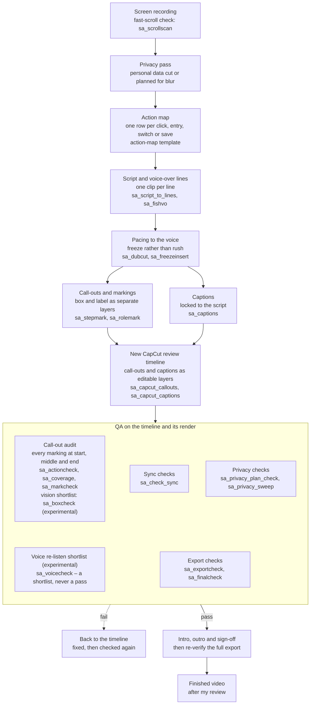

# Training-video production: from screen recording to reviewed CapCut timeline

**35 screen-recorded training videos (a 21-module end-to-end process series and 14 role-by-role modules) and 7 phone-app training videos, over two hours of finished training**, made with the method on this page: a raw recording of a business system becomes a paced, narrated, captioned video with a call-out on every action, finished as an editable CapCut timeline. Everything here was measured from my own finished edits, not invented; the code was written by AI coding agents (Claude Code and Codex) under my direction and review.

The tools are in [`tools/`](../tools/README.md) (listed by stage in [section 17](#17-tools-by-stage)); the action-map template is [`templates/training_action_map_template.csv`](templates/training_action_map_template.csv); the editing grammar is also published as data in [`Reference/SAAD_EDITING_GRAMMAR.json`](../Reference/SAAD_EDITING_GRAMMAR.json). The CapCut file format behind every build is in [capcut-draft-format.md](capcut-draft-format.md), the voice route in [fish-audio-voice-cloning.md](fish-audio-voice-cloning.md), and animated (non-recorded) tutorials in [hyperframes-brand-tutorials.md](hyperframes-brand-tutorials.md).

## The body of work, and how each series was made

| Series | Videos | Source | Canvas | How it was made |
|---|---|---|---|---|
| End-to-end process series | 21 modules | Desktop screen recordings of one business system, walking each process from first step to last | Landscape, probed per video (the first series ran 1920 × 1140) | A replacement voice-over, one clip per line; the picture paced to the voice with freezes rather than speed-ups; a call-out box on every action; captions; role labels at sign-ins; a short AI presenter intro, an outro and a spoken sign-off – all on an editable CapCut timeline |
| Role-by-role modules | 14, in two process families, numbered in process order | The same system, re-cut so each module follows one role; five were sliced from one parent timeline | Landscape, probed per video | Each opens on that role’s sign-in with the account row marked; voice per beat; markings measured on the paced frames; new work parked on separate tracks so my own edits stay untouched |
| Phone-app videos | 7 | Phone screen recordings, several supplied by other people | 9:16, the recording inside a phone mockup on a brand backdrop | Every screen state read on-device by OCR; a call-out placed only where OCR proves its target is on screen; picture pinned to the words that name each marking ([section 6](#6-phone-app-recordings-voice-anchored-pacing)); one voice track with one segment per line |

The method was built on the end-to-end series and then re-measured on the role-by-role modules (15 timelines: the 14 finished modules plus the parent timeline five of them were cut from). The phone-app series added the intake scroll check, voice-anchored pacing and three sync checks on the finished cut.

## Status at a glance

| Part | Status | Notes |
|---|---|---|
| The method, end to end | **Built, in use** | Used across all 35 screen-recorded modules; the phone-app series used the variant in section 6 |
| A module authored entirely by code (picture, voice lines, captions) | **Built, in use** | One module was built this way: it opened clean in CapCut, with 61 voice lines placed against the source recording with zero drift |
| New review timeline with the voice detached from the picture | **Built, in use** | Piloted on a short clip, then used for the phone-app series: one voice track, one segment per line |
| Fast-scroll check at intake ([`sa_scrollscan.py`](../tools/sa_scrollscan.py)) | **Built, in use** | Report-only; run on every phone-app source recording, four desktop recordings and each built cut |
| Voice-anchored pacing for phone recordings | **Built, in use** | Every marking’s screen pinned to its words |
| Privacy sweep of rendered recordings | **Built, in use** | Local OCR of every played quarter-second; first used on one long web-module build |
| Pronunciation gate for product names | **Built, in use** | Two speech models must both hear the word |
| Revision protocol for later changes to the software | **Built, awaiting review** | It refuses to start until the evidence for the change is complete |
| Automatic release approval | **Not approved** | Every cut is reviewed by me. The known reader limitations are listed under “What isn’t solved” |
| Local vision-model checks of call-outs | **Experimental** | Used only to shortlist frames for a human to look at, never to sign anything off |

## The pipeline at a glance

*The desktop method from recording to finished video, with the main tool behind each step. Anything that fails QA goes back to the timeline and is checked again; the vision and voice checks only shortlist frames and lines for a person and never pass anything; the intro and outro go on last, and the full export is re-verified after them. Every cut is reviewed by me before release.*

**Where to look:**

- The steps in full: [section 3, the method stage by stage](#3-the-method-stage-by-stage) · the [action-map template](templates/training_action_map_template.csv)
- Pacing and voice: [section 4](#4-pacing-the-numbers) · [section 9](#9-voice-over-lines)
- Intro, outro and the final re-check: [section 10](#10-the-ai-presenter-intro) · [stage 6](#stage-6--release-and-resume)
- QA: [section 8, three sync checks](#8-three-sync-checks-on-the-finished-cut) · [section 12, verification](#12-verification) · [section 13, privacy](#13-privacy-and-independent-checks-on-rendered-recordings)
- Every tool, by stage: [section 17](#17-tools-by-stage) · phone-app recordings use the variant in [section 6](#6-phone-app-recordings-voice-anchored-pacing)

## Contents

1. [Principle: copy the editor, measure the editor](#1-principle-copy-the-editor-measure-the-editor)
2. [What one video is made of](#2-what-one-video-is-made-of)
3. [The method, stage by stage](#3-the-method-stage-by-stage)
4. [Pacing: the numbers](#4-pacing-the-numbers)
5. [Fast scrolling in supplied recordings](#5-fast-scrolling-in-supplied-recordings)
6. [Phone-app recordings: voice-anchored pacing](#6-phone-app-recordings-voice-anchored-pacing)
7. [Sync: the thing viewers actually feel](#7-sync-the-thing-viewers-actually-feel)
8. [Three sync checks on the finished cut](#8-three-sync-checks-on-the-finished-cut)
9. [Voice-over lines](#9-voice-over-lines)
10. [The AI presenter intro](#10-the-ai-presenter-intro)
11. [The 18-rule editing grammar](#11-the-18-rule-editing-grammar)
12. [Verification](#12-verification)
13. [Privacy and independent checks on rendered recordings](#13-privacy-and-independent-checks-on-rendered-recordings)
14. [Traps worth knowing (the best of 50+)](#14-traps-worth-knowing-the-best-of-50)
15. [Other tutorial formats](#15-other-tutorial-formats)
16. [What isn’t solved](#16-what-isnt-solved)
17. [Tools by stage](#17-tools-by-stage)

---

## 1. Principle: copy the editor, measure the editor

The biggest lesson: I kept asking for my style to be copied, and the results improved only once the agents stopped inventing conventions and started **measuring my most recent finished project** before every build. My latest edit is the spec. Where a metric disagrees with my eye, my eye wins – the numbers once said to drop a 1-second head pad; I kept it, and it was right.

When sources disagree, this is the order of authority (also the `authority_order` in [`Reference/SAAD_EDITING_GRAMMAR.json`](../Reference/SAAD_EDITING_GRAMMAR.json)):

1. The approved final export, and my corrections to it
2. The named approved timeline
3. A human-reviewed cut sheet
4. The editing grammar (section 11)
5. Automatic analysis of the source

Draft durations, unused clips and automatic decisions come last.

**How a measurement changes.** The call-out tool first held a freeze for 2.2 s – the median of 24 freezes across 9 videos, measured while the series was still running. An audit of the finished corpus later found **120 freezes across the 20 modules finished at the time, median 3.0 s**, and the default moved to 3.0 s. When the agent described this as my instruction overriding its measurement, I corrected it: a bigger sample superseded a smaller one. Both numbers stay in the code so neither is lost.

The same discipline applies across series. The role-by-role modules have denser screens and longer lines: **78 freezes, median 4.45 s**. That doesn’t replace 3.0 s for the first series. A bigger sample supersedes a smaller one; a *different* corpus does not.

A default changes only after three recurrences, with the evidence written into the code comment. One video suggests; the corpus decides.

## 2. What one video is made of

Paced screen recording → voice-over (one clip per line) → captions → a call-out box on each action → role labels at sign-in changes → AI presenter intro → outro → spoken sign-off.

Measured house style from the reference edit:

| Element | Value |
|---|---|
| Head | ~5 s left before content for the intro; the title text sits over it |
| Captions | font size 5, y = −0.89, one line, never wrapped – 234 of 234 uniform in the reference edit |
| Voice-over volume | 1.00–1.073, never past 1.1 |
| Outro | 9.10 s, muted, butted to the end of the picture, with a 0.60 s slow fade on the clip before it |
| Music | none in the first series; where present, a bed under 0.15 volume that stops on the outro’s last frame |
| Call-outs | a freeze-frame still plus a box overlay; a covered gap in the base track is deliberate, not a hole |

Canvas: 1920 × 1140 at 30 fps for the first series, not 1080p – and canvases vary per video, so it is probed every time. See [capcut-draft-format.md](capcut-draft-format.md) for how these values map to the project file.

## 3. The method, stage by stage

### Stage 1 – Establish the module

Record the title, audience, learning outcome, software version and date, process owner and the source recording. Note the correct user role, starting state, complete actions and final successful state. **Do a short representative recording first** and check legibility and account permissions before recording the whole procedure. Original recordings are never changed.

For a recording someone else made: walk its frames every 2 s and cut anything that shows real personal data, and **run the fast-scroll check and report the count before building anything** ([section 5](#5-fast-scrolling-in-supplied-recordings)).

### Stage 2 – Map the lesson before any voice is generated

Every meaningful action becomes a row in an action map – template: [`templates/training_action_map_template.csv`](templates/training_action_map_template.csv). Columns:

`beat_id, role, source_file, source_start_s, source_end_s, ui_action, expected_result, narration, caption, approved_voice_file, voice_duration_s, export_start_s, export_end_s, callout_evidence, excluded_reason, review_status`

Rules for the map:

- Every button press, navigation click, field entry, role switch, save, status change and verification gets its own beat – or an explicit exclusion with a reason.
- Split any line that says “do X, then Y” into two beats. A sentence that names two things needs two markings.
- A visible UI label is evidence. A model’s recollection is not.
- Don’t skip a stretch of source without walking its frames for actions.
- Let the process owner settle uncertain procedure wording; keep working on verified beats meanwhile.
- Write each line so its caption fits in 46 characters, and so the words that trigger two markings in the same line start at least ~1.7 s apart ([section 6](#6-phone-app-recordings-voice-anchored-pacing)).

Before editing, I also build a chapter map of the story ([`sa_edit_skeleton.py`](../tools/sa_edit_skeleton.py)) – story first, never clip by clip in raw order.

### Stage 3 – Lock voice and timing

- **Reuse first.** Search approved voice clips and markings before generating anything. A reused line must match the new script word for word, in role and in meaning, and sound right next to its new neighbours. A filename or an old approval proves nothing about this cut. Copy an asset into the new project before adapting it, so earlier videos are unaffected.
- Generate short lines by beat ID (section 9). Keep original and replacement takes, so an approved take is never silently lost.
- **Measure each line before assigning its screen time.** The viewer needs time to find the control, hear the instruction, see the action and read the result. Extend a stable screen or slow the recording – never rush a meaningful action to fit the voice.

### Stage 4 – Build the review cut

The output is a **new** CapCut project – never a patch to one of my existing timelines:

- **Picture**: the paced screen recording, silent.
- **Voice**: one audio clip per line, each on the voice track at its own timestamp, so any single line can be cut, moved or swapped without touching the picture.
- **Captions**: editable text layers synced to that audio.
- **Markings**: separate, editable call-out layers – the box and its label as separate layers, so either can move alone.

One timing file drives picture, audio and captions, so they can’t drift apart. Two of my own approved edits were already built this way (picture muted, voice on separate tracks), so this is the house pattern, not a new invention.

Record the draft path, timeline ID, export start and end, and the draft’s SHA-256 in the review record; record the rendered MP4 and its SHA-256 separately. Never pick “the module” by newest file modification time – a project can hold several modules, experiments and old cuts.

### Stage 5 – Review the exported video

- **Every marking, at its start, middle and end** on the rendered sequence: right control, right words, border clear of text, label chip clear of live content, caption clear, timing right. If the screen scrolls or the control moves, re-anchor or split.
- Each result is **pass / fail / unknown**, with frame evidence and the reviewer’s name. Full coverage means every expected marking has evidence – not a sampled contact sheet.
- Sign-ins mark the actual account or role row on the login screen – not a nearby Login button, and not standalone text (my correction on the pilot).
- Watch the selected MP4 start to finish at normal speed. Compare a local transcription of the rendered audio against the captions and the course script; resolve mismatches by hand.
- Run the three sync checks (section 8) and the privacy sweep (section 13).
- Any failed extraction, missing transcript, missing file, unreviewed range or stale draft identity means **review is incomplete** – never a pass.

### Stage 6 – Release and resume

The intro and outro are added as a final stage (section 10), after which every shifted track and the full export are re-verified – old absolute timestamps are never reused after an intro insert. The approved MP4, the plain-text course script, the caption file, the review findings and my approval are kept together.

**Later changes to the software** (a new button, label or step) are treated as a versioned, surgical revision, never an informal edit: a fresh recording of the current screens, approved wording, the release version, sign-off from the process owner, and **two semantic anchors** – the step just before and just after the change. Timestamps alone are never enough, because any earlier insert shifts every later timestamp. The work happens in a duplicate; the finished project stays read-only. [`sa_training_revision.py`](../tools/sa_training_revision.py) blocks a request until that evidence is complete.

### Stop conditions

Stop and ask rather than improvise when the source, project or export is missing; evidence counts conflict and can’t be reconciled; a call-out can’t be proven on its final frame; the edit would touch an original or one of my working cuts; or two rebuild attempts have failed. After two failures, ask me for one concrete example and adjust from that.

## 4. Pacing: the numbers

### Pacing the picture to the voice

The first pacing tool forced each segment to last exactly as long as its voice line. When the new script was much shorter than the original narration, the speed cap stopped the picture speeding up and the tool **trimmed the source instead** – one module silently lost 3.7 minutes across 25 of its 43 segments. It looked fine; it was just missing.

Now a segment runs for `max(voice + gap, source span ÷ speed cap)` and the picture plays on after the line ends. The settings came from my own re-cut of one module, where I had inserted six freezes totalling 12.8 s – five of them on segments running at the old 2.2× cap:

| Setting | Value | Why |
|---|---|---|
| Speed cap | **1.6×** | I never let 2.2× stand |
| Gap between lines | **0.9 s** | a screen has to settle before the next line |
| Closing hold | **2.5 s** | the final screen lands instead of snapping away |

Re-paced, that module ran 164.7 s with nothing dropped, against 140.9 s with 9.2 s dropped before. **Longer is correct here.** If a segment still feels rushed, split it and write a second line – never raise the cap.

The 1.6× cap is a ceiling, not a target: busy content screens stay at 1.0–1.2×, review moments at 1.0× or slower, and call-outs on a moving screen hold for around 1.5–2.1 s. On busy desktop scrolling I accepted 1.0–1.2× and rejected 1.51× as too fast – the verdict the scroll check in section 5 is calibrated on.

### What my finished edits actually do

Measured across the role-by-role modules’ 15 timelines (the 14 finished modules plus the parent timeline five of them were cut from). The parent and its five slices overlap, so these totals can count the same material twice:

| Measure | Value |
|---|---|
| Recording cut out | 177 s across 9 videos – **6%** of the raw footage |
| Cuts | 37 in total; median 3.2 s, longest 30 s; two videos have none |
| Freezes added | **78, mean 6.54 s – about 510 s of picture added** |
| Net effect | roughly **three times** more time added than removed |

The instinct to “tighten” a training video is wrong. The recording is the lesson; the edit’s job is to keep the right screen up long enough.

**Why freezes exist.** Of those 78 freezes, 78% have the narration still speaking over them, 78% have a caption on screen, and 63% have a call-out on screen covering a median 87% of the freeze. A freeze is not decoration or a transition: it means *the voice is still explaining this, so the screen must stay on it*. When narration runs past the screen it describes, the fix is a freeze – not a speed change, not a cut.

### Captions and call-outs, series-wide

| Measure | Value |
|---|---|
| Call-out layers on screen | 1,099 across the 15 timelines – median hold **2.77 s**, mean 3.05 s, range 0.73–14.0 s |
| Captions | 1,148 – median **41 characters**, **2.32 s** on screen |
| Reading rate (median per caption) | 16.6 characters per second |
| Gap between captions | median **0.73 s** – air, not butt joins |

The 1,099 is a count of layers, not of markings: box and label layers are counted separately, across timelines that overlap. The finished modules hold 552 markings. The hold times are what matter here, and they don’t depend on the count.

So: split a new caption at about 41 characters, hold it about 2.3 s, and leave about 0.7 s before the next. Nothing I have ever used runs past about 61 characters, and new captions are capped at 46.

## 5. Fast scrolling in supplied recordings

Recordings made by other people often scroll fast; I scroll slowly. So at intake, **every supplied recording is checked for fast scrolls and the count is reported before anything is built** – “this one has N fast scrolls, at …” – and each fast scroll is then paced the way I record.

**The stepped scroll.** Start on the top of the page and stop each time the *next* section (a card, a row, a block) has become fully readable: section 1 is clear, pause; scroll until 2 is whole, pause; then 3 – in order, so every section is seen whole, at rest, once. Never leave a half-visible section as the resting frame. The steps are built as **held frames** (the module spec’s `holds` and `anchor_overrides`), never by slowing the footage – the pacing law of section 4 again: freeze rather than speed up.

[`sa_scrollscan.py`](../tools/sa_scrollscan.py) finds the fast scrolls and proposes the steps. It is report-only: it reads the video and writes nothing but an optional JSON report. Pixels are measured numerically and text is read by on-device OCR; this check runs locally and uploads nothing, and no vision model ever looks at a frame. It runs at low priority with two ffmpeg threads, because I am usually editing on the same laptop.

**What it measures**, per scroll episode: start and end, direction, distance in pixels, peak and mean speed in **pixels per second and viewport-heights per second** (the viewport being the measured scrolling band, with fixed headers, tab bars and side panels excluded by translation evidence), a fast/not-fast verdict with the reason, and for fast ones the proposed steps plus a ready-to-paste list of holds in source seconds.

**When a scroll counts as fast** – my rule, stated directly:

- **Skipped**: a section that was not yet scrolled past at the start is scrolled past by the end, and between the rest before and the rest after it was **never whole while moving at ≤ 0.2 viewport-heights per second for ≥ 0.6 s**. (0.2 VH/s is slow enough to read moving text: a screen takes 5 s to pass.)
- **Fly-by**: more than 0.6 VH/s sustained for at least 0.5 s while at least one whole viewport passes – the backstop when sections are unreliable.
- A stepped scroll like mine – short move, then a ≥ 0.6 s pause with the next section whole – is **never** fast, however quick each move is. Speed alone never makes a scroll fast.

**How the 0.6 s read time was chosen.** It is calibrated on my own verdict about one desktop recording – fine at 1.0–1.2×, too fast at 1.51×. The same 17 scrolls (each at least a quarter of a viewport), re-judged at different read times:

| Read time | 0.4 s | 0.5 s | 0.6 s | 0.7 s | 0.8 s | 1.0 s |
|---|---|---|---|---|---|---|
| flagged at 1.0× | 2 | 4 | **5** | 5 | 7 | 9 |
| flagged at 1.2× | 3 | 3 | **5** | 5 | 7 | 10 |
| flagged at 1.5× | 4 | 4 | **7** | 7 | 8 | 9 |

0.6 s is the shortest read time at which the speed I rejected flags more than the speeds I accepted, while keeping accepted footage mostly unflagged (1.0 s would flag 9 of 17 scrolls I had passed). After the defect fixes below, the same stretch re-encoded flags 3 · 3 · 5 at 1.0× · 1.2× · 1.5× – a cleaner separation. The default hold per step is **1.5 s**, from my own freeze holds (1.13–4.17 s), not from the read time.

**Not a page scroll**, so never flagged: a moving area under 25% of the screen height (toasts, alerts, pickers); a move under 0.1 viewport and 40 px (an alert settling); the whole frame, status bar included, sliding for ≤ 0.3 s (a system transition); a keyboard sliding in (OCR reads a keypad row); and a full-screen sheet presented or dismissed. **Instant jumps** – the whole move within two frames – are reported apart: nothing between was ever on screen, so the remedy is a hold before or after, not steps.

**What the first full run found** (scrolls moving at least a quarter of a viewport): **35 fast scrolls plus 1 instant jump out of 136 in 8 phone recordings (26%)**, and **14 fast plus 6 instant jumps out of 79 in 4 desktop recordings (18%)**. Every flag read by its OCR text was real content (lists, records, forms); the only false flags were overlays, now filtered.

**Self-test and skeptic pass.** The tool has a `--test` that builds synthetic recordings; a mutation (“step on the first partial visibility”) makes it fail, so the test can catch the error it exists for. A skeptic pass with 21 independent synthetic recordings found and fixed six defects, among them: on variable-frame-rate phone recordings (no frames at all while the screen is still) rests had no samples, so two flings 1.6 s apart merged into one episode that started 1.5 s early; steps were searched past the episode’s end; and on grouped layouts (grey page, white cards) the card fill was read as the page colour, so every *line* became a section and holds rested on half-visible cards.

**Independent checks of the scanner** – tracking the same words’ positions by OCR on every source and built frame, a different method from the scanner’s – confirmed the real fast scrolls within 25% on speed and found its blind spots:

- **It judges rests on the source.** A cut in the build that shortens a rest is invisible to it: one scroll was fast only because a later cut had removed the 1.9 s rest after it. Verify on the built picture.
- **It is scroll-local.** A fly-back over a card that had already been shown whole for 8.8 s needs no steps; check whether the page was seen whole earlier, and whether the move is a return-to-top.
- **A loader turning into a page is not a scroll**, and a held frame proposed there would freeze a blank loading screen.
- **A collapsing header can hide a real scroll** as a “sheet slide”. Before trusting “no scrolls”, compare the not-a-scroll counts with a plain frame-difference pass.

**In the build, steps compete with the voice.** Full stepped holds often collided with voice anchors (section 6): markings went late or lost their anchor unless the voice paused. A hold that fits the current voice is chosen first; a fly-back over content already explained may be better cut than stepped.

**Limits:** vertical scrolling only (no carousels, zoom or parallax); a page flicked and stopped dead within 0.3 s with no fixed header reads as a system slide and is dropped; OCR section labels are for a human, not a transcript; the read time is calibrated on my verdict about other people’s recordings and should be re-checked against one of mine.

## 6. Phone-app recordings: voice-anchored pacing

The phone-app videos needed their own front half, because a phone recording is a different object: tall, variable frame rate, dense, and often recorded by someone else.

**Read the screen as text.** [`sa_appread.py`](../tools/sa_appread.py) turns the recording into a list of **distinct screen states** – runs of identical screens collapsed into one entry, each with its OCR text and element boxes in source pixels – so an agent can read what was on screen, and when it changed, without looking at pixels. Frames are deleted as it goes; OCR runs on-device. It reads text, not taps: icon-only buttons are invisible to it.

**Place a call-out only where OCR proves the target is on screen.** [`sa_appbuild.py`](../tools/sa_appbuild.py) joins the action map, the OCR read and the call-out renderer. Anything it cannot prove is **skipped and listed**, never nudged to a plausible spot – markings had been wrong before by being placed from the sentence instead of the screen. Every box goes through the same crop-and-scale map as the picture, or it lands somewhere else entirely.

**The look.** The recording sits inside a phone mockup on a brand backdrop at 9:16 ([`sa_phoneframe.py`](../tools/sa_phoneframe.py)) – a raw phone recording is taller than 9:16, so the surround becomes the design instead of dead bars. When I re-laid the first video by hand in CapCut, [`sa_mobile_style.py`](../tools/sa_mobile_style.py) reproduced my layout for the preview and OCR composite – the app scaled 0.7159 and lifted 0.1148, a feathered glow, two masked strips filling the screen hole – and was checked against CapCut’s own full-size render: app screen edges within 0.5 px, phone outline within 0.3 px, OCR word boxes identical. (CapCut’s rectangle-mask feather turned out to be a smoothstep over `max(|x|/a, |y|/b) − 1`, which is why its glow looks like a soft diamond.) [`sa_capcut_restyle.py`](../tools/sa_capcut_restyle.py) then copied my hand-laid stack into the other projects, leaving their markings, voice and captions byte-identical.

**One voice track, one segment per line** ([`sa_addvo.py`](../tools/sa_addvo.py)), so a single line can be dragged without touching the rest; it refuses to stack two lines on top of each other, because overlapping voice is the one fault nobody can edit around.

### Screen-anchored zones

[`sa_plan_pacing.py`](../tools/sa_plan_pacing.py) gives each line a **zone** of the recording, from its screen anchor to the next line’s. The line’s window is the motion inside its zone, plus still padding until it can carry the line at normal speed (voice + gap). Everything in the zone outside the window contains **no motion by construction**, so dropping it is invisible: the frames either side of the cut are the same frozen screen. Nothing on screen is lost.

Two details made that true. An instant tap-through – one freeze ending and the next starting on the same frame – has zero length, so plain subtraction never saw it and a whole tab visit vanished from one module; each such seam is now kept as a 0.1 s motion event. And the gap: 0.9 s is the settle floor, but my own re-cut of a module had a median gap of 1.7 s and 0.9 s felt rushed, so the phone modules run **every line at exactly voice + 1.7 s**.

### Voice anchors

On the first finished phone video I found the picture finishing its motion early wherever the voice was longer than the picture – sitting on its last frame, so a tap or a scroll happened *before* the voice had talked about it, and markings were squeezed or skipped. I fixed it by hand with freeze frames before the transitions. [`sa_voice_anchors.py`](../tools/sa_voice_anchors.py) now does that on every module:

- For every marking: **`at` = the moment its words are said in the line’s clip, minus 0.3 s**, and **`src` = a steady moment of the recording, inside the line’s zone, where the target is on screen** – proven by OCR, never by the sentence.
- The pacer then freezes the current screen at the start of each piece and plays the motion so that it arrives on time.
- The target must stay on screen at least **1.6 s** after `at` (the placer drops any box that would show for under 1.3 s); if it would leave sooner, a **keep pin** holds it.
- A **frame check** reads the frames the cut will actually show, every 0.25 s from `at`, and pins the last frame that still shows the target – because the OCR read keeps element positions only from the first read of a merged screen, a slow scroll can hide a departure. A pin may cost at most **0.35 s**; one that would cost more – making the next marking late, or lengthening the segment and so moving every later line of voice – is refused and reported instead.
- Choosing among candidate moments: least added lateness, with penalties for a moving screen (0.5 s), for a moment that needs a keep pin (0.9 s), and for arriving more than 1.2 s late (2.0 s more, because the placer only looks 1.35 s past the word).
- **Overrides** in the module spec: `anchor_overrides` pins the words `say` in line *n* to source second `src`; `holds` keeps a frame `secs` longer and takes the time back from the motion after it. Only a hold that cannot be paid back lengthens the line, and the report says so – `late_or_longer` for markings now arriving late, `moves_voice` for every later line that moves. The voice never moves silently.

**Write the script for the placer.** The placer shows one box at a time; a box that starts less than 1.35 s after the previous one cuts it short, and if that leaves the earlier box under 1.3 s it is **dropped** – that is how one marking was lost. So within one line, **the words that trigger each marking should start at least ~1.7 s apart** (five or six words, or a full stop). One module’s lines were reworded to a smallest gap of 1.72 s: 71 of 71 markings anchored, none more than 0.43 s late, and no voice moved.

**Shared marking rules** that came out of the phone series, checked read-only on 119 built markings: boxes outline the whole element (tile, pill, button, row), never a thin strip round the text; box and heading are separate layers with the same timing; headings never sit on text (on text went from 66 to 6, the 6 left on dense screens and reported); outlines clear the letters and never run through a neighbouring line (from 14 to 1); words-only boxes with under 3 px of air went from 82 of 82 to 19.

## 7. Sync: the thing viewers actually feel

Three rebuilds of one module were rejected for sync problems before the cause was found: the line anchors came from the **old presenter’s narration timestamps**, not from when each action happens on screen. The new script had been rewritten and reordered, so those timestamps pointed at the wrong moments.

The method that converges:

1. **Anchor every action line to its on-screen moment** – the call-out times *are* those moments – with a ~1.2 s lead, because the instruction starts just before the click. Interpolate non-action lines between anchors by voice length.
2. **Audit per line, not per video**: take the frame playing 60% of the way through each line and judge it against that line’s words – in sync, ahead or behind.
3. **Correct by direction**: screen ahead of the words → move that line’s source window earlier; behind → later. Steps of 2.5 s, dropping to 1.2 s near convergence (bigger steps oscillate). Keep windows contiguous by moving the shared boundary.
4. **Re-render, re-audit, repeat.** Lines out of sync went 9 → 9 → 2 → 3 → 5 → 3 (of 61) over six rounds, then settled. The last three were “one field ahead or behind” – the source recording’s own order, not a build fault – so I stopped there.
5. **Trade pauses against sync.** Line-level windows sync tightly but leave silent holds; trim only the over-long windows, inside their static runs, protecting every call-out moment. The sync-converged build ended with one 1.9 s pause in 244 s, mean speed 1.09×, maximum 1.58×.

For phone recordings the anchors are word-level instead (section 6), which is what made the next section’s checks pass.

## 8. Three sync checks on the finished cut

“It’s not synching” is three different faults, and [`sa_check_sync.py`](../tools/sa_check_sync.py) checks each one on the finished module:

| # | Check | How | Reported as |
|---|---|---|---|
| 1 | **Box versus word** | each marking’s start against the moment its words are spoken | the worst offset, and how many are more than 1 s off |
| 2 | **Box held at start, middle and end** | OCR reads the marked element back from inside its box (padded 10 px) at start + 0.05 s, the middle, and end − 0.08 s; all three must read the label | clean markings out of total, with each failure’s time, label and position |
| 3 | **Caption versus speech onset** | each line’s first caption against the speech onset found **on the waveform** (a 10 ms RMS envelope; onset = first point above 6% of the peak, within 1.5 s of the planned start) | the worst line start, in milliseconds |

The waveform matters: a caption timed to a transcript’s word start can look right on paper and still lead or lag the audible voice. On five finished phone timelines, every marking held at start, middle and end, and the worst marking was 0.35 s off its word.

## 9. Voice-over lines

**The drift.** Several videos were flagged in review for voice quality. I heard it as smooth, then suddenly dull like old radio, then normal again. The cause: text-to-speech quality sags towards the tail of a long take. Lines cut from the final third of their source take averaged a high-frequency energy of 0.017, against 0.037 for the first third.

**The recipe** (validated on about 60 takes, with my ear as referee):

- Generate **short lines**, never paragraphs.
- Three takes per line, sweeping the stability setting across 0.3 / 0.5 / 0.75 – changing the setting moves the result more than another roll at the same setting. For a stubborn line, add 0.9, which won every weak-line rematch it entered on one module.
- Pick by high-frequency energy above 5 kHz ([`sa_hfcheck.py`](../tools/sa_hfcheck.py)), compared **only between takes of the same words**. There is no absolute threshold: a line with no “s” sounds reads low however well it’s spoken, and a passing number can still fail my ear.
- Use the generator’s output as-is: no tempo change, no normalising, no re-encode.
- A line still weak after about five takes is probably the wording – flag it for a listen and stop spending.

Those stability values belong to the engine they were measured on. The later cloned-voice route ([fish-audio-voice-cloning.md](fish-audio-voice-cloning.md)) has its own settings and gates – best of three takes with a local word check and a smoothness ranking ([`sa_fishvo.py`](../tools/sa_fishvo.py)) – and its speed is measured against approved narration, not chosen.

### The pronunciation gate for product names

A product name is the word most likely to come out wrong, and the one a viewer notices. Asked to check that every occurrence across one series sounded the same, I measured instead of re-listening at random: with word timestamps and a syllable split, every occurrence in the body of the videos lasted **0.20–0.36 s** with the stress on the second syllable, while the series’ sign-off take – an older, locked recording – drew the word out to **0.46 s**. That was exactly the mismatch I had heard. Respellings were then tested: the plain spelling opening a sentence was heard as a different common word; a doubled-vowel spelling and a hyphenated one were heard correctly (0.32 s and 0.38 s); a fourth turned into two words and was rejected. Nothing in any project changed: the choice of spelling was mine to make.

The rule now, for any line that names the product:

1. **Two different local speech-recognition models must both hear the intended word** (a medium and a large model). A take that half-passes – one model right, one wrong – is offered to me, not accepted.
2. **Among the passing takes, choose by MFCC closeness** (dynamic time warping of the word’s MFCCs) to the take I called clear.
3. **Re-time the captions on the new take’s word timings, and shift the tail** so the sign-off still lands where it did – on one re-voiced closing line the tail moved +0.21 s so the thank-you still arrived 0.6 s after the line.

The audit itself is a hint, not a verdict: it writes a listening file – my reference, then each occurrence to judge, suspects first – and my ear decides. One more trap from the same work: a line that named the product in a different phrase (“… web application”) slipped past a gate that only checked the usual phrase, so the gate now checks every line that contains the word.

**Existing edits are deliverables-only.** For a timeline I have already edited, replacement lines are delivered as files whose names carry the target timestamp (`USE_<nn>_<timestamp>s_<slug>.mp3`) and I place them myself. Writing audio into my timelines was tried once and I stopped it.

## 10. The AI presenter intro

Each module opens with a short AI-generated presenter clip speaking the title, in the ~5 s head before the recording starts. The recipe settled after about six wasted takes:

1. **The line** is the spoken title only. An em dash in a written title becomes a spoken “from”.
2. **Pace and pad** the voice line locally ([`sa_introline.py`](../tools/sa_introline.py)): slow it to 2.50 words per second (never speed it up), and pad 1.0 s of silence at head and tail to a whole-second length. The padded track must fill the whole clip, or the presenter improvises mouth movements.
3. **Generate** 16:9 with resolution and mode both set explicitly (the model silently defaulted to 720p otherwise), duration equal to the padded length, **one** reference image and the padded line as the audio reference. Two reference images put two people in frame.
4. **Prompt essentials**: presenter on the right, left two-thirds empty; no text, logos or graphics; locked-off camera; lips close when the voice stops; one person; no hands.
5. **Verify before accepting** ([`sa_introcheck.py`](../tools/sa_introcheck.py)): 1080p; presenter centre at 73.2% ± 0.5 of frame width and width 30.2% ± 0.5. Copying a historical generation record that passed a second reference image produced 34.0%, which put the presenter in the middle of the frame instead of to the side.
6. **Check for burnt-in text.** The video model once transcribed the voice line and painted a garbled version across the empty third (1 clip in 9). The check samples four frames and measures ink in the left third: clean clips score 0.0000, that one scored 0.0403, and the flag threshold is 0.005.
7. **Spending**: quote the cost before generating, and treat approval of one clip as approval of that clip only – not of further generations.

## 11. The 18-rule editing grammar

Extracted from a frame-level study of every marking and the full timeline structure of eight of my finished modules (331 frame composites). Every future build follows it.

| # | Rule | Measured in my edits |
|---|---|---|
| 1 | **Open cold on the live recording** – no separate title card. Overlay the title (including the role) while the voice states the video’s whole scope in one sentence from 0.00. The demo, and even the first box, may already run under the title. | Title held 0.00–4.40 s in all eight videos |
| 2 | **Bridge mid-series**: the first box lands on the previous stage’s completed state while the narration links back. | First box from ~0.2 s |
| 3 | **Establish the role before any task**: name it, box the role’s account row at sign-in, then a short box-free, click-free orientation beat on the role’s dashboard. | Box ~1–1.5 s after the role is named |
| 4 | **One continuous screen take per workflow**, paced with captions, boxes and freezes – never cuts mid-instruction. Cut only dead time (loading, navigation, form-filling), and rewind where needed so a click plays only *after* its instruction is spoken. | One module trimmed 292 s of source to 247.6 s |
| 5 | **Time every box within ~1 s of its cue**, usually slightly ahead of the words, and always up before the recorded click lands. | Leads of 0.3–1.3 s; occasionally up to ~1.8 s late; never seconds adrift |
| 6 | **Size the hold to the target.** | ~2–3 s for one control; 3.5–4.5 s for field groups or sections; ~0.7–2 s for quick clicks and confirmations |
| 7 | **One box per instruction**: wrap the whole clickable element or field group – never field by field, never tight around text. | – |
| 8 | **Two box grammars**: a tight, button-sized box for click targets; a full-width region box when the narration says “verify” or describes a state. | e.g. a 1,602 × 468 region against 100–210 px buttons |
| 9 | **Strictly serial boxes with clean air between them.** The only sanctioned overlap is wide-then-tight: the whole dialog first, then the control inside it. | Gaps of 0.3–0.6 s; wide-then-tight overlap ~1.3 s |
| 10 | **Confirm every action with proof of state**: instruction → action → proof (toast, status text, banner). The final result box may be the longest in the video. | e.g. a 3.3 s final success box |
| 11 | **Caption the verbatim voice-over continuously**, split mid-sentence to track speech, quoting the UI’s exact labels – never paraphrase. | 1–3 s chunks of ~5–8 words |
| 12 | **Ration on-screen text labels** to role switches and pivotal buttons, and glue each label to its box – identical in and out frames. | 5 labels in 248 s on one module |
| 13 | **Freeze where the narration outruns the screen** or a click navigates away. Keep the current box up through the hold; release exactly on the resume cut. | 0.8–4.5 s in this study (longer in later series – see section 1) |
| 14 | **Close every stage with a spoken result line**, then clean, box-free screen. Announce the next stage in narration first – never boxed. | ~1.5–3 s of air; next stage’s first box 3–8 s later |
| 15 | **Role hand-over recipe**: announce the new role ~1.5 s before the login cut; box that role’s account with a role label starting on the same frame; a short freeze so the voice finishes; box the new role’s first element just after the cut. If the next role isn’t shown, hand over in narration only. | First box ~0.8 s after the cut |
| 16 | **Keep conditional steps** with conditional narration and the box still on the conditional control. Dismiss features that aren’t demonstrated verbally, with no box. | – |
| 17 | **End on a held win, never motion**: final action box → boxed result → freeze the success frame → short beat → “Thank you for watching” → brand line → silent tail. All markings stop well before the end. | Final freezes 4–10 s; ~3–11 s tail after the last click |
| 18 | **QA before export**: re-check every box whose target sits below an expandable control – dropdowns and section expansions shift the layout, and were the only recurring box failure. Reset a reused call-out asset’s rectangle per placement; the asset name doesn’t bind it to one element. | – |

## 12. Verification

**A tool printing “done” proves a file was written, not that it is correct.** Three times a build reported total success and was wrong: 193 layers pointing at nothing, 15 projects showing the wrong timeline, and 3.7 minutes of video silently dropped. Every check now re-reads the artefact the way its consumer will.

**Three outcomes, not two.** Every check returns ok, wrong or **unknown** – and a check that couldn’t look must fail loudly, not exit 0. The overnight box check once “passed” for days in 30 seconds flat because the local vision model wasn’t running; every box came back unknown and the exit code still said success.

**Defect classes that actually reached a finished edit**, and are now checked before every export:

1. Reused call-out images with baked-in label text showing the wrong words (eleven in one module).
2. Duplicate full-frame picture layers left unmuted, doubling the voice.
3. Stray elements left past the outro, exporting as black with floating captions.
4. A late audio in-point – captions playing with no voice under them.
5. True black holes: a gap in the base track with nothing covering it. (A gap under a freeze still or a text card is not a hole.)
6. Echo patches: a patch segment overlapping the embedded voice by half a second.
7. Caption drift from the house size and position; missing role labels at sign-ins; instructions with no call-out on screen ([`sa_coverage.py`](../tools/sa_coverage.py)).

**One reviewer per marking.** Across two role modules with 132 markings between them, one AI review agent per marking judged its start and end frames against the script line: 15 clean, 71 minor, 46 major. Every major issue fell into four causes, all now fixed in code (rows 22–25 in the traps table). The same pass also caught two **script** errors – a signing option named wrongly, and a line that was false for the screen it played over – which were rewritten and re-voiced.

**Privacy.** Frames from the training screens never go to generation services. Routine checks – the call-out check, OCR, transcription and the privacy sweep – run locally and upload nothing; the large one-off verification passes, like the one-reviewer-per-marking pass above, used AI coding agents. Personal data on screen is found and proved hidden by the sweep in the next section.

## 13. Privacy and independent checks on rendered recordings

A business system on screen shows people: names in lists, e-mail addresses, the person who owns a record. Every one has to be hidden for the whole time it is visible – not just on the frame the lesson freezes on. The check runs in three passes, all on-device (ffmpeg frame grabs and on-device OCR; no vision model sees a frame), and the release check is always the **rendered** picture.

**1. Plan the blurs, then prove the plan covers every played frame.** At the script stage each privacy rectangle gets a span in source time (24 of them on one long module, over names and e-mail addresses). [`sa_privacy_plan_check.py`](../tools/sa_privacy_plan_check.py) then reads the **unblurred** source every 0.25 s across every window the cut will actually play, plus each row’s frozen frame, and lists every e-mail address or name token whose text box is not inside a rectangle active at that instant (spans padded by 0.25 s). It prints tokens **masked** – first two letters and the length – so the report itself names nobody.

**2. Harvest the names without storing them.** OCR reads each privacy rectangle on the unblurred source at its start, middle and end; every word of three or more letters that is not in an ordinary dictionary or the script’s own vocabulary is treated as a name token, and **only its hash is stored** (the first 16 hex digits of a SHA-1). E-mail addresses are matched by pattern.

**3. Sweep the render.** [`sa_privacy_sweep.py`](../tools/sa_privacy_sweep.py) OCRs **every 0.25 s of the rendered video** and fails a frame on:

- any e-mail address;
- any harvested name token, matched by hash as a whole word;
- **any legible word of three or more letters inside a blur rectangle while that rectangle is active** – a blur that can be read is not a blur.

**Sweep every played window, not just the held frame.** Names come back after the moment the lesson is about: a picker opening at the edge of a zone, a hover tooltip, a list reappearing after a dialog closes, a blur span ending 3 s early. On one module the first whole-window sweep caught a column with no blur at all and five more names or addresses on screen.

**Check every blur against the markings visible at the same moment.** A blur can hide the lesson: a draft rectangle labelled “(verify)” was covering the very calculation the step was teaching.

**What it looked like in practice.** The first sweep of one paced picture flagged **910 of 2,991 frames**. The cause was not the blurs but a seek offset (trap 31): every row played two frames late, so frozen frames fell one frame after their zone and names showed wherever a blur span ended exactly on a zone edge. After compensating, and padding blur spans by 0.15 s, **10 frames** were flagged, all ordinary interface text on adjudication – and the sweep passed. To adjudicate quickly, the tools print masked text plus its letter-case shape: Title Case in a data row is name-like; ALL CAPS is usually a label.

### Independent verification

The checks that built a cut should not be the only checks that pass it.

- **Re-transcribe the review render with a different, larger local model** than the build used (word timestamps, a medium model where the build used base and small ones) – [`sa_independent_asr.py`](../tools/sa_independent_asr.py) – and compare it with the script and captions. On one module: voice **123 of 123** lines matched; markings **145 pass, 13 cosmetic, 0 fail, 0 unknown**; privacy **pass**.
- **OCR the first frames of every row** (+0, +1, +2, +3, +5 and +8 frames) for words that should never appear – this is how the cut-boundary flash in trap 32 was found, after the 0.25 s sweeps and a 1.5 s read had both missed it.
- **The pronunciation audit** (section 9): two models and a distance to the reference as a hint, the editor’s ear as the verdict.
- **An adversarial script check before any build**: the draft script checked line by line against the source recording produced 116 fixes on one module, generated by a script so they can be re-run.

## 14. Traps worth knowing (the best of 50+)

The full catalogue has more than 50 entries, each tied to a code guard. These are the ones most likely to bite anyone automating screen-recorded training. CapCut file-format traps are in [capcut-draft-format.md](capcut-draft-format.md).

| # | Trap | What happened | Guard now |
|---|---|---|---|
| 1 | Speed cap trims the source | The pacer dropped on-screen steps to make the voice fit – 3.7 minutes across 25 of 43 segments | Segments run as long as they need; the picture plays on after the line ends |
| 2 | Box measured on a nearby frame | The UI had scrolled; the box sat on the wrong row | Measure on the exact frame the render freezes on |
| 3 | “The automated check passed” | Looking at all 110 call-outs found 17 real errors the check had passed | A contact sheet of every call-out at its freeze time, looked at by a person; drop a call-out rather than ship it wrong |
| 4 | Picture outlives the narration | Voice drifted up to ~20 s ahead of the picture by the end of one module; the sign-off played while three clicks were still coming | Tail check on every build; split voice segments longer than ~30 s of source |
| 5 | Guard matched its own harness | The overnight check refused all 17 sections in under a second because its busy-check matched its own wrapper process – and logged “ok” | Match the worker process that holds the resource, never the tool name |
| 6 | A frozen status light | The menu-bar watcher read “paused” for a day after resuming; 1,468 identical errors in its log, both watchers dead | A blind indicator shows “?”; it can never leave a stale state standing |
| 7 | Stale fitted reference | A hidden reference track sized to an older cut extended a signed-off video by 2.7 s | Pre-export check blocks when a reference outlasts real content |
| 8 | Checks keyed to track names | Fully captioned videos reported as uncaptioned because I had renamed the tracks | Key every check to content: a title is size-18 text; the sign-off is the words “thank you for watching” |
| 9 | One video is an anecdote | A freeze on one role change looked like a rule; across eight videos only 7 of 17 role moments had one (41%) | Change a default at three recurrences, with the evidence in the comment |
| 10 | The nearest click isn’t the narrated step | Of four click candidates for unmarked actions, two were sign-ins on the login screen | Click detection says *something* was clicked; confirm *which step* against the frame |
| 11 | “The editor moved my box” ≠ “my box was wrong” | Of 53 call-outs I repositioned, 42 were already on the right element; 27 moves were because the graphic covered something | Stroke outward from the target plus 8 px; test the label chip against every text box in the frame |
| 12 | Box and label baked into one image | Moving the label off live content dragged the box off target (7 of 53 moves) – label clearance outranks box precision | Render box and label as separate layers; place the label first |
| 13 | Measured on a frame the viewer never sees | Nine moves were re-anchors of 90–623 px after scrolling or retiming | Sample the target at the box’s in, mid and out points; re-anchor or split if it shifts more than ~8 px |
| 14 | Averaging two populations | Corrections mixed small nudges (10–35 px) with scroll re-anchors (90–623 px); their ~25 px median described no real move | Never fit a global offset to correction data |
| 15 | A duplicated layer carries its label | I duplicated a call-out across three buttons; all three read “Back” on screen for 3.6 s | Cover every beat so duplication isn’t needed; never bake the label into the box image |
| 16 | A screen calibrated on one video | An occlusion screen caught 13 of 14 known problems on one module, then flagged 43 of 76 on a later one – about 4 of the worst 12 were real | Scores are a shortlist to look at, never a list to fix |
| 17 | Corner coordinates in a width/height field | A box ran 1,752 px off a 1,920 px canvas; nothing in the pipeline noticed | Validate every box on write (`w>0, h>0, x+w≤W, y+h≤H`); for built work the rendered image is the truth |
| 18 | Fix the artefact, not the timeline | – | Call-outs are full-canvas images, so a wrong box is fixed by re-rendering the same filename; eight defects fixed overnight with no draft edit |
| 19 | A dead vision model looks like a clean result | 76 call-outs, “0 look wrong”, 76 unanswered | Exit with failure when every answer is unknown |
| 20 | A hard-coded “safe to touch” list | A week-old list nearly wrote labels into two videos I had since finished | Derive what may be written from my live progress record, every run |
| 21 | A small vision model contradicts itself | 11 of 17 “wrong box” flags named the correct element in the model’s own description; the filter built for that once downgraded a real defect | Self-consistency may only *lower* confidence to unknown – never declare anything correct |
| 22 | Fixed-width boxes | A 790 px “field” box sliced wide inputs in half and swallowed narrow neighbours | Take each input’s real container off the pixels |
| 23 | “No ink” isn’t “no content” | Label chips landed inside filled fields (a short time or phone number is under 5% ink) and hid the value | Reject any chip position overlapping detected text outside its own box |
| 24 | A dropdown opening is tiny | An opening menu is only 1.5–2.3% of the frame; the old change threshold (1.8%) let markings straddle it | Screen-change threshold lowered to 0.6% – still above cursor noise (~0.05%) |
| 25 | Text recognition finds words, not controls | The same words appear as a breadcrumb, a page subtitle and a button | When the line says “click”, confirm the instance by position, not text |
| 26 | Variable-frame-rate recordings | Seeking the raw file on a static screen returns the *next* stored frame – up to ~1 s late | Make a constant 30 fps intermediate first and measure that |
| 27 | A freeze that ends on the click | The hold showed the post-click screen; seven markings failed this way | Freeze rows end at least 0.3 s before the click |
| 28 | Reading a timeline by file name | The agent heard a rejected line in a project, reported the video faulty and generated an unneeded replacement – the file was muted and hidden; my fixed take was the live one | Filter every read on `visible` and `volume` first; a file being present proves nothing |
| 29 | Rebuilding from a stale plan | After a freeze insert, the plan’s times no longer matched the timeline | Once a timeline is hand-adjusted, edit it surgically; rebuild from the plan only while the plan is still the truth |
| 30 | Software changes patched by timestamp | An insert shifts every later timestamp, and old screens can’t prove a new procedure | Current recording plus two semantic anchors, in a duplicate only |
| 31 | A silent intermediate’s start time | The constant-frame-rate intermediate had no audio, so its container start time was the video stream’s 0.066 s, and every `-ss` seek landed two frames late: frozen frames fell after their zone, pickers showed open on three freezes, and names appeared where a blur ended on a zone edge | Probe `format=start_time` on every intermediate and seek at `t − start_time`; pad blur spans |
| 32 | Cut-boundary flash frames | A row starting just after a cut opened on four frames of the *fading* error dialog from the material that was cut | OCR the first frames of every row; fix by re-rendering only that row holding its first clean frame (`tpad` clone, same frame count), stream-copy concat, and prove only those frames changed |
| 33 | An OCR needle matching the wrong instance | “Save” matched the step header “Review & Save”; a button label matched the form’s heading; others matched help sentences | Pick the instance by case, region (`ymin`, `xmax`) or position, not by text alone |
| 34 | A coarse read is not evidence | A 1.5 s OCR walk stated what had been saved; a targeted re-read at 0.25–1 s corrected four facts in the map | Re-read at 0.25–1 s before stating what a screen shows |
| 35 | Row boundaries by plan time | Rows concatenated at whole-frame lengths drift from the plan’s row starts by up to ~0.1 s; the first sweep mis-mapped 8 boundary frames | Map times by cumulative frame counts |
| 36 | A zone starting on a cut edge | The opening hold read the last frame *before* the cut and held the wrong screen for 2.2 s | Start the zone at least one frame inside the next kept stretch |
| 37 | A single-frame grab returns the wrong frame | `ffmpeg -ss t -i … -frames:v 1` landed on a neighbouring frame | For exact frames use `-copyts` with `select=gte(t,…)` |
| 38 | A marking that continues another | Starting at 108.234 s after an end at 108.230 s left the 30 fps frame at 108.233 s with no box – a one-frame blink | A continuation starts at exactly the previous end, to the microsecond |
| 39 | Caption orphans | Lines just over 46 characters split into “tab.” or “level.” on their own | Write lines of 46 characters or fewer, or run the splitter before voicing |
| 40 | Frame-filtered decode is late | Any held-frame time taken from an `fps`-filtered decode is one frame late – 50 px or more during a fling | Decode every frame with its real timestamp; floor step times to the millisecond |

A pattern behind several of these: when a timeline looks strangely built – parallel stacked clips, a voice split in three – the likeliest explanation is that I have already solved the problem. I audition by stacking alternatives and muting the rejects (1 to 39 hidden segments per timeline), and the discards stay in the project.

## 15. Other tutorial formats

Not every tutorial is a screen-recorded training module. Three approved references cover the other cases; a new brief is classified against them before any style decision (the full recipe for each is in [capcut-tutorial-templates.md](capcut-tutorial-templates.md)):

| Reference | Length | Use for | Shape |
|---|---|---|---|
| Short walkthrough of an internal web tool | 61.6 s | One process, one system, under 90 s | 7 scenes: title and promise, 4–7 steps, a centred benefit closer, outro |
| Dense feature tour of a business phone app | 200.1 s | Many functions, many UI actions | Roughly one text element every 1–2 s; caption, section title and step label can coexist |
| Long HR/process module on an animated base | 563.9 s | 5–10 minute training | Median scene ~8 s; text only to correct or emphasise; music restarts as chapter markers every 3–4 minutes |

Shared invariants: 1920 × 1080; background music enters exactly at the export in-point; the logo outro closes; Slow Fade by default, Blur as the one effect. Screen-recording tutorials cut at a median of 4.0 s.

When there is no recording to teach from – brand values, a policy in plain words, a product explained – the tutorial is drawn as code instead: [hyperframes-brand-tutorials.md](hyperframes-brand-tutorials.md) (the pipeline and a reusable template), [code-rendered-motion-graphics.md](code-rendered-motion-graphics.md) (type, fonts, 3D and evidence) and [templates/remotion/](templates/remotion/README.md) (slides or a walkthrough rendered in React).

**No voice-over by default.** My edits aren’t all the same shape – some, like tribute montages, have no voice at all – so voice is generated only when I ask for it.

## 16. What isn’t solved

- **Automatic release approval isn’t ready.** The process works as a human-supervised workflow. One voice-quality reader can hide extraction failures, selects a timeline by newest modification, ignores the selected export range and doesn’t fully handle compound clips; it isn’t used as release approval until repaired and tested.
- **Vision checks are shortlists.** The small local model is unreliable at judging boxes (trap 21); a larger local model is markedly better but slower.
- **Freeze length doesn’t carry across series** (section 1). Each new series needs its own measurement.
- **The scroll check’s read time** is calibrated on my verdict about other people’s recordings; it should be re-checked against one of mine.
- **Stepped holds and voice anchors compete.** Where a fast scroll falls inside a line, the holds can push markings late; today a person chooses which to give up.
- **A pronunciation the models half-pass** still needs my ear: one re-voiced line passed one model and not the other, and was offered rather than accepted.

## 17. Tools by stage

All code was written by AI coding agents under my direction and review. Each tool is a single file; most have `--help` and many have a `--test` self-check.

| Stage | Tools |
|---|---|
| Intake | [`sa_scrollscan.py`](../tools/sa_scrollscan.py) · [`sa_whisper.py`](../tools/sa_whisper.py) |
| Plan and map | [`sa_edit_skeleton.py`](../tools/sa_edit_skeleton.py) · [action-map template](templates/training_action_map_template.csv) |
| Pacing | [`sa_dubcut.py`](../tools/sa_dubcut.py) · [`sa_freezeinsert.py`](../tools/sa_freezeinsert.py) · [`sa_markrules.py`](../tools/sa_markrules.py) |
| Phone-app recordings | [`sa_appread.py`](../tools/sa_appread.py) · [`sa_appbuild.py`](../tools/sa_appbuild.py) · [`sa_plan_pacing.py`](../tools/sa_plan_pacing.py) · [`sa_voice_anchors.py`](../tools/sa_voice_anchors.py) · [`sa_phoneframe.py`](../tools/sa_phoneframe.py) · [`sa_mobile_style.py`](../tools/sa_mobile_style.py) · [`sa_capcut_restyle.py`](../tools/sa_capcut_restyle.py) · [`sa_addvo.py`](../tools/sa_addvo.py) |
| Call-outs | [`sa_stepmark.py`](../tools/sa_stepmark.py) · [`sa_clickdetect.py`](../tools/sa_clickdetect.py) · [`sa_gridsheet.py`](../tools/sa_gridsheet.py) · [`sa_applyboxes.py`](../tools/sa_applyboxes.py) · [`sa_applyfix.py`](../tools/sa_applyfix.py) · [`sa_rolemark.py`](../tools/sa_rolemark.py) |
| Voice | [`sa_script_to_lines.py`](../tools/sa_script_to_lines.py) · [`sa_fishvo.py`](../tools/sa_fishvo.py) · [`sa_hfcheck.py`](../tools/sa_hfcheck.py) · [`sa_voiceclips.py`](../tools/sa_voiceclips.py) · [`sa_voicecheck.py`](../tools/sa_voicecheck.py) · [`sa_vo_quality_audit.py`](../tools/sa_vo_quality_audit.py) (see limits above) |
| Presenter intro | [`sa_introline.py`](../tools/sa_introline.py) · [`sa_introcheck.py`](../tools/sa_introcheck.py) · [`sa_introfull.py`](../tools/sa_introfull.py) |
| Assembly in CapCut | [`sa_capcut_callouts.py`](../tools/sa_capcut_callouts.py) · [`sa_capcut_captions.py`](../tools/sa_capcut_captions.py) · [`sa_import.py`](../tools/sa_import.py) · [`sa_outro.py`](../tools/sa_outro.py) · [`sa_capcut_signoff.py`](../tools/sa_capcut_signoff.py) · [`sa_tailkit.py`](../tools/sa_tailkit.py) |
| Sync | [`sa_check_sync.py`](../tools/sa_check_sync.py) |
| Privacy | [`sa_privacy_plan_check.py`](../tools/sa_privacy_plan_check.py) · [`sa_privacy_sweep.py`](../tools/sa_privacy_sweep.py) · on-device OCR: [`sa_ocr.swift`](../tools/sa_ocr.swift) · [`sa_ocr_bounds.swift`](../tools/sa_ocr_bounds.swift) |
| Review and QA | [`sa_actioncheck.py`](../tools/sa_actioncheck.py) · [`sa_coverage.py`](../tools/sa_coverage.py) · [`sa_videocheck.py`](../tools/sa_videocheck.py) · [`sa_qasheet.py`](../tools/sa_qasheet.py) · [`sa_markcheck.py`](../tools/sa_markcheck.py) · [`sa_occlude.py`](../tools/sa_occlude.py) · [`sa_boxcheck.py`](../tools/sa_boxcheck.py) · [`sa_boxcheck_all.sh`](../tools/sa_boxcheck_all.sh) · [`sa_tailcheck.py`](../tools/sa_tailcheck.py) · [`sa_exportcheck.py`](../tools/sa_exportcheck.py) · [`sa_finalcheck.py`](../tools/sa_finalcheck.py) · [`sa_ffrender.py`](../tools/sa_ffrender.py) |
| Independent verification | [`sa_independent_asr.py`](../tools/sa_independent_asr.py) · [`sa_training_timeline_audit.py`](../tools/sa_training_timeline_audit.py) · [`sa_training_mastery.py`](../tools/sa_training_mastery.py) |
| Learning from my corrections | [`sa_finaldiff.py`](../tools/sa_finaldiff.py) · [`sa_residue.py`](../tools/sa_residue.py) · [`sa_learncurve.py`](../tools/sa_learncurve.py) |
| Guards | [`sa_guard.py`](../tools/sa_guard.py) · [`sa_watchbar.py`](../tools/sa_watchbar.py) |
| Revisions | [`sa_training_revision.py`](../tools/sa_training_revision.py) |

---

**Related:** [capcut.md](capcut.md) · [capcut-draft-format.md](capcut-draft-format.md) · [capcut-tutorial-templates.md](capcut-tutorial-templates.md) · [learning-an-editors-style.md](learning-an-editors-style.md) · [learning-from-mistakes.md](learning-from-mistakes.md) · [fish-audio-voice-cloning.md](fish-audio-voice-cloning.md) · [hyperframes-brand-tutorials.md](hyperframes-brand-tutorials.md) · [code-rendered-motion-graphics.md](code-rendered-motion-graphics.md) · [security-and-data-policy.md](security-and-data-policy.md)
