# Workflows at a glance: every step, the tool that does it

Each workflow in this repository, drawn the way it actually runs: every box is the tool or the person that does the step, and every arrow names the file or data handed to the next step.
Read a diagram top to bottom; the table under it lists every step with what goes in and what comes out, and **Run it** shows the commands from the repository root.
The code was written by AI coding agents (Claude Code and Codex) under my direction and review, and nothing in these flows releases a video or a photo set without my own review.

## How to read the diagrams

| Colour | Kind of step | Examples |
|---|---|---|
| Blue | Source material you start from | a screen recording, an approved script, a RAW shoot, an approved CapCut project |
| Green | A tool that does the work: an `sa_` script, a template script, or a step an AI agent or a third-party renderer runs | [`sa_dubcut.py`](../tools/sa_dubcut.py), [`build_module.py`](templates/hyperframes-brand-tutorial/build_module.py), the HyperFrames CLI |
| Amber | A check or verification. It reports; the **Experimental** shortlists never pass anything | [`sa_finalcheck.py`](../tools/sa_finalcheck.py), [`sa_check_sync.py`](../tools/sa_check_sync.py), [`sa_boxcheck.py`](../tools/sa_boxcheck.py) |
| Grey | My own review, choice or approval | “My review”, “My listen”, “My pick” |
| Purple | A deliverable, or an artefact handed on to the next stage | a CapCut review draft, a finished MP4, a `.cube` LUT |

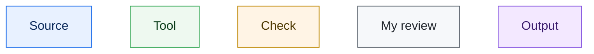

- **Arrow labels** name the artefact passed on: a file (`draft_info.json`, `.srt`), a set of clips, or a verdict (SEND / CHECK / STOP).
- **A dotted arrow** is an optional route, a loop back for a fix, or a measurement that sets a rule rather than a file the next step reads.
- **Maturity** is stated under every diagram and follows the [status labels](../README.md#status-labels). A shortlist check is labelled as one: it points a person at frames or lines to look at, and never signs anything off.
- **Every tool named exists** in [`tools/`](../tools/README.md) or in the folder its link points to. Where a step has no published tool – a plan written by hand, a third-party renderer, the private publishing sync – the table says so.

## Contents

1. [Desktop training videos](#1-desktop-training-videos)
2. [Phone-app training videos](#2-phone-app-training-videos)
3. [CapCut: building drafts and learning my style](#3-capcut-building-drafts-and-learning-my-style)
4. [Event films and reels](#4-event-films-and-reels)
5. [Photo: grade, LUT and fidelity-first retouching](#5-photo-grade-lut-and-fidelity-first-retouching)
6. [Voice-over and captions](#6-voice-over-and-captions)
7. [HyperFrames brand tutorials](#7-hyperframes-brand-tutorials)
8. [The AI workspace: hand-off, health checks, publishing](#8-the-ai-workspace-hand-off-health-checks-publishing)

---

## 1. Desktop training videos

A raw desktop screen recording becomes a paced, narrated, captioned video with a call-out on every action, built as a new, editable CapCut timeline and checked before and after export. Full playbook: [training-video production](training-video-production.md).

**Part 1 – from screen recording to a new CapCut review timeline**

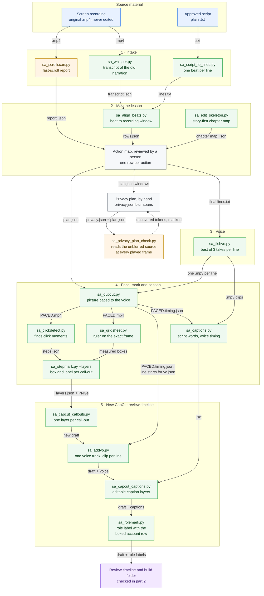

**Part 2 – checks, intro and outro, release**

```mermaid
flowchart TD
    n_tl["Review timeline and build folder<br/>draft, _layers.json, .srt,<br/>timing.json, privacy.json"]
    subgraph SG_DRAFT["6 · Checks on the draft and build files"]
        direction TB
        n_mark["sa_markcheck.py<br/>OCR and geometry pre-flight"]
        n_box["sa_boxcheck.py --verify<br/>vision shortlist, Experimental"]
        n_act["sa_actioncheck.py<br/>every instruction marked?"]
        n_cov["sa_coverage.py<br/>steps with no call-out"]
        n_qa["sa_qasheet.py<br/>one still per call-out"]
        n_vc["sa_voicecheck.py<br/>re-listen shortlist, Experimental"]
        n_mark -.->|"beats to look at first"| n_box
        n_act ~~~ n_cov
        n_qa ~~~ n_vc
    end
    subgraph SG_RENDER["7 · Checks on the review render"]
        direction LR
        n_rr["Review render<br/>.mp4 exported from the draft"]
        n_sync["sa_check_sync.py<br/>box vs word, caption vs voice"]
        n_priv["sa_privacy_sweep.py<br/>OCR every 0.25 s for names"]
        n_asr["sa_independent_asr.py<br/>second, larger local transcript"]
        n_rr -->|".mp4, _layers.json, .srt"| n_sync
        n_rr -->|".mp4, privacy.json"| n_priv
        n_rr -->|".mp4"| n_asr
    end
    n_me["My review<br/>every marking: pass, fail or unknown"]
    subgraph SG_FIN["8 · Intro, outro and sign-off"]
        n_line["sa_introline.py<br/>paces and pads the title line"]
        n_ichk["sa_introcheck.py<br/>1080p, framing, no burnt-in text"]
        n_ifull["sa_introfull.py<br/>intro in, tracks shifted, verified"]
        n_outro["sa_outro.py<br/>outro butted to the picture end"]
        n_tail["sa_tailkit.py<br/>music lands, two-part sign-off"]
    end
    subgraph SG_REL["9 · Release"]
        n_exp["sa_exportcheck.py<br/>safe to export?"]
        n_fin["sa_finalcheck.py<br/>exported MP4 against the script"]
        n_last["My final review<br/>full watch at normal speed"]
    end
    n_done["Finished video<br/>MP4, captions, script, review record"]
    n_fix["sa_applyfix.py<br/>fix, then every check again"]

    n_tl -->|"draft and build files"| SG_DRAFT
    SG_DRAFT -->|"export a review render"| SG_RENDER
    SG_RENDER -->|"shortlists, stills, offsets, sweep and transcript .json"| n_me
    n_me -->|"pass"| n_line
    n_line -->|"padded .wav, then generated clip"| n_ichk
    n_ichk -->|"clean intro clip"| n_ifull
    n_ifull -->|"draft + intro"| n_outro
    n_outro -->|"draft + outro"| n_tail
    n_tail -->|"finished draft"| n_exp
    n_exp -->|"exported .mp4"| n_fin
    n_fin -->|"SEND, CHECK or STOP"| n_last
    n_last -->|"approved"| n_done
    n_me -.->|"fail: corrections.json"| n_fix
    n_last -.->|"fail"| n_fix

    classDef input fill:#e8f1ff,stroke:#1f6feb,color:#0b2a5b
    classDef tool fill:#eef9f0,stroke:#2da44e,color:#0b3d1a
    classDef check fill:#fff4e5,stroke:#bf8700,color:#4d3800
    classDef output fill:#f3e8ff,stroke:#8250df,color:#3b1d6e
    classDef human fill:#f6f8fa,stroke:#57606a,color:#24292f
    class n_tl,n_rr input
    class n_mark,n_act,n_cov,n_box,n_qa,n_sync,n_priv,n_vc,n_ichk,n_exp,n_fin,n_asr check
    class n_fix,n_line,n_ifull,n_outro,n_tail tool
    class n_me,n_last human
    class n_done output
```

*How one desktop training video moves through the tools, from the raw screen recording to a finished MP4. Part 1 builds a new, editable CapCut review timeline; part 2 checks it, adds the intro and outro, and checks the export again before I approve it.* **Maturity:** Built, in use. The fast-scroll check, the detached voice track and the privacy sweep were added part-way through the series. [`sa_boxcheck.py`](../tools/sa_boxcheck.py) and [`sa_voicecheck.py`](../tools/sa_voicecheck.py) are Experimental shortlists that never pass anything. Nothing is released automatically: every cut ends with my review.

### Steps: desktop training videos

**Part 1 – from screen recording to a new CapCut review timeline**

| Step | Tool | What it does | In → Out |
|---|---|---|---|
| 1 | [`sa_scrollscan.py`](../tools/sa_scrollscan.py) | Flags fast scrolls and proposes stepped holds. It only reports, runs locally and uploads nothing. The count is reported before anything is built | recording `.mp4` → fast-scroll report (`--json`) |
| 2 | [`sa_whisper.py`](../tools/sa_whisper.py) | Makes a local transcript of the recording’s original narration, with segment times | recording `.mp4` → `transcript.json` |
| 3 | [`sa_script_to_lines.py`](../tools/sa_script_to_lines.py) | Splits the approved script into one narration beat per line, without breaking decimals, codes or abbreviations | script `.txt` → `lines.txt` |
| 4 | [`sa_align_beats.py`](../tools/sa_align_beats.py) | Matches each beat, in order, to the point in the recording where its content appears | `lines.txt` + `transcript.json` → `rows.json` (draft source windows) |
| 5 | [`sa_edit_skeleton.py`](../tools/sa_edit_skeleton.py) | Builds a story-first chapter map (`--family training_tutorial --format training_wide`) before any clip is placed | module brief → chapter map `.json` |
| 6 | Action map ([template](templates/training_action_map_template.csv)), reviewed by a person | Gives each click, entry, role switch, save or check its own row, or an exclusion with a reason. “Do X, then Y” lines are split, and the process owner settles any uncertain wording | `rows.json` + scroll report + chapter map → final `lines.txt` and `plan.json` (one source window per line) |
| 7 | Privacy plan, by hand (no tool) | Gives every name or e-mail address the lesson shows a blur rectangle with a span in source time, written at the script stage against the windows the action map will play. No published tool applies the blur itself | the action map’s windows (`plan.json`) → `privacy.json` (a rectangle and a span per blur) |
| 8 | [`sa_privacy_plan_check.py`](../tools/sa_privacy_plan_check.py) | Reads the unblurred source with on-device OCR every 0.25 s across every window the cut will play, plus each row’s frozen frame, and lists any e-mail address or harvested name token that is not inside a blur active at that moment. Tokens are printed masked (first two letters and the length). Runs locally and uploads nothing; the render sweep in step 26 stays the release check | unblurred source + `plan.json` + `privacy.json` (+ the hashed tokens from `sa_privacy_sweep.py harvest`) → `privacy_plan_check.json`; uncovered tokens go back to step 7 |
| 9 | [`sa_fishvo.py`](../tools/sa_fishvo.py) | Reads each line three times in an owned or licensed voice. A local word check drops misread takes, the smoothest take is kept and its loudness is matched. Only the line’s text goes to the voice service. This is the current route; earlier modules used another text-to-speech engine, with takes compared by [`sa_hfcheck.py`](../tools/sa_hfcheck.py) ([section 9 of the playbook](training-video-production.md#9-voice-over-lines)) | `lines.txt` → one `NN_line.mp3` per line |
| 10 | [`sa_dubcut.py`](../tools/sa_dubcut.py) | Paces the picture to the voice at between 0.70× and 1.6× speed, with 0.9 s between lines and a 2.5 s closing hold. It freezes the picture rather than rushing it, and never cuts the recording to fit the voice | `plan.json` + voice clips → `PACED.mp4` + `PACED.timing.json` |
| 11 | [`sa_clickdetect.py`](../tools/sa_clickdetect.py) | Finds click moments from cursor movement and screen changes. Labels come out as placeholders for a person to name | `PACED.mp4` → `steps.json` (draft) |
| 12 | [`sa_gridsheet.py`](../tools/sa_gridsheet.py) | Makes a contact sheet with a ruler in source pixels, so each box is measured on the exact frame the render will show | `PACED.mp4` + times → `grid.png` → measured boxes in `steps.json` |
| 13 | [`sa_stepmark.py`](../tools/sa_stepmark.py) `--layers` | Renders each call-out (box plus label chip) as a full-canvas transparent PNG in the house style | `steps.json` → `PACED_LAYERS/_layers.json` + PNGs |
| 14 | [`sa_captions.py`](../tools/sa_captions.py) | Takes the caption text from the locked script and the timing from the voice clips (local word timestamps), in cues of at most 46 characters | captions plan (script text + voice clips + `PACED.timing.json`) → `.srt` |
| 15 | [`sa_capcut_callouts.py`](../tools/sa_capcut_callouts.py) | Writes a new CapCut project with the paced picture and one layer per call-out, then reads the draft back to check it. Refuses while CapCut is open and never overwrites a project | `_layers.json` → new CapCut draft |
| 16 | [`sa_addvo.py`](../tools/sa_addvo.py) | Puts the voice on one track, one segment per line, and mutes the audio under it. Refuses to let two lines overlap | draft + `vo.json` (file and start per line, from the timing) → draft with a separate voice track |
| 17 | [`sa_capcut_captions.py`](../tools/sa_capcut_captions.py) | Imports the `.srt` as editable text layers, copying the style of a caption I typed myself. Backs the draft up first | draft + `.srt` → draft with a caption track |
| 18 | [`sa_rolemark.py`](../tools/sa_rolemark.py) `--fix` | Adds a role label at each sign-in on one track, copied from my own hand-typed label. Leaves videos already marked finished alone. Since my correction on the pilot, each sign-in is marked by a call-out box on the actual account or role row (a normal [`sa_stepmark.py`](../tools/sa_stepmark.py) call-out, step 13); the label only names the role and is never the marking on its own | draft + `role_items.json` → draft with role labels |

**Part 2 – checks, intro and outro, release**

| Step | Tool | What it does | In → Out |
|---|---|---|---|
| 19 | [`sa_markcheck.py`](../tools/sa_markcheck.py) | Pre-flight with no AI model: coverage, OCR text match, geometry and house-style fields. Lists only the beats that need a closer look | module folder (box specs) → shortlist |
| 20 | [`sa_boxcheck.py`](../tools/sa_boxcheck.py) `--verify` | **Experimental.** A local vision model checks whether each box sits on the element its label names. Runs locally and uploads nothing. Gives a person a shortlist and never passes anything | `_layers.json` (run on the beats [`sa_markcheck.py`](../tools/sa_markcheck.py) listed, `--limit N` by day) → flagged boxes |
| 21 | [`sa_actioncheck.py`](../tools/sa_actioncheck.py) | Splits the narration into single instructions and flags any with no marking nearby | draft captions + markings → possible gaps |
| 22 | [`sa_coverage.py`](../tools/sa_coverage.py) | Finds script steps that tell the viewer to act while no call-out is on screen | captions plan + `PACED.timing.json` + `_layers.json` → unmarked steps |
| 23 | [`sa_qasheet.py`](../tools/sa_qasheet.py) | Makes one still per call-out, with its box drawn on the frame that actually plays | `_layers.json` → `NN_<label>.jpg` + `index.json` |
| 24 | [`sa_voicecheck.py`](../tools/sa_voicecheck.py) | **Experimental.** Uses local transcription to list voice lines worth listening to again. It finds about 65% of bad lines, so a line it does not flag is unknown, not good. [`sa_voiceclips.py`](../tools/sa_voiceclips.py) turns the list into a one-click listening sheet | voice in the draft → `VOICE_CHECK.html` |
| 25 | [`sa_check_sync.py`](../tools/sa_check_sync.py) | Runs three sync checks: each box against its spoken word, the label read back by on-device OCR at the box’s start, middle and end, and each caption against the speech onset on the waveform | review render (composite + preview `.mp4`) + `_layers.json` + `.srt` + `timing.json` → worst offsets and failures |
| 26 | [`sa_privacy_sweep.py`](../tools/sa_privacy_sweep.py) | Reads every 0.25 s of the render with OCR and fails any frame showing an e-mail address, a collected name (stored only as a hash) or readable text under a blur. [`sa_privacy_plan_check.py`](../tools/sa_privacy_plan_check.py) checks the blur plan against the source first. Runs locally and uploads nothing | review `.mp4` + `privacy.json` → `privacy_sweep.json` |
| 27 | [`sa_independent_asr.py`](../tools/sa_independent_asr.py) | Transcribes the render again with a different, larger local model than the build used, with word timestamps, to compare with the script and captions | review `.mp4` → `<name>_words_medium.json` |
| 28 | Me | Every marking at its start, middle and end, judged pass, fail or unknown with frame evidence; unknown is never a pass. Large one-off verification passes also used AI coding agents | all findings → pass, or `corrections.json` |
| 29 | [`sa_applyfix.py`](../tools/sa_applyfix.py) | Applies measured corrections: checks every box fits the canvas, catches clashes in time and space, re-renders and retimes in the draft. Every check then runs again | manifest + `corrections.json` → fixed PNGs and draft |
| 30 | [`sa_introline.py`](../tools/sa_introline.py) | Slows the spoken title to 2.50 words a second (never faster) and adds silence at the start and end to make a whole number of seconds, so the AI presenter never mouths extra words. The clip itself is generated outside this repository, after I approve the cost | title line `.mp3` → padded `.wav` + clip length |
| 31 | [`sa_introcheck.py`](../tools/sa_introcheck.py) | Downloads the generated clip and checks it is 1080p, that the presenter’s position matches the approved set, and that no text is burnt into the empty third | clip URL → intro `.mp4`, exit 0 if clean, 1 if it needs a look |
| 32 | [`sa_introfull.py`](../tools/sa_introfull.py) `--apply` | Copies the intro, title and music recipe from a finished donor project and shifts every existing segment by the intro’s length. It then re-reads the draft and restores the backup if anything else moved | draft + intro clip + voice line → draft with intro |
| 33 | [`sa_outro.py`](../tools/sa_outro.py) `--apply` | Places the outro the way I do by hand: right after the last frame of the picture, muted, with a slow fade on the clip before it | draft → draft with outro |
| 34 | [`sa_tailkit.py`](../tools/sa_tailkit.py) `--apply` | Times the music so its own ending lands on the last frame, then adds the two-part spoken sign-off | draft → finished draft |
| 35 | [`sa_exportcheck.py`](../tools/sa_exportcheck.py) | Read-only check before export: captions, title, one-line rule, duplicate sign-off, black at the end, missing media. [`sa_tailcheck.py`](../tools/sa_tailcheck.py) catches picture still playing after the narration ends | finished draft → safe to export → exported `.mp4` |
| 36 | [`sa_finalcheck.py`](../tools/sa_finalcheck.py) | Checks the exported MP4 itself: container, loudness, silences, a black first or last frame, and a local transcript against every sentence of the script | export `.mp4` + script `.txt` → SEND / CHECK / STOP |
| 37 | Me | A full watch at normal speed; my approval releases it, and a failure goes back through step 29 | all evidence → finished MP4, caption file, script and review record |

`plan.json`, the captions plan, `vo.json`, `role_items.json` and `privacy.json` are per-module files put together from the action map and the timing during each build; no published tool writes them, so the diagram shows them as files passed between steps rather than as tools.

**Run it** – the build half of part 1, from the repository root. CapCut must be closed, and `CAPCUT_DONOR` should name your own approved template project:

```bash
python3 tools/sa_scrollscan.py recording.mp4 --json scroll.json
python3 tools/sa_dubcut.py plan.json -o PACED.mp4                 # also writes PACED.timing.json
python3 tools/sa_stepmark.py steps.json --layers                  # writes PACED_LAYERS/_layers.json
python3 tools/sa_captions.py captions.plan.json -o module.srt
python3 tools/sa_capcut_callouts.py PACED_LAYERS/_layers.json --name "Module 01 review"
python3 tools/sa_capcut_captions.py "Module 01 review" module.srt
```

---

## 2. Phone-app training videos

A phone screen recording becomes a reviewed 9:16 training video: the screen is read as text by on-device OCR, the picture is paced so each marking’s screen arrives on the words that name it, and the result is built as editable CapCut layers. Full playbook: [training-video production, section 6](training-video-production.md#6-phone-app-recordings-voice-anchored-pacing).

**Part 1 – intake, script and voice, plan**

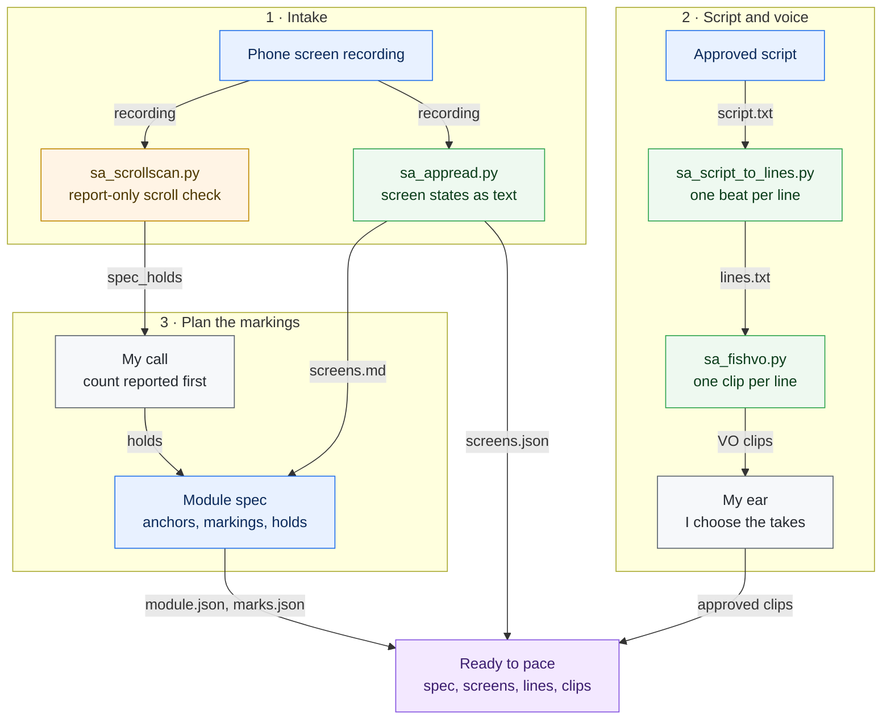

**Part 2 – pace, phone look, markings, captions**

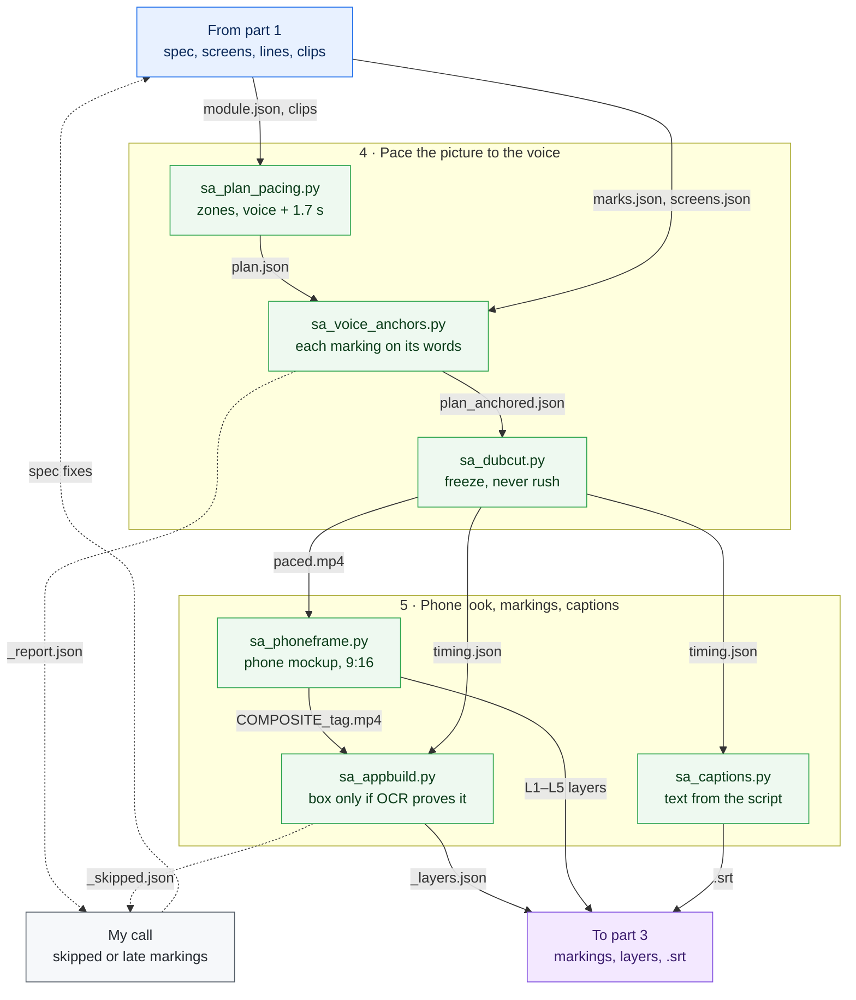

**Part 3 – the CapCut review timeline, checks and release**

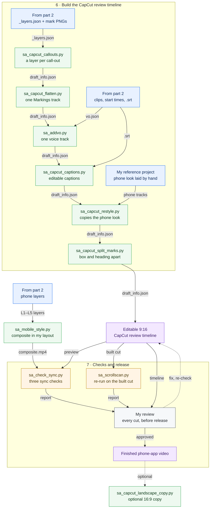

*A phone screen recording becomes a reviewed 9:16 training video in three parts: the screen is read as text by on-device OCR, the picture is paced so each marking’s screen arrives on the words that name it, and the result is built as editable CapCut layers and checked for sync before I review every cut.* **Maturity:** Built, in use on the phone-app series. The take score and the skipped-markings list are shortlists for a person, not passes. The checks use on-device OCR and a waveform, never a vision model. The 16:9 copy is optional.

### Steps: phone-app training videos

| Step | Tool | What it does | In → Out |
|---|---|---|---|
| 1 · Intake | [`sa_scrollscan.py`](../tools/sa_scrollscan.py) | Finds every fast scroll (a section skipped or flown past) in px/s and screen-heights/s and proposes stepped holds. Report only: it runs locally and uploads nothing | phone recording → printed report, `scroll.json` with ready `spec_holds` |
| 1 · Intake | – (my call) | I get the fast-scroll count before anything is built. Where a hold would push a marking late, I choose which one to give up | scroll report → `holds` / `anchor_overrides` in the module spec; revisited after step 4 when `_report.json` shows a late marking |
| 2 · Read | [`sa_appread.py`](../tools/sa_appread.py) | Collapses the recording into distinct screen states, each with OCR text and element boxes in source pixels. It deletes frames as it goes and cannot see icon-only buttons | recording → `screens.json`, `screens.md` |
| 2 · Read | [`sa_ocr.swift`](../tools/sa_ocr.swift) | On-device Apple Vision OCR, built once with `swiftc`. `--boxes` adds each line’s rectangle. The reader, the placer and the sync check all call it | frames → `text@x,y,w,h` lines |
| 3 · Script | [`sa_script_to_lines.py`](../tools/sa_script_to_lines.py) | Splits the approved prose script into one sentence per beat, never breaking inside a decimal, a code or an abbreviation | `script.txt` → `lines.txt` |
| 3 · Voice | [`sa_fishvo.py`](../tools/sa_fishvo.py) | Makes one clip per line through the Fish Audio API, with a voice you own or are licensed to use. Best of 3 takes, local Whisper word check, speed 0.95, a warning before any paid fallback | `lines.txt` → `vo/NN_slug.mp3` |
| 3 · Voice | – (my ear) | The smoothness score only shortlists. I decide which takes stand | VO clips → approved clips |
| 3 · Plan | module spec (written, not a tool) | Holds the line start anchors and each marking’s `line` · `say` · `target` · `heading`, plus `holds`, `anchor_overrides` and `exclude`. It is written against `screens.md`, with the trigger words in one line starting about 1.7 s apart | `screens.md`, `lines.txt`, holds → `module.json`, `marks.json` |
| 4 · Pace | [`sa_plan_pacing.py`](../tools/sa_plan_pacing.py) | Gives each line a zone of the recording and keeps its motion plus still padding up to voice + gap (1.7 s on phone modules). It drops only frozen frames and keeps instant tap-throughs as 0.1 s events | `module.json` (video, vo_dir, bounds, gap) → `plan.json` (+ `_tight.mp4` when faults are excluded) |
| 4 · Pace | [`sa_voice_anchors.py`](../tools/sa_voice_anchors.py) | Sets `at` = the marking’s words − 0.3 s and `src` = a steady moment where OCR proves the target is on screen. Adds keep pins (≥ 1.6 s on screen) and a frame check every 0.25 s, with pins capped at 0.35 s. It reports `late_or_longer` and `moves_voice` and never moves the voice silently | `plan.json`, `screens.json`, `lines.txt`, `marks.json` → `plan_anchored.json`, `_report.json` |
| 4 · Pace | [`sa_dubcut.py`](../tools/sa_dubcut.py) | Plays each line’s window at 0.70–1.60× and spends spare time as a freeze at the start of each piece, frame-exact at 30 fps | `plan_anchored.json` → `paced.mp4`, `paced.timing.json` |
| 5 · Look | [`sa_phoneframe.py`](../tools/sa_phoneframe.py) | Places the paced recording inside a phone mockup on a backdrop at 1080 × 1920 and writes each piece as its own CapCut layer. The colours are placeholders to sample from your own app | `paced.mp4` → `L1_background.png` … `L5_iphone_front.png`, `L4_app_<tag>.mp4`, `COMPOSITE_<tag>.mp4`, `layers.json` |
| 5 · Markings | [`sa_appbuild.py`](../tools/sa_appbuild.py) | Times each marking from the words in its voice clip, then outlines the whole element only where OCR finds the target exactly once and it stays on screen ≥ 1.3 s near those words. Anything it cannot prove is skipped and listed | `marks.json`, `lines.txt`, plan, `paced.timing.json`, composite → `layers/mark_NNN_box.png`, `_layers.json`, `_skipped.json` |
| 5 · Markings | – (my call) | A person reads the skipped list. Nothing is nudged to a plausible spot | `_skipped.json` → spec fixes |
| 5 · Captions | [`sa_captions.py`](../tools/sa_captions.py) | Takes the caption text from the locked script and the timing from forced alignment on each clip. Lines run to 46 characters, and no cue is shorter than 1 s | plan with `timing`, line text and clips → `module.srt` |
| 6 · CapCut | [`sa_capcut_callouts.py`](../tools/sa_capcut_callouts.py) | Builds a new draft with the picture, the optional phone stills and one untransformed full-canvas layer per call-out. Refuses while CapCut is open and never overwrites a project | `_layers.json` (+ phone layers) → new project `draft_info.json` |
| 6 · CapCut | [`sa_capcut_flatten.py`](../tools/sa_capcut_flatten.py) | Moves `_box.png` call-outs onto one Markings track and `_label.png` chips onto a Marking names track. Checks first and refuses if any call-outs overlap. Dry run unless `--apply`; backs up first (`.pre_flatten`) | draft → draft with a Markings and a Marking names track |
| 6 · CapCut | [`sa_addvo.py`](../tools/sa_addvo.py) | Adds one Voice over track with a segment per line and mutes the picture’s audio. Refuses overlapping lines; backs up first | `vo.json` (clip + start from `paced.timing.json`) → draft |
| 6 · CapCut | [`sa_capcut_captions.py`](../tools/sa_capcut_captions.py) | Adds the SRT as an editable Captions text track, styled like an approved project | `module.srt` → draft |
| 6 · CapCut | [`sa_capcut_restyle.py`](../tools/sa_capcut_restyle.py) | Copies the phone and app tracks of my hand-laid project with fresh ids and points them at this module’s app layer. Markings, Voice over and Captions stay byte-identical. It re-reads the draft and restores the backup on failure | reference project + `L4_app_<tag>.mp4` → restyled `draft_info.json` |
| 6 · CapCut | [`sa_capcut_split_marks.py`](../tools/sa_capcut_split_marks.py) | Redraws each marking as a box layer and a heading layer, mapped through the app’s scale and lift, keeping my hand-nudged timing. Headings never sit on text, and it prints `?? heading` / `?? edge` for anything still touching | `_layers.json` + project → Markings and Marking headings tracks |
| 7 · Checks | [`sa_mobile_style.py`](../tools/sa_mobile_style.py) | Renders my CapCut layout locally, with app edges within 0.5 px of CapCut’s own render, for preview and OCR | layer folder + tag (+ style JSON) → composite `.mp4` / `.png` |
| 7 · Checks | [`sa_check_sync.py`](../tools/sa_check_sync.py) | Runs three checks: box start against its words, the element read back inside its box at start, middle and end, and caption start against the speech onset on the waveform | composite, preview, `_layers.json`, `.srt`, `timing.json` → printed report |
| 7 · Checks | [`sa_scrollscan.py`](../tools/sa_scrollscan.py) | Runs again on the built cut, because a later cut can remove the rest after a scroll | built cut → report |
| 7 · Release | – (my review) | I review every cut in CapCut. Fixes go back to the timeline and are checked again | review timeline → finished 9:16 video |
| 7 · Release | [`sa_capcut_landscape_copy.py`](../tools/sa_capcut_landscape_copy.py) | Optional. Makes a 16:9 desktop copy of an approved 9:16 project, with the phone centred, captions on the right and the step list on the left. The reel itself is never touched | approved project → `<project> - 16x9` |

The module spec (`module.json`, `marks.json`), `vo.json` and the captions plan are written by hand or by an agent for each module; no published tool writes them.

**Run it** – one module, from the repository root:

```bash
swiftc -O tools/sa_ocr.swift -o tools/bin/sa_ocr                          # on-device OCR, built once
python3 tools/sa_scrollscan.py rec.mp4 --hold 1.5 --json scroll.json      # report the fast-scroll count before building
python3 tools/sa_appread.py rec.mp4 --out READ                            # READ/screens.json + screens.md
python3 tools/sa_plan_pacing.py module.json && python3 tools/sa_voice_anchors.py 01_Module plan.json --screens READ/screens.json --lines lines.txt --marks marks.json --video rec.mp4 --id 0001
python3 tools/sa_dubcut.py plan_anchored.json -o paced.mp4 && python3 tools/sa_phoneframe.py paced.mp4 --layers LAYERS/01_Module --name 01_Module
python3 tools/sa_appbuild.py --id 0001 --marks marks.json --lines lines.txt --plan plan_anchored.json --timing paced.timing.json --video LAYERS/01_Module/COMPOSITE_01_Module.mp4 --out BUILD/01_Module
```

Then, with CapCut closed: `sa_capcut_callouts.py BUILD/01_Module/_layers.json --name "Phone 01"` → `sa_capcut_flatten.py "Phone 01" --apply` → `sa_addvo.py "Phone 01" vo.json` → `sa_capcut_captions.py "Phone 01" module.srt` → `sa_capcut_restyle.py <reference> "Phone 01" --tag 01_Module` → `sa_capcut_split_marks.py 01_Module "Phone 01"`, and finally `sa_check_sync.py COMPOSITE.mp4 PREVIEW.mp4 _layers.json module.srt paced.timing.json`.

---

## 3. CapCut: building drafts and learning my style

My finished CapCut projects become style data, a plan I have reviewed becomes a brand-new CapCut draft, and my own edits of that draft are watched live and compared afterwards, so what survives becomes the next build’s defaults. Full playbooks: [the CapCut hub](capcut.md) and [learning an editor’s style](learning-an-editors-style.md).

**A. From my finished projects to a new CapCut draft (stages 1–3)**

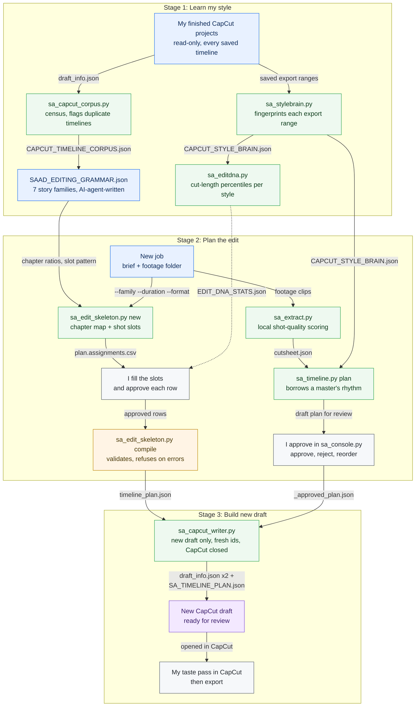

**B. Watching my edit and learning from what I changed (stages 4–7)**

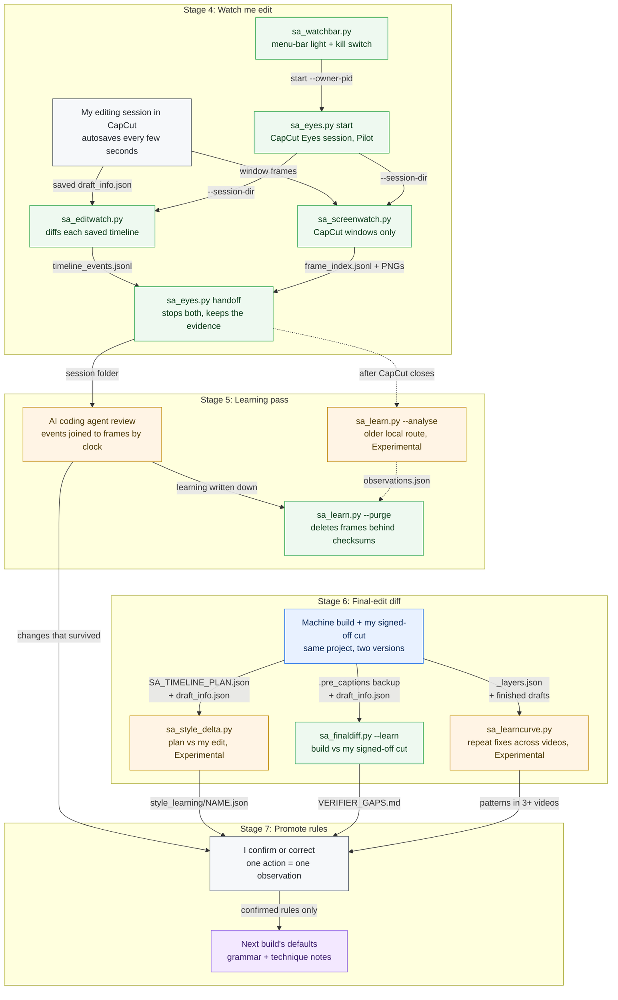

*My finished CapCut projects become style data, a plan I have reviewed becomes a brand-new CapCut draft, and my own edits of that draft are watched live and compared afterwards, so they become the next build’s defaults.* **Maturity:** style measurement and the final-edit diff ([`sa_finaldiff.py`](../tools/sa_finaldiff.py)) are Built, in use. The grammar, skeleton, planner and writer are Built, awaiting review. CapCut Eyes live watching is a Pilot. The plan-versus-final diff, the correction trend and the older local learning route are Experimental. Every delivered cut is still reviewed by me.

### Steps: CapCut drafts and style learning

| Step | Tool | What it does | In → Out |
|---|---|---|---|
| 1. Census | [`sa_capcut_corpus.py`](../tools/sa_capcut_corpus.py) | Lists every CapCut project and timeline without changing anything; content signatures flag duplicate timelines; marks encrypted or unreadable ones | CapCut projects folder (`--root`) → `CAPCUT_TIMELINE_CORPUS.json` + `.md` beside it (`--out` takes a file path) |
| 2. Fingerprint | [`sa_stylebrain.py`](../tools/sa_stylebrain.py) | One fingerprint per project from its saved export range: pacing, in-points, speed, reframes, transitions; a project with no saved range is measured over the whole draft and flagged `low` | each timeline’s `draft_info.json` → `CAPCUT_STYLE_BRAIN.json` + `.md` (`--json`, `--markdown`), kept private because it names projects; an anonymised copy is published as [`Reference/capcut_style_brain_anonymised.json`](../Reference/capcut_style_brain_anonymised.json) |
| 3. Cut rhythm | [`sa_editdna.py`](../tools/sa_editdna.py) | Cut-length percentiles, rhythm spread, speed-change share and video layers per style | `CAPCUT_STYLE_BRAIN.json` → [`Reference/EDIT_DNA_STATS.json`](../Reference/EDIT_DNA_STATS.json) (a planning target; no tool reads it automatically yet) |
| 4. Story grammar | data file, no tool: [`Reference/SAAD_EDITING_GRAMMAR.json`](../Reference/SAAD_EDITING_GRAMMAR.json) | Seven story families with chapter ratios, shot-slot patterns and transition budgets; written by an AI agent from the census and 11 approved exports (Built, awaiting review) | census + approved exports → the grammar that step 5 reads |
| 5. Skeleton | [`sa_edit_skeleton.py`](../tools/sa_edit_skeleton.py) `new` | Chapter map and semantic shot slots from the chosen family (Built, awaiting review) | grammar + `--name --family --duration --format [--brief]` → `plan.json`, `plan.assignments.csv`, `plan.md` |
| 6. My review | me | I fill the sheet in story order and mark a row `approved` only after checking its in- and out-points | `plan.assignments.csv` → approved rows |
| 7. Validate, compile | [`sa_edit_skeleton.py`](../tools/sa_edit_skeleton.py) `validate` / `compile` | Errors block the compile: missing or overlapping chapters, a total more than 0.35 s off, or an approved slot with no file or out-point. Warnings are listed | `plan.json` + sheet + `--donor` → `timeline_plan.json` (`--out`) |
| 8. Or: score footage | [`sa_extract.py`](../tools/sa_extract.py) | Local multi-frame scoring (sharpness, exposure clipping, jitter, duplicate removal) that proposes source windows and speeds | footage folder (`--cut-len`, `--candidates`, `--limit`) → `<folder>/_CUTSHEET/cutsheet.json` + `previews/` |
| 9. Or: plan from the style brain | [`sa_timeline.py`](../tools/sa_timeline.py) `plan` | Picks a master project of the chosen style and borrows its timing, in-points, speed and transforms; any choice not backed by a reviewed cutsheet is flagged for review | footage + `CAPCUT_STYLE_BRAIN.json` + `--cutsheet` (`--name`, `--style`, `--duration`) → `timeline_plan.json` (`--out`) |
| 10. Or: approve in the browser | [`sa_console.py`](../tools/sa_console.py) | Runs steps 8 and 9 from a plain-English brief, then serves a local page where I approve, reject or reorder clips; it re-plans from the approved cutsheet and calls the writer | brief + footage (`--port`) → `Console/<slug>/index.html`, `_approved_cutsheet.json`, `_approved_plan.json` |
| Optional check | [`sa_plan_preview.py`](../tools/sa_plan_preview.py) | Validates a plan and renders a silent review MP4 with ffmpeg | `timeline_plan.json` → review MP4 (`--out`) |
| 11. Write | [`sa_capcut_writer.py`](../tools/sa_capcut_writer.py) | Validates the plan and copies a donor’s metadata (not its caches) with fresh ids. It refuses to overwrite a project or to run while CapCut is open, and deletes a half-written project if anything fails (Built, awaiting review) | `timeline_plan.json` + donor (`--donor`, or the plan’s master) + `--name` → new project folder: `draft_info.json` (root and `Timelines/<uuid>/`) + `SA_TIMELINE_PLAN.json` |
| 12. Taste pass | me, in CapCut | Feel, music, timing and story, then export | new draft → finished timeline + export |
| 13. Start watching | [`sa_watchbar.py`](../tools/sa_watchbar.py) → [`sa_eyes.py`](../tools/sa_eyes.py) `start` | The menu-bar light starts a session tied to its own process id; closing it stops both watchers (Pilot) | → `Sessions/_eyes/<session-id>/manifest.json` |
| 14. What changed | [`sa_editwatch.py`](../tools/sa_editwatch.py) | Reads every saved timeline once a second and never writes to a project | autosaved `draft_info.json` → `timeline_events.jsonl`, `timeline_changes.md`, `timeline_before/`, `timeline_final/` |
| 15. How it was changed | [`sa_screenwatch.py`](../tools/sa_screenwatch.py) | Captures CapCut’s own windows only, about every 3 s, skipping near-identical frames; runs locally and uploads nothing | CapCut windows → `frames/*.png` + `frames/frame_index.jsonl` |
| 16. Hand off | [`sa_eyes.py`](../tools/sa_eyes.py) `handoff` | Stops both watchers and keeps every file for review | session → status `stopped_pending_claude_learning` |
| 17. Learning pass | AI coding agent (a process, not a repo tool) | Reads the event log against the frames; only changes that survive to the final draft become candidates; frames never go to generation services | session folder → written learning |
| Older route | [`sa_learn.py`](../tools/sa_learn.py) `--analyse` | Local vision join of frames and events; refuses while CapCut is open (Experimental, a shortlist, never a pass gate) | `--session-dir` → `observations.json`, `learning.md` |
| 18. Purge | [`sa_learn.py`](../tools/sa_learn.py) `--purge` | Deletes screenshots only when every frame is indexed, read and checksum-matched | `--session-dir` → `purge_receipt.json` |
| 19. Plan vs final | [`sa_style_delta.py`](../tools/sa_style_delta.py) | Clips removed or reordered, plus changed in-points, speed and reframes, between the plan and my finished edit (Experimental) | project folder + `--plan` (defaults to its `SA_TIMELINE_PLAN.json`) → `--out` `.json` + `.md` |
| 20. Build vs signed-off | [`sa_finaldiff.py`](../tools/sa_finaldiff.py) | For builds whose captions came from [`sa_capcut_captions.py`](../tools/sa_capcut_captions.py), which leaves a `.pre_captions` backup (the last purely machine-built state). Ignores freeze-frame PNGs and counts my typed labels separately (Built, in use) | project name (or `--all --prefix`) → diff report; `--learn` adds escaped defects to `Reference/VERIFIER_GAPS.md` |
| 21. Across videos | [`sa_learncurve.py`](../tools/sa_learncurve.py) | Recurring corrections, and whether they fall video by video; a pattern in 3+ finished videos counts as a build-default defect (Experimental) | build `_layers.json` manifests + finished drafts → printed report |
| 22. Promote | me | A single action stays an observation; only repeated sessions or my direct correction change the grammar | evidence → next build’s defaults |

The two diffs use different baselines: [`sa_style_delta.py`](../tools/sa_style_delta.py) compares my edit with the `SA_TIMELINE_PLAN.json` the writer saved inside the draft, and [`sa_finaldiff.py`](../tools/sa_finaldiff.py) compares it with the `.pre_captions` backup a training build leaves behind. The grammar file was written by an AI agent from the census figures; no tool writes it.

**Run it** – from the repository root:

```bash
python3 tools/sa_stylebrain.py && python3 tools/sa_editdna.py
python3 tools/sa_edit_skeleton.py new --name "Example recap" --family event_recap_fast --duration 30 --format story_9x16 --out plan.json   # then fill and approve plan.assignments.csv
python3 tools/sa_edit_skeleton.py compile plan.json plan.assignments.csv --donor "Review Donor" --out timeline_plan.json
python3 tools/sa_capcut_writer.py timeline_plan.json --name "Review v1"   # CapCut must be closed
python3 tools/sa_eyes.py start   # edit "Review v1" in CapCut, then: python3 tools/sa_eyes.py handoff
python3 tools/sa_style_delta.py "$HOME/Movies/CapCut/User Data/Projects/com.lveditor.draft/Review v1" --out style_learning/review-v1
```

“Review Donor” stands for any existing CapCut project of yours used as the donor.

---

## 4. Event films and reels

Two routes from the same event footage: **A** rebuilds an event film from raw footage against a measured, approved reference and renders it with ffmpeg; **B** takes a story-first plan into a new, editable CapCut draft that I finish by hand. Full playbook: [learning an editor’s style, section 10](learning-an-editors-style.md#10-event-films-measure-the-approved-reference-before-cutting).

**A. Event film: the rebuild chain**

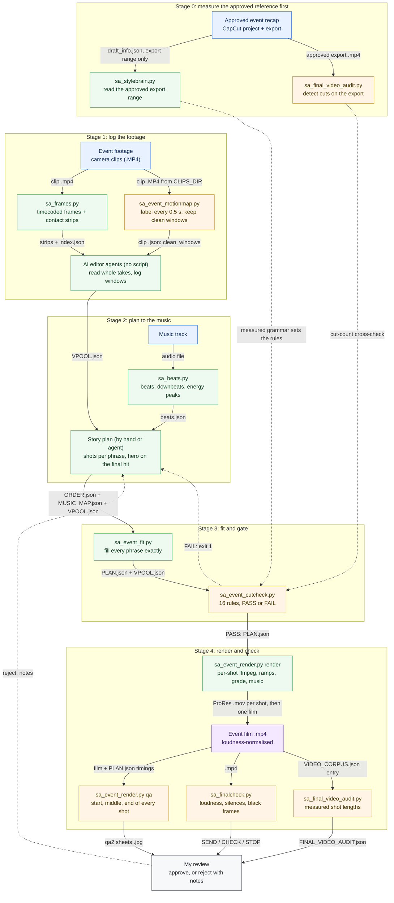

*An event film rebuilt from raw footage: the approved reference is measured first, then the footage is logged and checked for camera motion, shots are fitted to the music, the plan is gated, and the film is rendered and checked. Dotted lines are measurements that set the gate’s rules (not files the gate reads) and the two loops back to the story plan.* **Maturity:** Experimental – the chain has not yet produced a cut I have reviewed.

**B. Event reel: from a story skeleton to an editable CapCut draft**

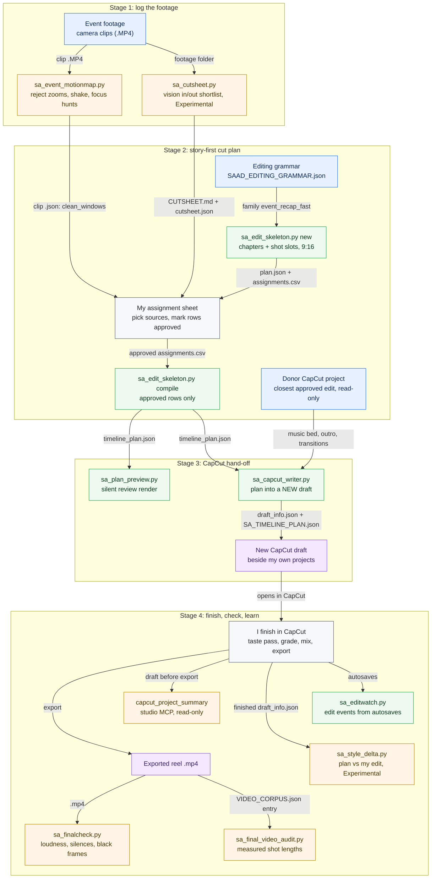

*An event reel goes from logged footage, through a story-first plan, into a new editable CapCut draft and then to export checks.* **Maturity:** the skeleton and the CapCut writer are Built, awaiting review. The cut sheet is an Experimental vision-model shortlist, the edit watcher is a Pilot and the style delta is Experimental.

### Steps: event films and reels

**A. Event film: the rebuild chain** (Experimental: it has not yet produced a cut I have reviewed)

| Step | Tool | What it does | In → Out |
|---|---|---|---|
| A0 · Read the reference timeline | [`sa_stylebrain.py`](../tools/sa_stylebrain.py) | Fingerprints CapCut drafts read-only, inside the approved export range only: shot lengths, in-points, speeds, reframes and transitions | CapCut `draft_info.json` → style-brain `.json` + `.md` |
| A0 · Check it against the export | [`sa_final_video_audit.py`](../tools/sa_final_video_audit.py) | Detects cuts on the exported MP4 with PySceneDetect. Soft transitions are the expected misses | `VIDEO_CORPUS.json` naming the export → `FINAL_VIDEO_AUDIT.json` |
| A1 · Frames to read | [`sa_frames.py`](../tools/sa_frames.py) | Takes a frame every 0.5 s with the source timecode burned in, plus 8 × 3 contact strips. It uses local ffmpeg and uploads nothing | clip → `frames/`, `strips/`, `index.json` |
| A2 · Motion map | [`sa_event_motionmap.py`](../tools/sa_event_motionmap.py) | Samples at 10 fps (480 × 270, greyscale) and labels every 0.5 s as `lens_zoom`, `push`, `whip`, `shake`, `focus_hunt`, `exposure` or `stable`. Usable stretches of 0.8 s or more become clean windows. The thresholds were calibrated on one shoot, so retune them for each camera. `--relabel` re-labels stored scans | `$CLIPS_DIR/<clip>.MP4` → `<clip>.json` (`bins`, `clean_windows`, `raw`) |
| A3 · Window pool | AI editor agents (no script) | Read each long take in full and log candidate windows that sit inside the clean windows. This is a shortlist, not a pass. AI coding agents read the frames; frames never go to a generation service | strips + `<clip>.json` → `VPOOL.json` (`id`, `clip`, `in`, `out`, `fps`, hints) |
| A4 · Beat grid | [`sa_beats.py`](../tools/sa_beats.py) | Finds the tempo, every beat, downbeat estimates (every fourth beat) and energy peaks worth cutting on | music file → `<music>.beats.json` (or `--out`) |
| A5 · Story plan | – (by hand or by an agent; no script) | Puts the pool’s shots in order inside each music phrase, with people and motion first and never the venue or text on the LED walls. Names the hero shot that lands on the final hit | `VPOOL.json` + `beats.json` → `ORDER.json`, `MUSIC_MAP.json` (`phrase_starts_film`, `final_hit_film`, `segments`, `file`) |
| A6 · Fit to the music | [`sa_event_fit.py`](../tools/sa_event_fit.py) | Fills every phrase exactly. Each shot starts at its window length ÷ 0.79, then stretches (down to 0.69×, or 0.5× on a flagged high-frame-rate hero) or shrinks (down to 0.45 s). Body shots are capped at 1.6 s, and rounding is absorbed so the hero starts on the hit | `ORDER.json` + `VPOOL.json` + `MUSIC_MAP.json` → `PLAN.json` |
| A7 · Plan gate | [`sa_event_cutcheck.py`](../tools/sa_event_cutcheck.py) | Checks 16 PASS/FAIL rules taken from the reference, including: final shot on the hit (±0.03 s) and 2.0–3.0 s long; body median 0.95–1.15 s, p25 ≥ 0.70 s, p75 ≤ 1.30 s; ≥ 8 shots in the first 10 s; every shot inside its window; legal speeds; ≤ 3 deep slow-motion shots; ≤ 4 transitions; no duplicates and no keyframed push-ins. Any FAIL exits with code 1, and the plan goes back to step A5. The hit time (`HIT`) and the 33–38 shot band are constants in the script, so set them for your track | `PLAN.json` + `VPOOL.json` → PASS/FAIL list + exit code |
| A8 · Render | [`sa_event_render.py`](../tools/sa_event_render.py) `render` | Renders at 1920 × 1080, 30 fps. Each shot gets its speed or ramp pieces, `zoompan` framing (a fixed zoom and anchor per shot; the gate fails any keyframed push-in), the grade (`EVENT_GRADE`), the fix for faces lit by LED walls, and a cut, fade, flash or dip. Then it adds the end card, the music segments and natural-sound bites, and runs `loudnorm` to −17 LUFS. `EVENT_SHOTS` re-renders only the shots you name | `PLAN.json` + clips in `$EVENT_SRC` → `shots2/<version>/*.mov` (ProRes) → `Event_Film_<version>.mp4` |
| A9 · Shot sheets | `sa_event_render.py` `qa` | Takes stills at the start, middle and end of every shot, ten shots to a sheet, labelled with id, clip, times, speed and note | film + `PLAN.json` → `qa2_<version>_N.jpg` |
| A10 · Export check | [`sa_finalcheck.py`](../tools/sa_finalcheck.py) | Run it without `--script` for a music film. It checks the container, loudness (warns outside −24 to −12 LUFS), the longest silence and black first or last frames, and gives a SEND, CHECK or STOP verdict | `.mp4` → report (`--json` to save it); exit 1 unless SEND |
| A11 · Measured rhythm | [`sa_final_video_audit.py`](../tools/sa_final_video_audit.py) | Measures shot lengths on the rendered film so they can be compared with the reference | `VIDEO_CORPUS.json` → `FINAL_VIDEO_AUDIT.json` |
| A12 · Review | Me | Approve, or reject with notes that go back to the story plan | sheets + reports → decision |

**B. Event reel: from a story skeleton to an editable CapCut draft** (Built, awaiting review; the cut sheet is an Experimental shortlist, edit watching is a Pilot and the style delta is Experimental)

| Step | Tool | What it does | In → Out |
|---|---|---|---|
| B1 · Motion gate | [`sa_event_motionmap.py`](../tools/sa_event_motionmap.py) | Same as A2: rejects optical zooms, shake, focus hunts and exposure jumps before anything is chosen | clips → `<clip>.json` clean windows |
| B2 · Cut sheet | [`sa_cutsheet.py`](../tools/sa_cutsheet.py) | **Experimental.** Samples candidate moments in each clip with a local vision model, flags shaky or steady footage, and suggests one window and a speed. These are suggestions for me to review, never a pass. Full-folder runs happen overnight; `--limit` runs a small sample during the day | footage folder → `_CUTSHEET/CUTSHEET.md` + `cutsheet.json` |
| B3 · Story skeleton | [`sa_edit_skeleton.py`](../tools/sa_edit_skeleton.py) `new` | Builds a chapter map and shot slots from a grammar family. For `event_recap_fast` the chapters are hook, arrival, discover, programme, recognition, participation and resolution, in the `story_9x16` format | [`SAAD_EDITING_GRAMMAR.json`](../Reference/SAAD_EDITING_GRAMMAR.json) → `plan.json`, `plan.assignments.csv`, `plan.md` |
| B4 · Assignment sheet | Me | Fill each slot with a file, in/out points and speed. Confirm `reframed_for_format`, and mark a row `approved` only after checking the exact frames. Choose the donor: the closest approved edit | cut sheet + clean windows → approved `plan.assignments.csv` |
| B5 · Compile | `sa_edit_skeleton.py` `compile` | Validates first. Errors stop it: missing chapters, or approved rows with no file or out-point. Warnings travel with the plan: an unconfirmed 9:16 reframe, a speaker run with no reaction shot between, too many transitions for the budget, or a repeated asset with no new reason. Then it compiles the approved rows only | `plan.json` + `.csv` + `--donor` → `timeline_plan.json` (schema 1.0) |
| B6 · Preview | [`sa_plan_preview.py`](../tools/sa_plan_preview.py) | Validates the plan and renders a silent review MP4 at the plan’s canvas size | `timeline_plan.json` → `--out` `.mp4` |
| B7 · CapCut hand-off | [`sa_capcut_writer.py`](../tools/sa_capcut_writer.py) | Refuses to run while CapCut is open and never overwrites a project. It copies the donor’s skeleton with fresh IDs and keeps only the new picture, one donor music bed and the outro it identifies. Both `draft_info.json` copies are written byte-identical, and the plan is saved inside the draft | `timeline_plan.json` + donor project → new draft folder (`--output-root` to test outside CapCut) |
| B8 · Finish | Me, in CapCut | The taste pass: speed ramps, reframes, grade, mix, final timing, export | new draft → finished draft + export |
| B9 · Watch the edit | [`sa_editwatch.py`](../tools/sa_editwatch.py) | Reads CapCut’s autosaves while I work and writes the edits as plain-English events. It is read-only, runs locally and uploads nothing (Pilot) | autosaved draft JSON → edit events (`--summary`, `--session-dir`) |
| B10 · Pre-export check | [`capcut_project_summary`](../mcp/studio/README.md) (studio MCP) | Reports the duration, canvas, export In/Out range, tracks, cut pace, transitions, and any media missing from disk, including inside compound clips. Read-only | project name → summary |
| B11 · Export checks | [`sa_finalcheck.py`](../tools/sa_finalcheck.py) + [`sa_final_video_audit.py`](../tools/sa_final_video_audit.py) | Same as A10 and A11. `sa_finalcheck.py` gives a STOP to anything under 20 s as “suspiciously short”, so check that verdict yourself on short reels | `.mp4` → SEND / CHECK / STOP; `FINAL_VIDEO_AUDIT.json` |
| B12 · Learn | [`sa_style_delta.py`](../tools/sa_style_delta.py) | Lists what changed between the plan and my finished edit: clips removed or reordered, and changed in-points, durations, speeds and transforms (Experimental) | project folder (`draft_info.json` + `SA_TIMELINE_PLAN.json`) → `--out` `.json` + `.md` |

No published tool writes `VPOOL.json`, `ORDER.json` or `MUSIC_MAP.json`: they come from the agents’ log and the story plan. And no published tool turns the event `PLAN.json` into a CapCut draft; the CapCut route that exists is chain B, which reads a `timeline_plan.json`.

**Run it** – install [`tools/requirements.txt`](../tools/requirements.txt) first; paths are relative to the repository root:

```bash
CLIPS_DIR=~/Movies/event-shoot python3 tools/sa_event_motionmap.py motion/ C0001 C0002 C0003
python3 tools/sa_event_fit.py ORDER.json VPOOL.json MUSIC_MAP.json PLAN.json
python3 tools/sa_event_cutcheck.py PLAN.json VPOOL.json && EVENT_SRC=~/Movies/event-shoot python3 tools/sa_event_render.py PLAN.json render
python3 tools/sa_event_render.py PLAN.json qa && python3 tools/sa_finalcheck.py tools/Event_Film_v1.mp4
python3 tools/sa_edit_skeleton.py compile recap/plan.json recap/plan.assignments.csv --donor "Approved Recap" --out recap/timeline_plan.json
python3 tools/sa_capcut_writer.py recap/timeline_plan.json --name "Event Recap v1"
```

Lines 1–4 are chain A. The render stops if the gate prints a FAIL. The film is written to `tools/Event_Film_<version>.mp4`, where `<version>` comes from `ORDER.json`. Lines 5–6 are chain B. They run after `sa_edit_skeleton.py new --name "Event Recap" --family event_recap_fast --duration 45 --format story_9x16 --out recap/plan.json` and after I have approved the sheet. Quit CapCut before line 6.

---

## 5. Photo: grade, LUT and fidelity-first retouching

**A** takes a RAW shoot to a graded set and a video LUT, with presets learnt from my own Lightroom catalogue; **B** is the fidelity-first branch for product, outdoor and web-set work, where nothing is ever redrawn. Full playbooks: [my Lightroom recipe](lightroom-recipe.md) and [fidelity-first photo retouching](photo-fidelity-retouching.md).

**A. From a RAW shoot to a graded set and a video LUT**

```mermaid
flowchart TD
    subgraph s1["Stage 1: cull the shoot"]
        shoot["RAW shoot<br/>.ARW + .JPG twins"]:::input
        cull["sa_cull.py<br/>scores sharpness, exposure,<br/>clipping; groups brackets"]:::tool
        keep["My pick<br/>keepers into SELECTED/,<br/>room in the file name"]:::human
    end
    subgraph s2["Stage 2: learn the recipe from my edits"]
        catalog["Lightroom catalogue<br/>Managed Catalog.mcat,<br/>re-read after each shoot"]:::input
        lrread["sa_lrread.py<br/>every slider and mask<br/>per frame"]:::tool
        against["against-the-window.txt<br/>frames shot into the glass"]:::human
        presets["sa_presets.py<br/>drops synced looks, median<br/>per scene; --dry writes nothing"]:::tool
    end
    subgraph s3["Stage 3: prepare for the grade"]
        rawdev["sa_rawdev.py<br/>exposure, recovery, noise;<br/>white balance as shot"]:::tool
        webcrops["sa_webcrops.py<br/>six web crops,<br/>geometry only"]:::tool
    end
    subgraph s4["Stage 4: grade"]
        lrgrade["I grade in Lightroom<br/>scene preset, WB by eye,<br/>window and reverse masks"]:::human
        graded["Graded set<br/>synced except WB<br/>and exposure"]:::output
    end
    subgraph s5["Stage 5: preset to video LUT"]
        tocube["sa_xmp2cube.py<br/>approximate LUT"]:::tool
        lutid["sa_lut.py identity<br/>1089 x 33 strip"]:::tool
        lrstrip["I apply the preset<br/>to the strip, export sRGB"]:::human
        lutpng["sa_lut.py frompng<br/>exact LUT"]:::tool
        gradev["sa_grade.py<br/>ffmpeg lut3d,<br/>strength blend"]:::tool
        video["Graded clip or still<br/>or LUT in CapCut"]:::output
    end
    subgraph s6["Side flow: deliver a photo library"]
        library["Photo library<br/>JPEG, PNG, TIFF"]:::input
        photolib["sa_photolib.py build<br/>dedupe, quality flags,<br/>upscale only under 3 MP"]:::tool
        delivery["Delivery folder<br/>ranked copies + .xmp,<br/>_REVIEW/ for flagged"]:::output
        libsheet["sa_photolib.py sheet<br/>numbered contact sheet"]:::check
        librev["My review<br/>the sheet and _REVIEW/"]:::human
    end

    shoot -->|".JPG twins"| cull
    cull -->|"cull.json, picks.txt,<br/>contact sheets"| keep
    catalog -->|"revisions + settings files"| lrread
    lrread -->|"edits JSON"| presets
    against -->|"frame numbers"| presets
    keep -->|".ARW keepers"| rawdev
    keep -->|"native .JPG still"| webcrops
    rawdev -->|".xmp sidecars"| lrgrade
    webcrops -->|"ungraded crops"| lrgrade
    presets -->|"five scene<br/>presets .xmp"| lrgrade
    lrgrade -->|"exports"| graded
    lrgrade -->|"preset .xmp"| tocube
    lrgrade -->|"preset .xmp"| lrstrip
    lutid -->|"strip.png"| lrstrip
    lrstrip -->|"graded.png"| lutpng
    tocube -->|"look.cube"| gradev
    lutpng -->|"look.cube"| gradev
    gradev -->|"name_graded.mp4 or .jpg"| video
    library -->|"images"| photolib
    lrgrade -.->|"my INDOOR.xmp,<br/>OUTDOOR.xmp"| photolib
    photolib -->|"ranked copies + .xmp, _REVIEW/"| delivery
    delivery -->|"delivery folder"| libsheet
    libsheet -->|"sheet.jpg"| librev
    graded ~~~ lutid
    keep ~~~ catalog
    presets ~~~ rawdev
    video ~~~ library

    classDef input fill:#e8f1ff,stroke:#1f6feb,color:#0b2a5b
    classDef tool fill:#eef9f0,stroke:#2da44e,color:#0b3d1a
    classDef check fill:#fff4e5,stroke:#bf8700,color:#4d3800
    classDef output fill:#f3e8ff,stroke:#8250df,color:#3b1d6e
    classDef human fill:#f6f8fa,stroke:#57606a,color:#24292f
```

*From a RAW shoot to a graded set and a video LUT: the tools cull the shoot, write technical develop sidecars and learn scene presets from my own catalogue; I grade in Lightroom; a side flow prepares a photo library for my review, and two routes turn a preset into a `.cube`.* **Maturity:** Built, in use. The presets rest on a small sample (10 individual edits, and two presets on a single frame). The syncable luminance-range window mask is Planned and is not drawn.

**B. Fidelity-first branches: product, outdoor and listing frames, and the web set**

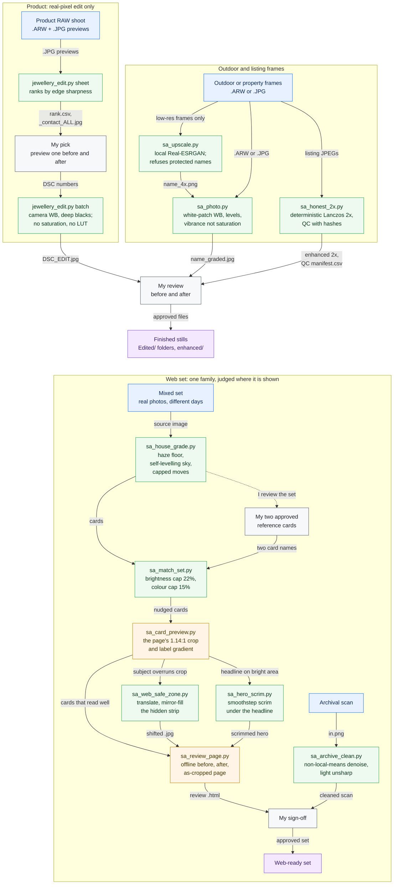

*Fidelity-first branches: product and outdoor frames are graded without generative AI and pass my before-and-after review, and a mixed web set is levelled, matched to two approved references and judged at the page’s real crop before my sign-off.* **Maturity:** Built, in use, except [`sa_archive_clean.py`](../tools/sa_archive_clean.py) and [`sa_honest_2x.py`](../tools/sa_honest_2x.py), which are Built. Generative clutter removal stays Experimental and is not drawn: it has no repository tool, only a prompt and a manual masked edit ([section 4 of the playbook](photo-fidelity-retouching.md#4-if-you-must-remove-clutter-the-boxed-in-prompt)).

### Steps: photo grading and retouching

**A. RAW shoot to graded set and LUT** (playbook: [lightroom-recipe.md](lightroom-recipe.md))

| Step | Tool | What it does | In → Out |
|---|---|---|---|
| 1. Cull | [`sa_cull.py`](../tools/sa_cull.py) | Scores every JPEG twin on sharpness (Laplacian variance), mean level and clipping. Groups brackets and burst re-shoots and keeps the best of each. Never moves or edits a source file | Shoot folder (`--recurse` scores each unit) → `cull.json`, `picks.txt`, `sheet_<unit>.jpg` (`--sheet`), walk-through sheets (`--walk`) |
| 2. Pick | Me | I check the sheets and move the keepers into `SELECTED/`, with the room in the file name | Contact sheets → `SELECTED/` RAWs |
| 3. Read my edits | [`sa_lrread.py`](../tools/sa_lrread.py) | Reads a copy of Lightroom’s catalogue, follows each revision to its settings file, pulls out every slider and mask, and joins them to frames by capture time | `Managed Catalog.mcat` + `settings/<sha256>` + `--shoot` folder → printed table, `--json` file |
| 4. Build presets | [`sa_presets.py`](../tools/sa_presets.py) | Runs `sa_lrread.py` and counts a look synced across frames only once. Groups frames by scene; frames listed in `against-the-window.txt` take 01b. Takes the median per scene and writes five presets. `--dry` prints and writes nothing | `--shoot` folder → five scene `.xmp` presets in `--out` (default `~/Downloads/Lightroom Presets`) **and** in Camera Raw `Settings/Property/` |
| 5. Technical develop | [`sa_rawdev.py`](../tools/sa_rawdev.py) | Measures each `.ARW` at half size. Writes exposure only outside a 0.34–0.60 median-luma band, plus highlight and white recovery, shadow lift, noise reduction by effective ISO and the lens profile. White balance stays as shot, sharpening at 0, and colour is untouched | `.ARW` → `.xmp` sidecar beside it (`--dry` prints only; `--preview DIR` writes approximate before/after JPEGs). Lightroom’s cloud version ignores sidecars |
| 6. Web crops | [`sa_webcrops.py`](../tools/sa_webcrops.py) | Cuts six crops by geometry only from the native file: hero 16:9, banner 3:1, card 4:3, portrait 4:5, square and mobile 9:16. Never upscales, never recolours | Native still → `web crops (ungraded)/` (or `--out`) |
| 7. Grade | Me, in Lightroom | I apply the scene preset, set white balance by eye, put an Object mask on windows and a reverse mask on dark surfaces, and check noise. Then I sync everything except white balance and exposure | RAW + sidecar + preset → graded set |
| 8a. LUT, quick | [`sa_xmp2cube.py`](../tools/sa_xmp2cube.py) | Approximates exposure, contrast, the tone sliders, vibrance, saturation, blue hue and saturation, and mild white balance as a 3D LUT | Preset `.xmp` → `.cube` (`--size 33`) |
| 8b. LUT, exact | [`sa_lut.py`](../tools/sa_lut.py) | `identity` makes a 1089 × 33 strip. I apply the preset in Lightroom and export sRGB with no sharpening or resizing. `frompng` reads the strip back as a LUT | `strip.png` → `graded.png` → `.cube` |
| 9. Apply the LUT | [`sa_grade.py`](../tools/sa_grade.py) | Runs ffmpeg `lut3d`, blended with the original by `--strength` | Clip or still + `.cube` → `<name>_graded.<ext>` (or `--out`) |
| Side flow. Library delivery | [`sa_photolib.py`](../tools/sa_photolib.py) | `scan` reports what is there. `build` keeps the best of each near-duplicate cluster (dHash), routes soft, blown or dark frames to `_REVIEW/`, upscales only frames under 3 MP with local Real-ESRGAN (`--upscale`) and writes an indoor or outdoor sidecar per image. `sheet` draws a numbered contact sheet | Library + my own `INDOOR.xmp` / `OUTDOOR.xmp` in `tools/presets/` → ranked copies + `.xmp`, `_REVIEW/`, `sheet.jpg` |
| Side flow. Review | Me | I go through the numbered sheet and every frame routed to `_REVIEW/` before the folder is handed over | `sheet.jpg` + `_REVIEW/` → approved delivery folder |

**B. Fidelity-first branches** (playbook: [photo-fidelity-retouching.md](photo-fidelity-retouching.md))

| Step | Tool | What it does | In → Out |
|---|---|---|---|
| P1. Rank | [`jewellery_edit.py`](../tools/jewellery_edit.py) | `sheet` ranks every shot by edge sharpness (cut-off 12) and marks the picks. `preview <DSC>` shows one frame before and after, from RAW | `JEWEL_SRC` folder → `rank.csv`, `_contact_ALL.jpg` |
| P2. Pick | Me | I choose the frames to edit | Contact sheet → DSC numbers |
| P3. Edit | [`jewellery_edit.py`](../tools/jewellery_edit.py) | `batch` decodes the RAW with camera white balance, resets the black point and brightens under a soft highlight knee. Then chroma denoise, clarity and a fine sharpen. Never saturation, vibrance, hue shift or LUT | Picked `.ARW` → `Edited/<DSC>_EDIT.jpg` |
| O1. Enlarge | [`sa_upscale.py`](../tools/sa_upscale.py) | Local Real-ESRGAN, 4× by default or `--2x`. Refuses any path containing a protected word (`SA_UPSCALE_PROTECT`, default jewellery) | Low-res file or folder → `<name>_4x.png` |
| O2. Outdoor grade | [`sa_photo.py`](../tools/sa_photo.py) | White-patch balance with a slight cool bias, levels and gamma, shadow lift and highlight pull, vibrance (never saturation), chroma denoise, clarity | `.ARW` / `.JPG` folder or one file → `Edited/<name>_graded.jpg` (or `out_dir`; `--n` tests a few) |
| O3. Listing 2× | [`sa_honest_2x.py`](../tools/sa_honest_2x.py) | Deterministic: EXIF orientation, clamped white balance and tone, flat-area denoise, Lanczos 2×, mild sharpen, then QC with hashes. Originals are never written to | JPEGs → `HONEST2X_OUT/output/enhanced/`, `enhanced_2x.zip`, `index.html`, `QC/manifest.csv`, `QC/summary.json` |
| P4, O4. Review | Me | I compare every edited product, outdoor or listing frame with its original, before and after, and approve it before it is used | edited files → finished stills |
| W1. House treatment | [`sa_house_grade.py`](../tools/sa_house_grade.py) | Finds the haze floor, adds only the contrast and colour each frame lacks, and lifts the sky through a blurred mask until it levels at the target. Then a closing pass, warm highlights and cool shadows, a light vignette and sharpen | Source → card at 1672 × 941 (`--crop x0,y0,x1,y1`; `--native` keeps the full size) |
| W2. References | Me | I approve the two cards that define the look | Cards → two card names |
| W3. Match the set | [`sa_match_set.py`](../tools/sa_match_set.py) | Moves each card’s brightness (cap ±22%) and colour (cap ±15%) towards the references. References are untouched and cards within 2% are left alone. Measures only until `--write` | Folder of `.jpg` + `--ref a,b` → cards rewritten in place |
| W4. See it as shown | [`sa_card_preview.py`](../tools/sa_card_preview.py) | Renders every card at the page’s 1.14 : 1 centre crop, with the label gradient over the bottom third | `CARD_IMAGES` folder → `card_preview.jpg` |
| W5. Fix an overrun | [`sa_web_safe_zone.py`](../tools/sa_web_safe_zone.py) | Slides the whole frame sideways and mirror-fills the strip that lands outside the visible crop | `in.jpg` + shift in px → `out.jpg` |
| W6. Headline scrim | [`sa_hero_scrim.py`](../tools/sa_hero_scrim.py) | Darkens from the left with a smoothstep falloff so a headline laid on the photo stays readable | `in.png` → `out.png` (`--reach 0.46`, `--depth 0.72`) |
| W7. Review page | [`sa_review_page.py`](../tools/sa_review_page.py) | One offline HTML page showing before, after and the crop the site shows, with the images embedded | `REVIEW_NEW_DIR`, `REVIEW_OLD_DIR` → `REVIEW_OUT` page |
| A1. Archival scan | [`sa_archive_clean.py`](../tools/sa_archive_clean.py) | Non-local-means denoise plus a light unsharp; prints edge energy before and after | `in.png` → `out.png` (`--strength 8`, `--sharpen 0.35`) |
| W8. Sign-off | Me | I approve the set before it is used | Review page → web-ready set |
| Not drawn | [`sa_xmp_detail_apply.py`](../tools/sa_xmp_detail_apply.py) | Applies only the detail fields of each JPEG’s XMP (noise reduction, sharpening) at native size. Files with no detail settings are byte-copied | `--input` JPEG + `.xmp` → `--output` files + `--qc` manifest (`--validate-only` checks first) |

**Run it – RAW shoot to LUT (A)**

```bash
python3 tools/sa_cull.py "<shoot>" --recurse -o cull --sheet
python3 tools/sa_presets.py --shoot "<shoot>" --dry
python3 tools/sa_rawdev.py "<shoot>" --recurse --preview previews
python3 tools/sa_photolib.py build "<library>" delivery --upscale   # needs your own INDOOR.xmp / OUTDOOR.xmp in tools/presets/
python3 tools/sa_xmp2cube.py "<preset>.xmp" look.cube --size 33
python3 tools/sa_grade.py clip.mp4 look.cube --strength 0.8
```

**Run it – fidelity-first and web set (B)**

```bash
JEWEL_SRC="<product shoot>" python3 tools/jewellery_edit.py sheet
python3 tools/sa_photo.py "<outdoor folder>" graded --n 3
python3 tools/sa_house_grade.py src/card-a.jpg cards/card-a.jpg
python3 tools/sa_match_set.py cards --ref card-a,card-b
CARD_IMAGES=cards python3 tools/sa_card_preview.py card_preview.jpg
```

---

## 6. Voice-over and captions

**Diagram 1** turns an approved script into one checked clip per line in a cloned voice, placed on one voice track; **diagram 2** takes those clips to script-locked captions, an editable caption track in CapCut, SRT and Arabic subtitle drafts, with a separate route for live captions. Full playbooks: [cloned-voice voice-over with Fish Audio](fish-audio-voice-cloning.md) and [training-video production, sections 4 and 8](training-video-production.md#4-pacing-the-numbers).

**Diagram 1 – voice-over, one checked clip per line**

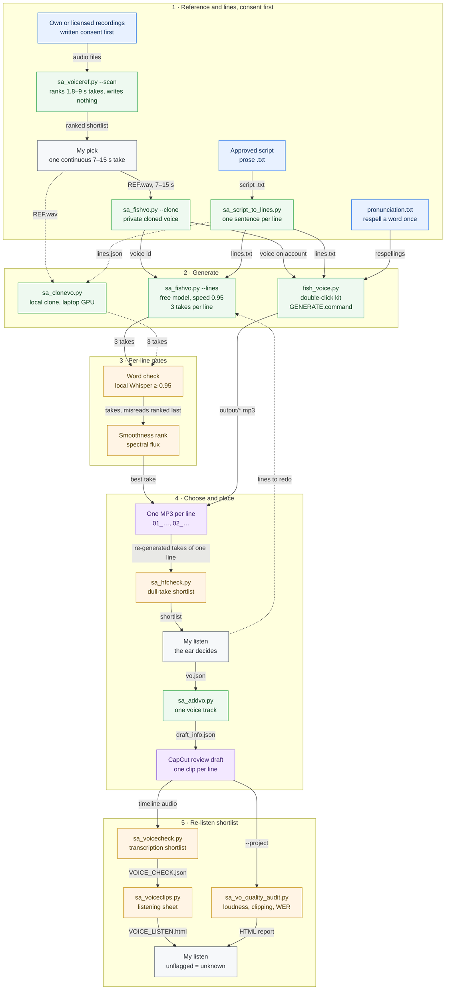

*A recording I own or am licensed to use becomes a private cloned voice, and the approved script becomes one checked MP3 per line, placed as its own clip on one voice track.* **Maturity:** the API route is Built, in use; the double-click kit is a Pilot; the local clone is a Pilot. The word check and the smoothness ranking only choose between takes. [`sa_hfcheck.py`](../tools/sa_hfcheck.py), [`sa_voicecheck.py`](../tools/sa_voicecheck.py) and [`sa_vo_quality_audit.py`](../tools/sa_vo_quality_audit.py) are Experimental shortlists for my ear and never pass a line. Anything I reject is respelt in `pronunciation.txt` or generated again.

**Diagram 2 – captions, SRT export and live captions**

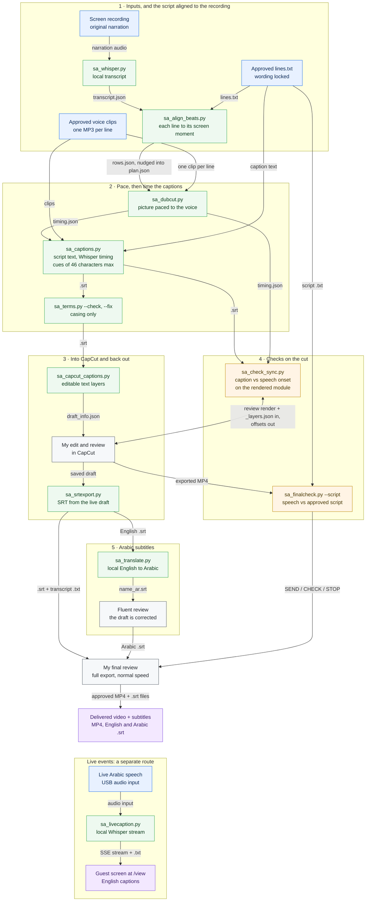

*Caption words come only from the approved script, and only their timing comes from the audio. The captions go into CapCut as editable text and come back out as SRT for delivery and for Arabic drafts. Live events use a separate local route that uploads nothing.* **Maturity:** script-locked captions, CapCut caption import and SRT export are Built, in use. Arabic translation is Built, in use, for drafts only, and is always reviewed. Live captions are a Pilot. [`sa_check_sync.py`](../tools/sa_check_sync.py) and [`sa_finalcheck.py`](../tools/sa_finalcheck.py) give me evidence to review and release nothing; my final review releases the delivery.

### Steps: voice-over and captions

**Voice-over (diagram 1)**

| Step | Tool | What it does | In → Out |
|---|---|---|---|
| V1 | [`sa_voiceref.py`](../tools/sa_voiceref.py) `--scan` | Ranks recordings you own or are licensed to clone by peak level, length, silence and high-frequency brightness. It then reads the shortlist back with faster-whisper and drops takes that stutter or repeat a phrase. Keep one continuous take of 7–15 s, never a splice. Runs locally and uploads nothing | Folder named by `VOICE_REF_DIR` → ranked report (writes nothing; it scores takes of 1.8–9 s). I cut one continuous 7–15 s take from the best recording and save it as `REF.wav`. `--build` joins takes into a ~90 s montage, which this route does not use |
| V2 | [`sa_fishvo.py`](../tools/sa_fishvo.py) `--clone` (kit: [`fish_voice.py`](../kits/fish-voice-kit/fish_voice.py) `--clone`) | Uploads the reference to Fish Audio and creates a **private** voice. `--ref-text` skips transcribing the reference | `REF.wav` (+ `--title`) → voice id (the kit saves it to `my_voice.txt`) |
| V3 | [`sa_script_to_lines.py`](../tools/sa_script_to_lines.py) | Splits the approved prose script into one sentence per line. It skips the title block, joins wrapped lines, and never splits inside a decimal, a reference code or an abbreviation | Script `.txt` → `lines.txt` |
| V4 | [`sa_fishvo.py`](../tools/sa_fishvo.py) `--lines` | Speaks every line through the Fish Audio API on the free `s2.1-pro-free` model (the model is sent as a request header), at speed 0.95, three takes per line. If the free model is refused, it falls back to the paid `s2.1-pro` and warns on every line that the line is charged. Joins initials such as “Q and A” with hyphens so they are not spoken as separate phrases | `lines.txt` + `--voice` → one `NN_slug.mp3` per line in `--outdir` |
| V5 | Gates inside [`sa_fishvo.py`](../tools/sa_fishvo.py) and [`sa_clonevo.py`](../tools/sa_clonevo.py) | **Word check:** a local faster-whisper transcript must match the line at ≥ 0.95, or the take drops to the bottom. **Smoothness:** a spectral-flux ranking keeps the least choppy take. Trailing silence is trimmed and loudness matched to the reference. Runs locally and uploads nothing | 3 WAV takes → 1 kept take per line |
| V6 | Fish Voice Kit: [`GENERATE.command`](../kits/fish-voice-kit/GENERATE.command) → [`fish_voice.py`](../kits/fish-voice-kit/fish_voice.py) | Double-click route for non-technical users. It picks the voice from the account’s own list, applies [`pronunciation.txt`](../kits/fish-voice-kit/pronunciation.txt) to every line, sends each line with the key that owns the voice, and trims and levels it to −16 LUFS (true peak −1.5 dB). Pilot | `lines.txt` + `pronunciation.txt` + `fish_key.txt` + `my_voice.txt` → `output/NN_*.mp3` |
| V7 | [`sa_clonevo.py`](../tools/sa_clonevo.py) `--lines` | Local alternative: clones the voice on the laptop GPU from the reference alone (no training step) with an MIT-licensed open model, at no cost per line. Same best-of-3, word check and smoothness ranking. Pilot. The API route replaced it for production lines | `lines.json` (a list of line number and text) + `--ref REF.wav` → one WAV per line |
| V8 | [`sa_hfcheck.py`](../tools/sa_hfcheck.py) | Measures energy above 5 kHz on voiced frames to shortlist dull “old radio” takes. Compare only takes of the same words; there is no absolute threshold. Experimental shortlist | Two or more fresh takes of the same line (MP3/WAV) → ranked measurements |
| V9 | My listen | I approve or reject each line; a rejected line goes back to V4. A misread word gets a `pronunciation.txt` respelling instead of more takes. Stop after about five takes | Clips + shortlist → approved clips and their start times |
| V10 | [`sa_addvo.py`](../tools/sa_addvo.py) | Puts the approved lines on one voice track in a **new** CapCut review draft, one segment per line, and mutes the original narration. It refuses overlapping lines, backs the draft up first and runs only with CapCut closed | Project name + `vo.json` (file and start time per line) → `draft_info.json` (backup `.pre_vo`) |
| V11 | [`sa_voicecheck.py`](../tools/sa_voicecheck.py) | Shortlists lines worth a re-listen by transcription error rate. High precision, about 65% recall: a line it does not flag is unknown, never good. Runs locally and uploads nothing. Experimental shortlist | Timeline captions + voice audio → `VOICE_CHECK.json` + `VOICE_CHECK.html` |
| V12 | [`sa_voiceclips.py`](../tools/sa_voiceclips.py) | Cuts every spoken line into its own clip beside its script, weakest first, so the listening pass is quick | `VOICE_CHECK.json` → `VOICE_LISTEN.html` + `voice_clips/` |
| V13 | [`sa_vo_quality_audit.py`](../tools/sa_vo_quality_audit.py) | Read-only audit of the draft’s active voice clips: WER where captions exist, loudness, clipping, silences and dropouts. Experimental shortlist | `--project` (+ `--draft`) `--out` → folder with an HTML report |
| V14 | My listen | I make the final call on every flagged line; a rejected line goes back to V4 or gets a respelling in V6 | Report + listening sheet → lines to redo |

**Captions (diagram 2)**

| Step | Tool | What it does | In → Out |
|---|---|---|---|
| C1 | [`sa_whisper.py`](../tools/sa_whisper.py) | Local faster-whisper transcript of the recording’s original narration, timed against the recording. Runs locally and uploads nothing | Build folder or video → `transcript.json` (start, end, text) |
| C2 | [`sa_align_beats.py`](../tools/sa_align_beats.py) | Matches each approved line, in order, to where its content is spoken, which gives each line its source window. This is a draft: I nudge each window to end just before the screen changes | Build folder (`lines.txt` + `transcript.json`) → `rows.json` (`--dry` prints only) |
| C3 | [`sa_dubcut.py`](../tools/sa_dubcut.py) | Paces each source window to its voice clip by stretching, squeezing or freezing, with optional voice anchors | `plan.json` (source windows + voice clips) → `out.mp4` + `out.timing.json` |
| C4 | [`sa_captions.py`](../tools/sa_captions.py) | Takes caption text from the locked script and timing from Whisper word timestamps on each clip. Cues are at most 46 characters and 9 words. A cue never splits a product name or breaks after an abbreviation’s full stop | `plan.json` (timing file + clip and text per segment) → `.srt` |
| C5 | [`sa_terms.py`](../tools/sa_terms.py) | Makes product and role names consistent across a series. In SRT files it changes case only, and refuses any edit that would change the spoken words | Series SRTs + call-out labels → `--check` report or `--fix` edits |
| C6 | [`sa_capcut_captions.py`](../tools/sa_capcut_captions.py) | Imports the SRT as editable CapCut text layers, styled like a caption I already approved, plus an optional two-line title. It only adds a track, backs the draft up first, and refuses to run while CapCut is open | Project name + `.srt` (+ `--title LINE1 LINE2`) → new Captions text track in the draft |
| C7 | My edit and review | I edit in CapCut; the captions stay as text I can retype | Draft → saved draft + exported MP4 |
| C8 | [`sa_check_sync.py`](../tools/sa_check_sync.py) | Three sync checks on the rendered module: each marking against its spoken word; each marking held at start, middle and end (read back by on-device OCR); and each line’s first caption against the speech onset on the waveform | `COMPOSITE.mp4`, `PREVIEW.mp4`, `_layers.json`, captions `.srt`, `timing.json` → printed offsets |
| C9 | [`sa_finalcheck.py`](../tools/sa_finalcheck.py) | Checks the exported MP4 for loudness, silences and black frames, then fuzzy-matches a local transcript to the approved script sentence by sentence (≥ 0.72). Read-only | Video + `--script` (+ `--json`) → SEND / CHECK / STOP with reasons |
| C10 | My final review | A full watch of the export at normal speed, with the sync offsets and the SEND / CHECK / STOP verdict beside it; my approval releases the video and its subtitle files | export, the English and Arabic `.srt` + C8 and C9 evidence → approved delivery |
| C11 | [`sa_srtexport.py`](../tools/sa_srtexport.py) | Exports SRT subtitles and a clean transcript from the live CapCut draft, which CapCut cannot do itself. Hidden cues are skipped and the projects are only read. The [studio MCP server](../mcp/studio/README.md)’s `capcut_export_srt` does the same for the export range | Project → `project.srt` + transcript `.txt` |
| C12 | [`sa_translate.py`](../tools/sa_translate.py) | Drafts English-to-Arabic subtitles (or `--to en` for the reverse) through a local Ollama model, keeping every timing. Terms listed in `SA_KEEP_TERMS` stay untranslated. Runs locally and uploads nothing | `.srt` → `name_ar.srt` draft |
| C13 | Fluent review | A fluent reader corrects the draft; a machine translation is never published as it comes out | `name_ar.srt` → reviewed Arabic `.srt` |
| C14 | [`sa_livecaption.py`](../tools/sa_livecaption.py) | Live Arabic speech to English captions, fully local. Whisper streams on the Apple GPU (MLX) with a CPU fallback, and a glossary helps it get names right. It has a browser control page and a full-screen guest page. Pilot | Audio input (`--list`, `--device`; test first with `--file` or `--selfcheck`) → `localhost:8765/view` + a session transcript `.txt` |

Only the script text goes to Fish Audio; the word check, the ranking and the loudness work run locally and upload nothing. For a timeline I have already edited, replacement lines are delivered as files for me to place by hand; [`sa_addvo.py`](../tools/sa_addvo.py) only writes into new review drafts.

**Run it** – from the repository root:

```bash
VOICE_REF_DIR=~/Voice/my-recordings python3 tools/sa_voiceref.py --scan    # only recordings you own or are licensed to clone
python3 tools/sa_fishvo.py --clone REF.wav --title "Narrator"               # prints the new private voice id
python3 tools/sa_script_to_lines.py script.txt vo/lines.txt
python3 tools/sa_fishvo.py --credit && python3 tools/sa_fishvo.py --voice "$FISH_VOICE_ID" --lines vo/lines.txt --outdir vo --speed 0.95 --takes 3
python3 tools/sa_captions.py plan.json -o module.srt
python3 tools/sa_capcut_captions.py "Module 01" module.srt
```

---

## 7. HyperFrames brand tutorials

A brand tutorial module goes from script to an editable CapCut draft, with a knowledge check and a certificate at the end. Full playbook: [brand tutorial videos with HyperFrames](hyperframes-brand-tutorials.md); the brand-agnostic template is [templates/hyperframes-brand-tutorial/](templates/hyperframes-brand-tutorial/README.md).

```mermaid
flowchart TD
  subgraph s1["1 · Script"]
    in_brief["Brief + source documents"]:::input
    h_script["Write + audit the script<br/>one sentence per line"]:::human
  end
  subgraph s2["2 · Voice"]
    t_fish["sa_fishvo.py<br/>cloned voice, 3 takes a line"]:::tool
    h_listen["Listen-back by ear<br/>keep or re-voice"]:::human
  end
  subgraph s3["3 · Word timing + edit plan"]
    t_words["vo_words.py<br/>local word timestamps"]:::tool
    in_brand["brand.json<br/>colours, fonts, music"]:::input
    c_build["build_module.py --check<br/>cues heard, quiz taught"]:::check
    t_build["build_module.py --out<br/>timing core, scenes, captions"]:::tool
  end
  subgraph s4["4 · Render + proof"]
    t_hf["HyperFrames CLI<br/>npm run check / render"]:::tool
    c_frames["Frame evidence<br/>lint, snapshots, dead frames"]:::check
    c_fonts["verify_fonts.py --strict<br/>fake face must fail"]:::check
  end
  subgraph s5["5 · Review preview"]
    t_mux["mux_preview.py<br/>VO at planned starts + bed"]:::tool
    h_watch["Watch the preview<br/>notes go back to the plan"]:::human
  end
  subgraph s6["6 · CapCut hand-off"]
    t_cc["sa_capcut_build_from_plan.py<br/>backup, VO + music tracks"]:::tool
    t_scaf["sa_capcut_callouts.py<br/>writes draft scaffold"]:::tool
    t_caps["sa_capcut_captions.py<br/>SRT to caption track"]:::tool
    c_cc["13 read-back checks<br/>--verify re-runs them"]:::check
    o_draft["Editable CapCut<br/>review draft"]:::output
    h_edit["Editor finishes<br/>music levels, outro"]:::human
  end
  subgraph s7["7 · Knowledge check"]
    t_cert["make_certificate.py<br/>A4, blank name fields"]:::tool
    h_proof["My review<br/>quiz and certificate"]:::human
    o_learn["quiz.json + certificate<br/>for the learning platform"]:::output
  end
  in_brief -->|"source facts"| h_script
  h_script -->|"lines.txt"| t_fish
  t_fish -->|"one .mp3 per line"| h_listen
  h_listen -.->|"re-voice a line"| t_fish
  h_listen -->|"approved clips + lines.txt"| t_words
  t_words -->|"words.json"| c_build
  h_script -->|"module.json + quiz.json"| c_build
  in_brand -->|"brand.json"| c_build
  c_build -->|"PASS"| t_build
  t_build -->|"index.html + package.json"| t_hf
  t_build -->|"index.html"| c_fonts
  t_hf -->|"picture + end frame .mp4"| c_frames
  c_frames -->|"silent picture .mp4"| t_mux
  c_fonts -->|"fonts proven"| t_mux
  t_build -->|"_timing.json"| t_mux
  t_mux -->|"preview.mp4"| h_watch
  h_watch -->|"go-ahead, renders + VO clips"| t_cc
  t_build -->|"_edit_plan.json"| t_cc
  t_cc -->|"scaffold_manifest.json"| t_scaf
  t_scaf -->|"new draft folder"| t_caps
  t_cc -->|".srt from plan cues"| t_caps
  t_caps -->|"draft_info.json"| c_cc
  c_cc -->|"13 of 13 pass"| o_draft
  o_draft -->|"CapCut project"| h_edit
  h_edit ~~~ t_cert
  in_brand -->|"brand.json"| t_cert
  t_cert -->|"certificate.html / .pdf"| h_proof
  h_proof -->|"approved"| o_learn
  classDef input fill:#e8f1ff,stroke:#1f6feb,color:#0b2a5b
  classDef tool fill:#eef9f0,stroke:#2da44e,color:#0b3d1a
  classDef check fill:#fff4e5,stroke:#bf8700,color:#4d3800
  classDef output fill:#f3e8ff,stroke:#8250df,color:#3b1d6e
  classDef human fill:#f6f8fa,stroke:#57606a,color:#24292f
```

*A tutorial module goes from script to an editable CapCut draft. Each voice line is timed word by word, built into a fixed-timing HyperFrames scene plan, rendered, checked for its fonts and previewed, then rebuilt as a new CapCut project that is read back with 13 checks; the quiz and the certificate pass my review before upload.* **Maturity:** the pipeline and the template are Built, awaiting review; the CapCut builder and the font proof are Built, in use; the voice word check is a shortlist, so the ear decides.

### Steps: HyperFrames brand tutorials

| Step | Tool | What it does | In → Out |
|---|---|---|---|
| 1. Script | Me, by hand (no tool) | One sentence per line, written to fit a 46-character caption and audited against the sources. The quiz is written alongside it, so every answer is taught in the module | brief + source documents → `lines.txt`, `module.json`, `quiz.json` |
| 2. Voice | [`sa_fishvo.py`](../tools/sa_fishvo.py) (or the double-click [Fish voice kit](../kits/fish-voice-kit/README.md)) | Speaks each line in a cloned voice through the Fish Audio API, using a voice you own or are licensed to use. It makes 3 takes per line at speed 0.95. A local Whisper word check drops misread takes and a choppiness score ranks the rest. This is a shortlist, not a pass | `lines.txt` → one `01_….mp3` clip per line |
| 3. Listen-back | Me, by ear | I pick the take, re-voice any line that sounds wrong and add a pronunciation fix the first time a name is wrong | clips → approved clips |
| 4. Word timing | [`vo_words.py`](templates/hyperframes-brand-tutorial/vo_words.py) (template form of [`sa_vo_words.py`](../tools/sa_vo_words.py)) | Runs faster-whisper locally and uploads nothing. It records the start and end of every word and each clip’s real duration, and stops if the number of clips does not match the number of lines | clips + `lines.txt` → `words.json` |
| 5. Build gate | [`build_module.py`](templates/hyperframes-brand-tutorial/build_module.py) `--check` | Fails on a cue word the voice never says, a caption over the limit, captions that are not the script’s words, voice over voice, or a quiz answer the module never teaches. Writes nothing | `module.json` + `brand.json` + `words.json` (+ `quiz.json`) → PASS or a list of errors |
| 6. Build | [`build_module.py`](templates/hyperframes-brand-tutorial/build_module.py) `--out` | Applies the fixed timing core: 5 s title, 0.9 s gaps, 2.5 s tail, 6.3 s end frame. Builds the 3D depth scenes with every item cued to its spoken word, and the captions | same inputs → `index.html`, `hyperframes.json`, `package.json`, `<id>_timing.json`, `<id>_edit_plan.json`, `<id>.srt` |
| 7. Render | HyperFrames CLI (third-party; `npm run check`, `npm run render` from the generated `package.json`; Node 22+) | Renders the page in headless Chrome and encodes it with ffmpeg: the silent picture and the end frame as separate files | project folder → silent picture `.mp4` + end frame `.mp4` |
| 8. Frame evidence | `npm run lint`, then a snapshot comparison and a dead-frame scan (the scan scripts are not published) | Lint must show 0 errors. Rendered frames must match the composition’s snapshots (about 46 dB PSNR). No run of 1 s or more may be empty while the voice is speaking | renders → pass / fail |
| 9. Font proof | [`verify_fonts.py`](templates/hyperframes-brand-tutorial/verify_fonts.py) `--strict` (template form of [`sa_verify_fonts.py`](../tools/sa_verify_fonts.py)) | Checks that every declared font loads in headless Chrome and that a declared fake font fails. In strict mode it also checks the font actually used by every text element | `index.html` → exit 0 / 1 |
| 10. Preview | [`mux_preview.py`](templates/hyperframes-brand-tutorial/mux_preview.py) | Places each voice clip at its planned start and adds the music bed at 0.16, about 14 dB under the voice. The audio is padded to the picture’s full length | `_timing.json` + silent picture + clips + bed → `preview.mp4` |
| 11. Review | Me, watching | I watch the preview. Fixes go back to the plan; a picture-only fix leaves `_timing.json` byte-identical | `preview.mp4` → go-ahead or notes |
| 12. CapCut build | [`sa_capcut_build_from_plan.py`](../tools/sa_capcut_build_from_plan.py) | Checks CapCut is closed before every write. Snapshots the projects folder and backs up the donor project. Writes the SRT from the plan’s cues and the scaffold manifest, then adds the voice-over and music tracks (the bed restarts at a scene boundary) | `<m>_edit_plan.json` + `<m>_timing.json` + renders + clips → a new draft |
| 13. Scaffold (imported) | [`sa_capcut_callouts.py`](../tools/sa_capcut_callouts.py) | Writes the new draft from the manifest: picture track plus the end-frame layer. Never overwrites an existing project | `scaffold_manifest.json` → new draft folder |
| 14. Captions (imported) | [`sa_capcut_captions.py`](../tools/sa_capcut_captions.py) | Adds the SRT as editable text in the donor project’s caption style, not burned into the picture | `<m>.srt` → caption track in `draft_info.json` |
| 15. Read-back | [`sa_capcut_build_from_plan.py`](../tools/sa_capcut_build_from_plan.py) (`--verify` re-runs) | Runs 13 checks: the two project-file copies are identical, ids agree, all media exist, no overlaps, durations agree, voice starts within ±0.01 s, music, captions, end-frame type, no donor leftovers, donor SHA-256 unchanged, no other project changed | draft → 13 of 13 PASS |
| 16. Finish | The editor, in CapCut | Keyframes the music levels by hand and swaps in the brand outro | review draft → finished module |
| 17. Certificate | [`make_certificate.py`](templates/hyperframes-brand-tutorial/make_certificate.py) | Makes an A4 landscape certificate in the brand’s type and colours, either blank (`{{learner_name}}`, `{{completion_date}}`, `{{learner_id}}`) or filled. `--pdf` also prints a PDF | `brand.json` → `certificate.html` (+ `.pdf`) |
| 18. Review | Me | I read the quiz against the module and check the certificate in the brand’s type and colours before either goes to a learning platform | `quiz.json` + `certificate.html` → approved files |

The HyperFrames CLI is the one step with no file in this repository: it is the third-party renderer, called through the `package.json` that `build_module.py` writes. [`sa_capcut_build_from_plan.py`](../tools/sa_capcut_build_from_plan.py) accepts only the module keys in its own table and reads `<m>_edit_plan.json`, `<m>_timing.json` and the voice lines from its own folder, with media from `SA_TUTORIAL_MEDIA` and the donor named by `CAPCUT_DONOR`, so copy the template’s build files in under those names first.

**Run it** – from the template folder:

```bash
cd playbooks/templates/hyperframes-brand-tutorial        # lines.txt = the module's script, one line per row; FISH_API_KEY + FISH_VOICE_ID set
python3 ../../../tools/sa_fishvo.py --lines lines.txt --outdir vo/acme_m1 && python3 vo_words.py --clips vo/acme_m1 --lines lines.txt --out vo/acme_m1_words.json
python3 build_module.py example/module.json --brand brand.example.json --words vo/acme_m1_words.json --out build/acme_m1
(cd build/acme_m1 && npm run check && npm run render) && python3 verify_fonts.py --strict build/acme_m1/index.html
python3 mux_preview.py build/acme_m1_timing.json renders/acme_m1.mp4 preview.mp4 --music bed.mp3
python3 ../../../tools/sa_capcut_build_from_plan.py m1   # builds the draft and runs the 13 checks; add --verify to re-run them only
```

---

## 8. The AI workspace: hand-off, health checks, publishing

Two coding agents hand work to each other through files on disk, share one local memory, read projects through a local MCP server and recover from ground truth after compaction, while a health check, an overnight runner and a private leak-safe sync keep the set-up honest. Full playbooks: [running two AI agents](running-two-ai-agents.md), [session hand-off](session-handoff.md) and [the brain](the-brain.md).

**Diagram 1 – a working session: resume, work, checkpoint, recover**

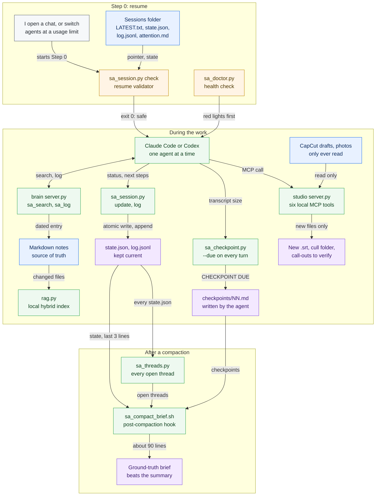

**Diagram 2 – health checks, overnight runs and publishing**

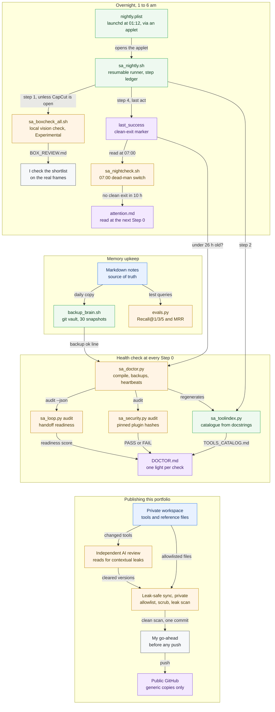

*Two coding agents hand work to each other through files on disk, share one local memory, read projects through a local MCP server and recover from ground truth after compaction, while a health check, an overnight runner and a private leak-safe sync keep the set-up honest.* **Maturity:** Built, in use – the hand-off, the brain, the health check, checkpoints, the compact brief (Claude Code only), the studio MCP server and the nightly runner. The 07:00 dead-man checker is Built, but a macOS permissions regression currently refuses it. The overnight vision check and the morning note are Experimental, and the vision output is a shortlist I check, never a pass. The sync is Built and private.

### Steps: the AI workspace

**A working session (diagram 1)**

| Step | Tool | What it does | In → Out |
|---|---|---|---|
| 1. Resume | [`sa_session.py`](../tools/sa_session.py) `check` | Validates the hand-off before any work: the pointer, the eight keys, and no newer work sitting in another folder | `LATEST.txt`, `state.json`, `log.jsonl` → exit 0 (safe to resume) or exit 1 with the problems listed |
| 2. Health check | [`sa_doctor.py`](../tools/sa_doctor.py) | Compiles every tool; checks for a verified backup, paired job heartbeats, git state and last night’s clean exit; runs steps 16–18 | `backup.log`, heartbeat log, `last_success` → `Reference/DOCTOR.md`; exit 1 if any light is red |
| 3. Keep state | [`sa_session.py`](../tools/sa_session.py) `new`, `update`, `log` | Writes the eight-key state atomically (a temporary file, then a rename) and appends one typed line per change | `--status`, `--last-action`, `--next "a;b"` → `state.json`, `log.jsonl` |
| 4. Remember | [`server.py`](../workspace-kit/brain/server.py) (the brain) | A local MCP server both agents call: `sa_briefing`, `sa_search`, `sa_log`, `sa_instinct`, `sa_recent`, `sa_reindex` | a query or a dated entry → the top eight chunks, or a new entry in a Markdown note |
| 5. Index | [`rag.py`](../workspace-kit/brain/rag.py) | Re-chunks only the notes that changed, embeds them on the device and serves hybrid search; falls back to keywords if the vector layer breaks | Markdown notes → `chroma_db/` (a rebuildable cache) → ranked hits |
| 6. Read projects | [`server.py`](../mcp/studio/server.py) (studio MCP) | Six local tools – project summary, SRT export, call-out audit, photo cull, style lookup, prompt search – built on [`sa_capcut.py`](../tools/sa_capcut.py), [`sa_captions.py`](../tools/sa_captions.py), [`sa_actioncheck.py`](../tools/sa_actioncheck.py), [`sa_editdna.py`](../tools/sa_editdna.py), [`sa_console.py`](../tools/sa_console.py) and [`sa_cull.py`](../tools/sa_cull.py) | CapCut timeline JSON, a JPG folder → summary text, a new `.srt`, a new cull folder, call-out candidates to check on frames (never a pass) |
| 7. Checkpoint | [`sa_checkpoint.py`](../tools/sa_checkpoint.py), run by [`discipline.sh`](../workspace-kit/.claude/hooks/discipline.sh) | The per-turn hook runs `--due`. Once the transcript has grown about 8 MB, it asks the agent for a checkpoint; `--mark` records it | transcript `.jsonl` size → `CHECKPOINT DUE` → `checkpoints/NN.md`, `checkpoints/_state.json` |
| 8. Open threads | [`sa_threads.py`](../tools/sa_threads.py) | Lists unfinished sessions, owed items, recently touched git checkouts and the newest project entries in the brain | every `state.json`, git checkouts → a digest; `Sessions/OPEN_THREADS.md` with `--write` |
| 9. After compaction | [`sa_compact_brief.sh`](../tools/sa_compact_brief.sh) | Claude Code’s `SessionStart:compact` hook re-reads the ground truth in about 90 lines. If the doctor can’t run, it reports health as UNKNOWN, not green | the first 1,800 characters of `state.json`, last 3 log lines, the threads digest, checkpoints, the doctor’s red lights, `attention.md` → a brief in the fresh context |

**Health checks, overnight runs and publishing (diagram 2)**

| Step | Tool | What it does | In → Out |
|---|---|---|---|
| 10. Schedule | [`nightly.plist`](../workspace-kit/scheduling/nightly.plist) | A launchd job at 01:12. It opens a Full Disk Access applet, which runs the night’s script | the clock → [`sa_nightly.sh`](../tools/sa_nightly.sh) started |
| 11. Night run | [`sa_nightly.sh`](../tools/sa_nightly.sh) | Resumable runner: (1) vision check, skipped while CapCut is open; (2) catalogue; (3) text-only morning note, Experimental; (4) clean-exit marker | per-day ledger → `Sessions/_nightly/<date>.log`, `<date>.morning.md`, `last_success` |
| 12. Vision shortlist | [`sa_boxcheck_all.sh`](../tools/sa_boxcheck_all.sh) | A local vision model looks at every call-out in a series. **Experimental:** it gives a shortlist that I check on the real frames, never a pass | `_layers.json` call-out manifests → `findings.json` beside each one, `BOX_REVIEW.md`, an UNKNOWN count |
| 13. Dead-man check | [`sa_nightcheck.sh`](../tools/sa_nightcheck.sh) | At 07:00, if the runner has left no clean exit in the last 10 hours, it sends a macOS notification and writes a note | `last_success` → `Sessions/_nightly/attention.md` |
| 14. Backups | [`backup_brain.sh`](../workspace-kit/brain/backup_brain.sh) | Copies the notes and the brain’s code daily to a git vault outside the notes folder and keeps 30 rotating snapshots. The index is not backed up | Markdown notes → a vault commit, `snapshots/*.tar.gz`, a `backup ok` line in `backup.log` |
| 15. Retrieval test | [`evals.py`](../workspace-kit/brain/evals.py) | Replays the test queries through the live search after any big change | [`eval_set.json`](../workspace-kit/brain/eval_set.json) → Recall@1/3/5, MRR, pass rate per tag |
| 16. Hand-off audit | [`sa_loop.py`](../tools/sa_loop.py) `audit --json` | Scores the active hand-off from L0 to L3 and runs the circuit breaker for long agent loops | session files, loop ledger → `Reference/SA_LOOP_AUDIT.json` and `.md`, a score for the doctor |
| 17. Plugin audit | [`sa_security.py`](../tools/sa_security.py) `audit` | Checks installed third-party plugins and hooks against pinned versions and hashes | `PLUGIN_SECURITY.json`, the installed-plugins list → PASS or FAIL lines |
| 18. Catalogue | [`sa_toolindex.py`](../tools/sa_toolindex.py) | Writes one line per tool from its docstring, read with AST so nothing is imported, and flags tools with no docstring or no `--test` | tool scripts → `Reference/TOOLS_CATALOG.md` |
| 19. Publish | Leak-safe sync – private, not published | Copies only allowlisted files and holds changed tools for independent review. It then scrubs them and runs a leak scan; one hit and nothing is committed | allowlisted workspace files → one reviewed commit → public GitHub, only on my go-ahead ([details](security-and-data-policy.md#6-how-this-portfolio-is-kept-clean)) |

The tools read the workspace location from different settings: [`sa_session.py`](../tools/sa_session.py), [`sa_checkpoint.py`](../tools/sa_checkpoint.py), [`sa_compact_brief.sh`](../tools/sa_compact_brief.sh) and [`sa_nightcheck.sh`](../tools/sa_nightcheck.sh) read `WORKSPACE_ROOT`, [`sa_threads.py`](../tools/sa_threads.py) reads `SA_WORKSPACE`, and the doctor, the loop audit and the nightly runner use the folder above their own script – which is why the example below sets both and keeps the tools in `Tools/`.

**Run it** – in your own workspace, with the `sa_` tools copied into `Tools/`:

```bash
cd ~/my-workspace && export WORKSPACE_ROOT=$PWD SA_WORKSPACE=$PWD    # sa_ tools copied into Tools/
python3 Tools/sa_session.py check            # Step 0: exit 1 means fix first
python3 Tools/sa_doctor.py                   # traffic lights -> Reference/DOCTOR.md
python3 Tools/sa_session.py update --agent codex --status "rough cut built" --next "check lines 5-6;export"
python3 Tools/sa_session.py log codex vo_generated "lines 5 and 6 regenerated (done by codex)"
python3 Tools/sa_threads.py --write          # every open thread -> Sessions/OPEN_THREADS.md
```

---

**Related:** [README](../README.md) · [tool index](../tools/README.md) · [training-video production](training-video-production.md) · [CapCut hub](capcut.md) · [learning an editor’s style](learning-an-editors-style.md) · [Lightroom recipe](lightroom-recipe.md) · [fidelity-first retouching](photo-fidelity-retouching.md) · [Fish Audio voice-over](fish-audio-voice-cloning.md) · [HyperFrames tutorials](hyperframes-brand-tutorials.md) · [running two AI agents](running-two-ai-agents.md)
